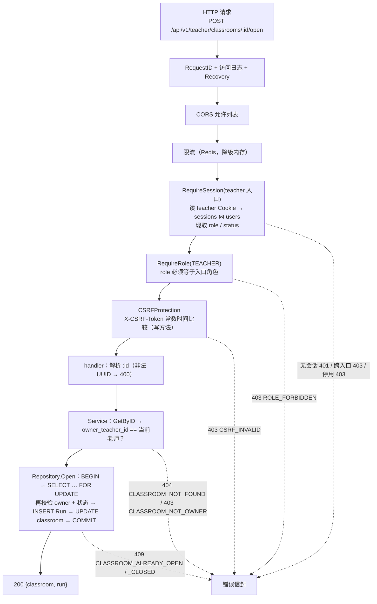

# 控制面（Control Plane）

> 本文档描述 ClassWatch 控制面的**职责与边界**：什么由它决定、什么不由它决定、请求链上的授权在哪里发生、
> 开课/关课事务为什么这样写、错误码与领域事件的接缝在哪里。
>
> 它是 Phase 3（Classroom Domain）的产物，因此文中的"已实现"指 Phase 3 的代码；
> 提到 Phase 6 / Phase 8 的地方都显式标注为**尚未实现**，并说明届时会在哪一行接上。
>
> 相关文档：[架构总览](overview.md)、[数据库设计](../database/schema.md)、
> [状态机](../database/state-machines.md)、[RBAC](../auth/rbac.md)。

---

## 1. 控制面是什么

任务书 §33 把系统切成两半：

```text
CONTROL PLANE（本项目实现）            MEDIA PLANE（LiveKit，现成组件）
├── Auth / Session                    ├── Screen 转发
├── RBAC（三个入口、三种角色）           ├── Camera 转发
├── Classroom / ClassroomRun          ├── Microphone 转发
├── ClassroomStudent（授权名单）        └── Teacher 私密语音
├── StudentSession / SessionEvent（Phase 8）
└── LiveKit Token 签发（Phase 6）
```

| | 控制面 | 媒体面 |
| --- | --- | --- |
| 职责 | 身份、授权、**业务状态**、事件、凭证签发 | 搬运音视频字节流 |
| 实现 | Go API + PostgreSQL（+ Redis） | LiveKit SFU |
| 是不是 Source of Truth | ✅ 是 | ❌ 不是 |
| 挂掉会怎样 | 课堂无法开启/进入（业务停止，但数据仍然正确） | 画面中断，**课堂状态依旧正确** |
| 知道学生姓名吗 | 知道（数据库里有账号与姓名） | **不知道**，只看到 opaque UUID |

Phase 3 的控制面只覆盖其中的 Classroom 部分：Auth/RBAC 来自 Phase 1/2，
Classroom / ClassroomRun / ClassroomStudent 是本文的重点，StudentSession / SessionEvent 属于 Phase 8。

---

## 2. 为什么 PostgreSQL 是唯一 Source of Truth

### 2.1 被明确禁止的推论

```text
❌ 「LiveKit Room 存在」        ⇒ 「Classroom 已开启」
❌ 「LiveKit Room 不存在」      ⇒ 「Classroom 已关闭」
❌ 「Redis 里有 presence key」   ⇒ 「这个学生在线」
```

这三条推论每一条都可以在真实环境里被打破：

| 事实 | 可能的原因 | 如果拿媒体面当状态会怎样 |
| --- | --- | --- |
| Room 不存在，但课堂是 OPEN | Phase 6 尚未创建 Room；LiveKit 重启；创建请求超时 | 老师看到"未开启"，再点一次开课 → 产生第二个 Run（若没有 §4 的双重防线） |
| Room 存在，但课堂是 CLOSED | 关课时 TerminateRoom 失败/超时 | 学生仍能连进一个"已经结束"的课堂，监督台却显示已关闭——老师以为没人了 |
| presence key 过期 | Redis 重启、TTL 到期、网络分区 | 监督墙上的学生凭空消失，而这从未发生过 |

结论：**媒体面只能被控制面观察，不能被控制面当作事实来源**。Phase 8 的 LiveKit Webhook
同样是"输入"，它写入 `student_sessions` / `session_events` 之后，状态才在控制面成立。

### 2.2 Redis 的定位（Phase 1/2 已如此）

Redis 在本项目里只承担三类**可以丢失**的数据：限流计数、WebSocket fan-out、短期 presence。
它们全部满足"丢失后系统仍然正确，只是体验变差"。
业务状态（谁是老师、课堂开没开、谁被授权）一律在 PostgreSQL，且有约束兜底。

### 2.3 数据库不只是存储，它是最后一道防线

`migrations/0004…0006` 把关键不变式写成 CHECK / 唯一索引 / 触发器，
服务端**同时**做一遍校验。两者分工明确：

| 层 | 目的 | 例子 |
| --- | --- | --- |
| 服务端（`internal/classroom`） | 给出**可读的**拒绝理由，让前端知道该改什么 | `name must be at most 80 characters` |
| 数据库（CHECK / UNIQUE / 触发器） | 保证**任何**写入路径都不能产生非法行 | `classrooms_run_consistency`、`classroom_runs_one_open_idx` |

为什么两层都要：应用校验会被绕过（人工 SQL、导入脚本、未来新增的调用点、并发窗口），
而数据库约束不会。反过来，只有数据库约束的话，老师收到的会是一句 SQLSTATE。

---

## 3. Ownership 校验在请求链中的位置

### 3.1 完整链路



### 3.2 每一层回答的问题

| 层 | 回答的问题 | **不**回答的问题 |
| --- | --- | --- |
| `RequireSession` | 这个浏览器带着本入口的有效会话吗？账号还是 ACTIVE 吗？ | 它是谁、能做什么 |
| `RequireRole` | 会话账号的 role 等于入口角色吗？ | 它能不能操作**这个**资源 |
| `CSRFProtection` | 这个写请求来自我们自己的页面吗？ | 同上 |
| handler | 请求形状合法吗（UUID、严格 JSON、至少一个字段）？ | 同上 |
| Service `owned()` | **这个课堂是不是这位老师的？** | 现在的状态允许这个迁移吗 |
| Repository 事务 | 在行锁之下，状态仍然允许这次迁移吗？ | —— |

三条硬性设计决定：

1. **role 与 status 每个请求现取**（`sessions ⋈ users`），不放进 Cookie、不放进 JWT。
   管理员停用账号或改角色，**下一个请求**就生效（任务书 §37）。
2. **路由前缀不是授权**。`/api/v1/teacher/**` 只证明"调用者是老师"。
   `owner_teacher_id == current_teacher.id` 由 **Service 对每个端点**校验（§37/§63），
   包括只读的 `GET`。这样"某个端点忘了检查"这件事在结构上不可能发生。
3. **owner 从会话推导，绝不从请求体读取**。`POST /teacher/classrooms` 的 body 里没有
   `ownerTeacherId`；`PATCH` 里的 `ownerTeacherId` 会被严格 JSON 绑定当成未知字段拒绝（400）。
   否则任何老师都能以别人的名义建课堂。

### 3.3 为什么 ADMIN 不能开别人的课堂

任务书 §4 把管理员的能力边界定为**账号管理**：建老师、建学生、改名、启停、重置密码。
它**不**包含"代替老师开课"。实现上这不是靠 handler 里写 `if role == ADMIN`，而是结构性的：

```text
/admin/**  → RequireSession(admin 入口) + RequireRole(ADMIN)
/teacher/** → RequireSession(teacher 入口) + RequireRole(TEACHER)
```

管理员会话只存在于 `classwatch_session_admin` Cookie 里，teacher 入口根本不看它。
结果是一个管理员访问任何 `/api/v1/teacher/**` 都会得到 **403 `ROLE_FORBIDDEN`**，
而且发生在任何数据库查询之前。

为什么值得这样做，而不是"给管理员一个后门，方便支持"：

- 后门会创造**唯一一类所有权检查覆盖不到的账号**，而它恰好是攻击者最想拿到的账号。
- 支持场景（老师忘了关课）的正确解法是**重置老师密码**（Phase 2 已有），让老师自己关；
  这留下审计痕迹，也符合"课堂是老师的责任范围"这一产品前提。
- 反过来，管理员也不能借 teacher 路由"顺手"改课堂状态；两个入口的权限集合不重叠，
  于是"这个账号能做什么"永远只有一张表。

---

## 4. 开课事务（§48，已实现）

### 4.1 逐步说明

```text
POST /api/v1/teacher/classrooms/:id/open
│
├─ Service（可读错误的快速路径，不持锁）
│   1. repo.GetByID(id)            → 不存在 ⇒ 404 CLASSROOM_NOT_FOUND
│   2. owner_teacher_id != 我       → ⇒ 403 CLASSROOM_NOT_OWNER
│   3. status == OPEN              → ⇒ 409 CLASSROOM_ALREADY_OPEN
│   4. runID = uuid.New();  roomName = "lk_" + runID
│
└─ Repository.Open（一个事务，权威判定）
    BEGIN
    5. SELECT owner_teacher_id, status FROM classrooms WHERE id=$1 FOR UPDATE   ← 行锁
    6. 再校验 owner（锁保护之下）      → 不符 ⇒ ErrNotOwner
    7. 再校验 status == 'CLOSED'      → OPEN ⇒ ErrAlreadyOpen
    8. INSERT INTO classroom_runs (id, classroom_id, status, livekit_room_name, opened_at)
         VALUES ($1, $2, 'OPEN', $3, now())        → 23505/one_open_idx ⇒ ErrAlreadyOpen
    9. UPDATE classrooms SET status='OPEN', current_run_id=$2, updated_at=now() WHERE id=$1
   10. SELECT … （读回最终行，返回给 API）
    COMMIT
```

### 4.2 为什么是"两步校验"

第 1–3 步与第 6–7 步看起来重复，但它们解决不同问题：

- 第 1–3 步在事务外，负责**常见的、非竞争的**情况，能给出精确错误（404 / 403 / 409）。
- 第 6–7 步在行锁内，负责**正确性**：从第 1 步到第 8 步之间，另一个请求完全可能已经把课堂开起来了。
  真正做决定的必须是持锁的那一次读。

这与 `internal/user.SetStatus`（"最后一个管理员不可停用"）的处理方式一致：服务层做可读判断，
SQL 里再做一次原子判断。

### 4.3 并发分析

| 场景 | 结果 |
| --- | --- |
| 老师双击按钮 / 两个标签页同时点 | 一个成功；另一个在锁释放后读到 `OPEN` → 409 `CLASSROOM_ALREADY_OPEN` |
| 两个 API 进程（水平扩展）同时收到请求 | 同上：行锁是数据库级的，跨进程有效 |
| 事务在第 8 步后崩溃（未提交） | 回滚：Run 与状态一起消失，没有"半个开课" |
| 有人绕过服务直接 SQL 插第二条 OPEN Run | 被 `classroom_runs_one_open_idx` 拒绝（23505） |
| 未来某个新调用点忘了 `FOR UPDATE` | 唯一索引仍会拦住第二条 Run；错误映射成同一个 409，而不是 500 |

**为什么不用更高隔离级别（REPEATABLE READ / SERIALIZABLE）**：显式行锁已经把所有关键读放在锁内，
隔离级别再高只会引入序列化失败（40001），迫使 API 层写重试循环——那是把复杂度从"一行 FOR UPDATE"
搬到"每个写端点都要正确重试"，收益为零。

**为什么不在事务里调用 LiveKit**：见 §5.2。

### 4.4 房间名为什么在此时分配，且为什么是不透明的

```text
livekit_room_name = "lk_" + <classroom_run_uuid>
```

- **在此时分配**：房间名属于"这一次执行"，它的生命周期与 Run 一致。
  先写库再建房间，让"数据库里有一条 OPEN Run"成为"这个房间名已被占用"的权威记录；
  Phase 6 只需读取它去创建 Room，不需要重新生成（重新生成会引入"两次生成的房间名不同"的窗口）。
- **为什么是 opaque**：房间名会通过媒体 SDK 暴露给房间里的每一个人。
  用学生账号、老师姓名或真实班级名做房间名，等于把花名册发布给所有参与者（§8）。
  UUID 不携带任何可反推身份的信息。
- **唯一约束为什么在数据库**：两个 Run 共用房间名会把两节课合并进同一个 LiveKit Room，
  第二节课的学生会出现在第一节课的监督墙上。应用层"从 UUID 生成"已经几乎不可能碰撞，
  但数据库的 UNIQUE 让"几乎"变成"不可能"。
- **Phase 3 不把房间名放进任何 DTO**：它是媒体面细节，Phase 6 会随 media-token 一起发给
  "有权进入这个房间的人"，而不是发给每一个读课堂列表的人。

---

## 5. 关课事务（§49，已实现）与 Phase 6/8 的接缝

### 5.1 逐步说明

```text
POST /api/v1/teacher/classrooms/:id/close
│
├─ Service：GetByID → owner → status != OPEN ⇒ 409 CLASSROOM_ALREADY_CLOSED
│
└─ Repository.Close（一个事务）
    BEGIN
    1. SELECT owner_teacher_id, status, current_run_id … FOR UPDATE   ← 行锁
    2. 校验 owner / status == 'OPEN' / current_run_id 非空
    3. UPDATE classroom_runs SET status='CLOSED', closed_at=now()
         WHERE id = <current_run_id> AND status='OPEN'   RETURNING …
    4. UPDATE classrooms SET status='CLOSED', current_run_id=NULL, updated_at=now() WHERE id=$1
    5. 读回最终行
    COMMIT
    ───────────────────────────────────────────────  ← 媒体面 / 实时面在这里之后
    Phase 6（未实现）：调用 LiveKit TerminateRoom(lk_<run_uuid>)
    Phase 8（未实现）：把该 Run 下活跃 student_sessions 置 ROOM_CLOSED，写 session_events，广播 ROOM_CLOSED
```

### 5.2 顺序为什么不能反过来

```text
✅ 先 COMMIT 控制面，再动媒体面
   DB: CLOSED  →  LiveKit TerminateRoom  →  broadcast ROOM_CLOSED

❌ 先 TerminateRoom，再改数据库
   房间没了，但数据库还说 OPEN
   → 老师刷新页面看到"进行中"，学生重连被 LiveKit 拒绝，两边状态互相矛盾
```

推论：**TerminateRoom 必须在事务提交之后**。

- 若在事务内调用，会持有一个 classroom 行锁跨越一次网络请求（LiveKit 慢或超时 = 整个课堂的
  开/关操作被阻塞）。
- 若在提交前调用而事务回滚，房间已经没了，数据库却还是 OPEN —— 这正是 §33 禁止的"媒体面决定控制面"。

### 5.3 为什么关课失败不需要"补偿"

`close` 的数据库部分要么整体成功，要么整体回滚。Phase 6 之后，TerminateRoom 可能失败，
但那时的正确行为是**保持数据库为 CLOSED 并重试/告警**，而不是把课堂改回 OPEN：
控制面已经对老师做出了承诺（"课堂已关闭"），媒体面残留的房间随后被清理即可；
反过来回滚状态才会让学生进入一个数据库认为已结束的课堂。

Phase 3 不实现这些，也**不写空函数**：一个永远返回 nil 的 `terminateLiveKitRoom()` 会让调用者
以为自己已经接好了媒体面。接缝以注释形式留在 `internal/classroom/postgres.go` 的 `Close` 上。

---

## 6. 错误码契约

控制面把每个失败翻译成"机器可读的 code + 人可读的 message"（§58），前端只按 `code` 分支。
Phase 3 涉及的部分：

| code | HTTP | 含义 | 前端可以做什么 |
| --- | --- | --- | --- |
| `AUTH_REQUIRED` | 401 | 没有本入口的有效会话 | 跳登录页 |
| `ROLE_FORBIDDEN` | 403 | 已登录，但入口/角色不对（含 ADMIN 访问 teacher 路由） | 提示无权限，不要重试 |
| `CSRF_INVALID` | 403 | 写请求缺少/不匹配 CSRF token | 提示刷新页面 |
| `INVALID_REQUEST` | 400 | 请求形状不合法（非法 UUID、未知字段、name/description 越界、`accounts` 数量越界） | 定位到具体输入项 |
| `CLASSROOM_NOT_FOUND` | 404 | 该 id 没有课堂 | 返回列表并提示"可能已被删除" |
| `CLASSROOM_NOT_OWNER` | 403 | 课堂存在，但不属于当前老师 | 隐藏/禁用操作入口 |
| `CLASSROOM_ALREADY_OPEN` | 409 | 开课时它已经是 OPEN | 重新拉取状态，直接展示 OPEN |
| `CLASSROOM_ALREADY_CLOSED` | 409 | 关课时它已经是 CLOSED | 重新拉取状态，直接展示 CLOSED |
| `STUDENT_NOT_FOUND` | 404 | 批量添加时该账号不存在 | 标红那一行，提示改账号 |
| `NOT_A_STUDENT` | 400 | 该账号存在但不是学生 | 标红那一行，提示换账号 |
| `ACCOUNT_DISABLED` | 403 | 该账号被停用 | 提示联系管理员启用 |
| `STUDENT_NOT_ASSIGNED` | 404 | 要移除的学生不在名单里 | 刷新名单 |

设计要点：

- **`CLASSROOM_NOT_FOUND` 与 `CLASSROOM_NOT_OWNER` 必须分开**（§58）：前者是"刷新列表"，
  后者是"这不是你的课堂"。课堂 id 是不可枚举的 UUID，调用者又是已认证老师，区分二者不泄露任何信息。
- **批量添加的 4 个 code 出现在 `rejected[]` 数组里**，不是整个请求的失败：
  一次导入里"有两个账号打错了"是常态，整体失败会逼老师自己去二分查找错在哪一行。
- **`500 INTERNAL` 永远不携带内部原因**：`RespondError` 把 cause 写进服务端日志，
  响应体里只有 code + 通用文案。

---

## 7. 领域事件的接缝（Phase 8）

Phase 3 **没有**实时通道，也没有广播任何事件。前端目前只能"请求后刷新"。
这不是"暂时用轮询假装实时"的妥协，而是明确留待 Phase 8（§47/§74）。

Phase 8 会在同一批控制面动作之后广播（**提交之后**，顺序与 §5.2 相同）：

| 事件 | 触发点 | 谁会收到 | 内容（只含 ID 与状态，不含姓名/账号） |
| --- | --- | --- | --- |
| `ROOM_OPENED` | `open` 提交后 | 该课堂的学生 + 老师监督台 | `classroomId`, `runId`, `status` |
| `ROOM_CLOSED` | `close` 提交后 | 同上 | `classroomId`, `runId`, `status` |
| `STUDENT_ONLINE` / `SCREEN_LOST` / `STUDENT_LEFT` … | Phase 8 Webhook 写入之后 | 老师监督台 | `sessionId`, `studentId`, 状态 |

为什么事件也在控制面：事件是"状态变化的结果"，必须先有权威状态，再有通知。
反过来（先广播、后落库）会出现"前端已经显示已关闭，刷新后又是开启"的抖动。

---

## 8. 已实现的限制与取舍

| 取舍 | 现状 | 理由 / 何时需要重新考虑 |
| --- | --- | --- |
| 课堂列表不分页 | `GET /teacher/classrooms` 一次返回全部 | 一个老师的课堂数量是个位数。加分页是**追加式**契约变更（将来加 `?page=` 可保持默认行为），现在加只会让前端多一份永远用不到的状态 |
| 批量添加是部分成功 | 200 + `students[]` + `rejected[]` | 导入天然会有错行；逐项带 code 比整体失败可用得多。`students` 直接返回"操作后的完整名单"，前端不需要自己合并增量 |
| 每个账号一次查询 | 一次批量最多 100 次按主键/唯一索引的查找 | 换取"每条 rejection 都能说明原因"。上限 100 让最坏情况可控；真到性能瓶颈时再换 `account = ANY($1)` + 一次 JOIN |
| 房间名不出现在 DTO | Phase 3 的所有响应都不含 `livekitRoomName` | 媒体面细节，Phase 6 随 media-token 发给有权的人 |
| 只有 owner 一个人能操作 | 没有"协同老师"概念 | §4 明确 V1 不做多老师共管；要做得引入 `classroom_teachers` 关联表并重审所有权判定 |
| 无课堂删除 API | 只有人工 SQL，且有 Run 时被 RESTRICT 拒绝 | §1：不物理删除历史 |
| owner 角色触发器不覆盖"老师被降级" | 触发器只在写 `classrooms` 时校验 | Phase 2 的管理 API 没有改角色的路径（§4），所以只能由人工 SQL 造成；adminctl 是 break-glass 通道 |
| 关课不清理媒体面 | Phase 3 无媒体面 | Phase 6/8 在提交后接上，见 §5 |

---

## 9. 相关代码与测试

| 关注点 | 位置 |
| --- | --- |
| 领域类型与规则 | `services/api/internal/classroom/classroom.go`、`service.go` |
| 事务、行锁、约束翻译 | `services/api/internal/classroom/postgres.go` |
| HTTP 契约与错误映射 | `services/api/internal/httpapi/teacher_classrooms.go` |
| 路由与中间件编排 | `services/api/internal/httpapi/router.go`（`registerTeacherRoutes`） |
| 迁移 | `services/api/migrations/0004_classrooms.sql` … `0006_classroom_runs.sql` |
| 规则单测（fake repo） | `services/api/internal/classroom/service_test.go` |
| SQL / 并发集成测试 | `services/api/internal/classroom/postgres_integration_test.go` |
| 端到端（真实会话 + 数据库） | `services/api/internal/httpapi/teacher_classrooms_integration_test.go` |
| 传输契约单测 | `services/api/internal/httpapi/teacher_classrooms_test.go` |
