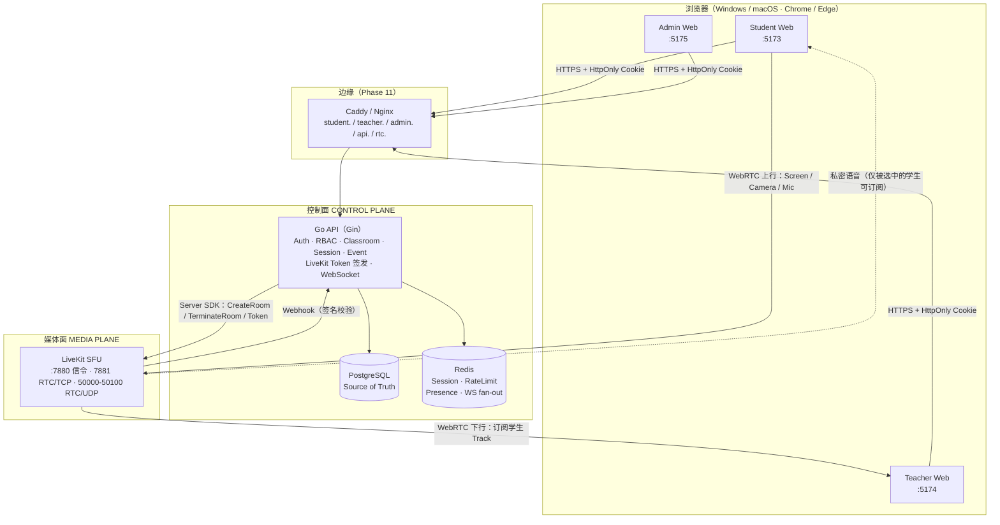
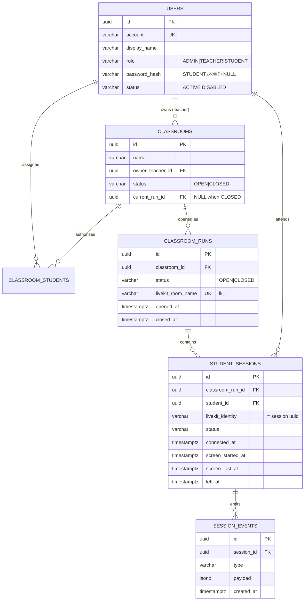
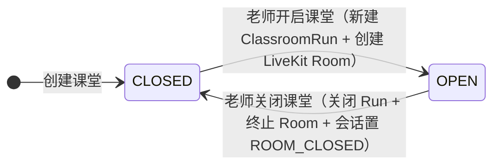
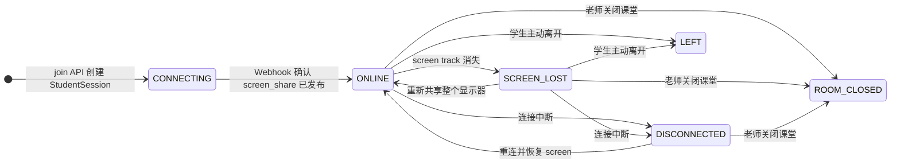
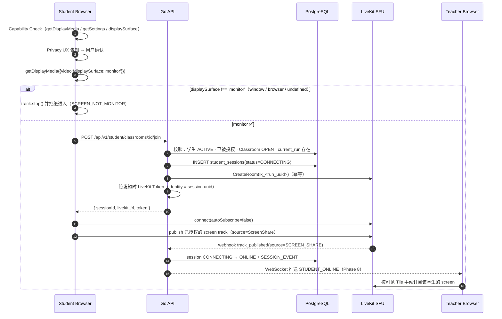

# ClassWatch 架构总览

> 本文档回答三个问题：**系统由哪些部分组成**、**数据如何流动**、**为什么这样设计而不是别的方案**。
>
> 它是 Phase 0 的产物，但描述的是 V1 的完整目标架构；每个 Phase 只实现其中一部分，
> 未实现的部分在文中明确标注了所属 Phase。

---

## 1. 产品定位

ClassWatch 是一个**完全基于浏览器**的远程课堂监督系统：

```text
Browser-based Classroom Supervision Platform
```

它**不是**会议软件（不是腾讯会议 Clone），也**不是** LockDown Browser。
V1 只服务三个核心目标（对应任务书 §85）：

| # | 核心目标 | 架构上的落点 |
| --- | --- | --- |
| ① | 老师控制**谁能进入哪个课堂** | `classroom_students` 授权表 + 服务端 Classroom Authorization |
| ② | 学生必须**持续共享完整显示器** | 前端 `displaySurface === 'monitor'` 硬 Gate + 服务端 Track 观察 |
| ③ | 老师能同时监督多个学生并与指定学生私密沟通 | LiveKit SFU + Teacher Monitor DTO + Private Talk 订阅权限 |

任何不能明显服务这三个目标的功能都不进入 V1（任务书 §54 列出了明确禁止项：
学生注册、学生密码、聊天、文件传输、录屏、远控、AI 行为检测等）。

---

## 2. 系统架构



关键点：

- **只有 API 与数据库知道业务状态**。LiveKit 只负责搬运媒体流，它不知道谁是老师、哪个课堂开着。
- **浏览器直接与 SFU 建立媒体连接**，API 不在媒体路径上（否则后端带宽与 CPU 会先崩）。
- **Webhook 是服务端对媒体的唯一权威观察通道**（Phase 8）。

---

## 3. 控制面与媒体面必须分离

这是全项目最重要的一条架构纪律（任务书 §33）。

| | 控制面 | 媒体面 |
| --- | --- | --- |
| 职责 | 身份、授权、课堂状态、会话状态、事件、Token 签发 | Screen / Camera / Mic 的转发 |
| 实现 | Go API + PostgreSQL（+ Redis） | LiveKit SFU |
| Source of Truth | ✅ 是 | ❌ 不是 |
| 失效影响 | 课堂无法开启/进入（业务停止） | 画面中断，但**课堂状态仍然正确** |

必须避免的经典错误：

```text
❌ LiveKit Room 存在  ⇒  认为 Classroom 是 OPEN
```

如果这样设计，那么：老师忘了关课堂、LiveKit 房间因 `empty_timeout` 被回收、
网络抖动导致房间重建，都会让「课堂开着还是关着」这件事失去唯一答案。

正确关系是：

```text
Classroom.status == OPEN          ← 业务事实，只有老师能改（PostgreSQL 事务保证）
        │
        │ 同一个业务动作里
        ▼
ClassroomRun（一次开启 = 一条 Run 记录）
        │
        │ 创建/销毁
        ▼
LiveKit Room 名 = lk_<run_uuid>   ← 媒体事实，随 Run 生灭
```

因此 LiveKit 侧配置了 `room.auto_create: false`（见 `deploy/livekit/livekit.yaml`）：
**Room 必须由后端显式创建**，名字是不可反推个人信息的 opaque UUID，
从根本上杜绝「随便起个名字自助开房」以及「从房间名反推学生姓名」的可能。

---

## 4. 三个入口 = 三个独立 Web 应用

```text
apps/student-web   :5173  学生：登录 → 我的课堂 → PreJoin → 共享整个屏幕 → 课堂会话
apps/teacher-web   :5174  老师：登录 → 课堂管理 → 开启/关闭 → 监督墙 → Focus View → 语音
apps/admin-web     :5175  管理员：登录 → 用户管理（创建老师/学生、停用、重置密码）
```

为什么不是「一个页面按 role 切换 UI」：

1. **授权边界不同**。学生端永远不应该加载到「创建老师」「停用账号」这些页面的代码。
   一个 SPA 里靠 `v-if` 隐藏，等于把后台按钮发到了每个学生的浏览器里。
2. **发布节奏不同**。老师端的监视墙会频繁迭代，学生端改动越少越好——
   学生端每次改版都意味着一次真实的课堂风险。
3. **生产域名不同**（`student.` / `teacher.` / `admin.`），入口分离让 Cookie 与 CORS 策略可以按入口收紧。

同时，为了避免复制公共代码，三个应用共享：

```text
packages/shared-types   领域类型与错误码契约（前后端共用的“词表”）
packages/api-client     统一 HTTP 客户端（Cookie 会话、统一错误结构、CSRF 预留）
packages/ui             Tailwind v4 主题 + 无业务逻辑的基础组件
```

共享的边界很清楚：**共享类型、请求封装、视觉原子**；**不共享**任何页面级业务逻辑。

---

## 5. 领域模型



### 5.1 Classroom ≠ ClassroomRun（必须理解）

```text
Classroom「C++ 算法训练」        ← 长期存在的“课程/班级容器”，老师拥有它，学生被授权进入它
   ├── ClassroomRun 2026-10-01 19:00 → 21:05   ← 一次真实的“开课”
   ├── ClassroomRun 2026-10-02 19:00 → 21:10
   └── ClassroomRun 2026-10-03 19:00 → （进行中）
```

每次 `CLOSED → OPEN` **必须新建一条 Run，禁止复用**。
为什么：出勤、事件、会话都必须挂在一个**有限的时间区间**上，
否则「这个学生的屏幕是什么时候断的」在多个晚上之间无法区分。

### 5.2 两条状态机



用户可见的 Classroom 状态**只有 `OPEN` / `CLOSED`**（任务书 §7）。
`WAITING`、`PAUSED`、`ENDED`、`ARCHIVED` 一律不引入——
每多一个状态，前端、测试、文档的复杂度都翻倍，而 V1 的业务并不需要它们。



注意两点设计意图：

- `PRE_JOIN` **不是**数据库状态，它是纯前端状态（任务书 §12）。
  学生还没拿到媒体授权之前，服务端不应该产生任何会话记录。
- `ONLINE` 的判定权在服务端：`screen_share` 必须真实存在且 live（任务书 §21/§45）。
  前端说「我成功了」不算数。

---

## 6. 学生进入课堂主流程（V1 主干）



这条流程的三个「不许」：

1. **不许先连 LiveKit 再问屏幕权限**——否则会出现「人已经在房间里，但什么都没共享」的空窗期。
2. **不许把前端提交的 `displaySurface` 当成安全证明**——它只是诊断信息（任务书 §19/§43）。
3. **不许让服务端因为前端汇报就改状态**——`ONLINE` 由 webhook 说话。

---

## 7. 技术选型与取舍

| 层 | 选型 | 为什么 | 考虑过但没选 |
| --- | --- | --- | --- |
| 后端 | Go + Gin | 并发模型适合大量长连接（WebSocket）与 IO 密集的鉴权/授权；部署是单个静态二进制；团队可读性高 | Node/NestJS（与前端同语言但长连接与 CPU 成本更高）、Spring Boot（启动与内存开销大） |
| 数据库 | PostgreSQL | 需要事务、行级锁（`SELECT ... FOR UPDATE` 保证 Classroom 状态迁移的并发正确性）、JSONB（事件 payload）、可用的部分唯一索引 | MySQL（JSONB/索引表达力弱）、MongoDB（课堂状态迁移需要强事务） |
| 访问层 | pgx + 手写 SQL | 课堂状态机与授权查询需要精确控制 SQL（锁、索引、约束），ORM 会隐藏这些细节 | GORM/Ent（迁移与隐式行为难以审计） |
| 缓存/会话 | Redis | 会话、限流、短期 presence、WebSocket fan-out 都需要带 TTL 的共享状态 | 内存 map（无法多实例）、PostgreSQL 表（写放大且不优雅） |
| 媒体 | LiveKit SFU | 浏览器端 1 上行 / N 下行是课堂监督的天然形态；提供 track 级订阅权限、webhook、服务端 SDK | Mesh P2P（N 个学生时上行爆炸）、自研 SFU（远超 V1 范围）、录制型方案（V1 明确不录像） |
| 前端 | Vue 3 + TS + Vite + Pinia | 组合式 API 对媒体状态机（track 生命周期）表达力好；Vite 启动快；Pinia 与 Vue 生态一致 | React（同样可行，但与任务书约定不符） |
| 样式 | Tailwind v4 | 状态色（OPEN 绿 / CLOSED 灰 / SCREEN_LOST 红）需要一致的原子级表达；v4 的 CSS-first `@theme` 让主题集中在 CSS 中，无需 JS 配置 | 组件库（Element/Ant）会带来与「低噪声 Dashboard」相反的老式后台观感 |

---

## 8. 仓库结构

```text
classwatch/
├── apps/
│   ├── student-web/          学生端 SPA（:5173）
│   ├── teacher-web/          老师端 SPA（:5174）
│   └── admin-web/            管理端 SPA（:5175）
├── packages/
│   ├── shared-types/         领域类型 + 错误码（前后端契约）
│   ├── api-client/           统一 HTTP 客户端
│   └── ui/                   Tailwind 主题 + 基础组件
├── services/
│   └── api/                  Go 后端
│       ├── cmd/              api / migrate 两个二进制
│       ├── internal/         config · apperr · httpapi · infrastructure · media
│       └── migrations/       versioned SQL migration（embed 进二进制）
├── deploy/
│   ├── docker/               生产镜像相关（Phase 11）
│   ├── livekit/              livekit.yaml（非机密配置；密钥走环境变量）
│   └── nginx/                反向代理与 TLS（Phase 11）
├── docs/                     架构 / 认证 / 数据库 / 媒体 / 前端 / 部署
├── docker-compose.yml        本地基础设施编排
├── Makefile                  开发者唯一入口
└── .github/workflows/ci.yml  CI
```

目录边界原则（任务书 §36）：**清晰 > 炫技**。
不做 15 层 Clean Architecture 抽象，也不允许把后端塞进一个 `main.go`。

---

## 9. 安全模型与威胁模型（必须诚实说明）

### 9.1 明确接受的业务风险

学生账号**无密码、仅凭 account 登录**（任务书 §2.2）。
因此：知道某个学生账号的人，理论上可以冒充该学生。

这是 V1 **主动接受**的业务安全模型，不是实现缺陷。
它换来的是「零门槛进入课堂」——远程课堂真正的失败模式是学生进不来，而不是有人冒名顶替。

仍然必须实现（这些是工程底线，与上面的业务妥协无关）：

- IP / API Rate Limit
- Session 管理（opaque token，服务端只存 hash，可过期/撤销）
- Disabled account 检查
- Classroom Authorization（服务端）
- Server-side RBAC + Ownership 校验

### 9.2 我们**不**防御什么

`displaySurface === 'monitor'` 是浏览器客户端检查。服务端可以验证
「学生是否发布了 ScreenShare track」，但**无法**获得密码学证明「这条 track 一定来自整块物理显示器」。

所以 ClassWatch V1 防御的是：误选 Tab/窗口、故意只共享单个窗口、
中途停止共享、切走应用等**普通课堂逃避行为**。

它**不是**高对抗型国家考试防作弊系统；主动改前端代码、自研 WebRTC 客户端的攻击者不在 V1 威胁模型内。

> 文档与产品宣传中禁止出现「100% 防作弊」「绝对无法绕过」这类表述。

---

## 10. Phase 0 的完成边界（现状）

| Phase | 已完成 | 未完成（明确属于后续 Phase） |
| --- | --- | --- |
| 0 | monorepo（3 前端 + 3 共享包 + Go API）、`docker compose` 一键起 postgres/redis/livekit/api、`/healthz` `/readyz` `/api/v1/meta`、versioned migration 执行器、结构化日志、统一错误码、优雅关闭、CORS allowlist、Lint/Format/Test/CI、三个 SPA 的 §55 全部路由骨架 | —— |
| 1 | 三种登录（学生免密 / 老师与管理员密码）、Argon2id、opaque session（服务端只存 hash）、按入口隔离的 Cookie 与 CSRF 防护、角色中间件与跨入口拒绝、停用账号立即失效、登录限流、`adminctl` 破窗工具、三个前端的登录页/会话/路由守卫 | 用户管理（Phase 2） |
| 2 | 管理员用户管理：账号列表（筛选/分页）、创建老师与学生、编辑显示名、启停用（停用立即撤销会话）、重置老师密码（可服务端生成一次性密码）、管理端页面 | Classroom 领域与状态机（3） |
| 3 | Classroom 领域：创建/编辑/列出自己的课堂、学生授权名单（按账号添加、部分成功）、OPEN/CLOSED 状态机、每次开启新建 ClassroomRun、严格 Ownership（ADMIN 也不能开关他人课堂）、数据库级不变量（owner 触发器 + 单课堂仅一个 OPEN Run） | 学生课堂门户（4） |
| 4 | 学生课堂门户：只返回被授权的课堂（服务端 JOIN）、OPEN/CLOSED 卡片、PreJoin（必选整屏 + 可选摄像头麦克风 + 隐私告知原文）；加入课堂的媒体动作留给 Phase 5/6 | 屏幕共享 Gate（5） |
| 5 | 整屏共享 Gate：浏览器能力自检（不满足即拒绝，不降级）、`getDisplayMedia` 约束偏好（禁 surface switching）、`displaySurface === 'monitor'` 硬闸门（window/browser/undefined 一律 stop 并拒绝）、停止共享的客户端检测与重新共享入口 | LiveKit 接入（6） |
| 6 | LiveKit 媒体接入：join API（Screen Gate 之后才建会话）、短时 Token（identity 为 opaque UUID、权限位按角色收窄）、复用同一条屏幕轨道发布、老师端手动订阅并渲染；会话状态由**服务端观测**（RoomService）推进，媒体面故障不写成业务事实；关课终止 Room | 多学生监督墙与 Focus View（7） |
| 7 | 多学生监督墙：monitor 返回**完整课堂名单**（含未进入的学生，即 `18 / 25` 的分母）、网格 + Focus View、按可见性与焦点动态订阅与画质分层、服务端 `UpdateSubscriptions` 撤销学生互订 | 事件与 WebSocket（8） |
| 8 | 运行时状态与事件：LiveKit Webhook（签名校验）权威推进会话状态、`session_events` 审计、业务 WebSocket（`/ws/student`、`/ws/teacher`，Cookie 鉴权 + 作用域隔离 + close code 4401/4403）、开课/关课广播、前端改事件驱动并保留低频兜底 | 摄像头（9） |
| 9 | 摄像头（可选）：学生进入课堂后可开/关/再开（`getUserMedia` → `source=Camera`），服务端由 webhook 发 `CAMERA_CHANGED` 且**不改变会话状态**（§21/§24），老师端卡片右下角画中画（§29）+ Focus 面板摄像头区，订阅沿用可见性协调器 | 麦克风与私密语音（10） |
| 10 | 麦克风与私密语音：学生可选麦克风（不影响会话状态）、老师麦克风经 `UpdateSubscriptions` **只让被选中的那一个学生**订阅（切换先撤销旧目标）、`PRIVATE_TALK_REQUEST/STARTED/ENDED` 事件与 `TEACHER_TALK_*` 审计、Focus 面板「语音沟通」启用、老师可听 Focus 学生的麦克风 | 生产加固（11） |
| 11 | 生产加固：Caddy 反向代理与 HTTPS、生产 compose、`/metrics`、加固中间件、TURN relay-only 真机验证 | 性能压测（12） |
| 12 | 性能压测（**真实媒体**，非假 `<video>` 标签）：1 老师 + 20 学生通过（20/20 发布、老师入站 6.66 Mbps 全订 / 2.15 Mbps 六路、掉帧 1.8%）；30 人在本机单出口未通过（上行 21 Mbps 饱和 + 重传放大，6~16/30 连不上，**不宣称通过**）；瓶颈用三路对照定位到 API 出站 RPC 与媒体抢同一条上行；顺带实测并修复两个真实缺陷（请求取消被报成 500、每 IP 16 条 WS 上限挡住整间教室 NAT） | ——（V1 阶段完成） |

验收标准：Phase 0 是 **`make dev` 能启动基础环境**（任务书 §66）；
Phase 1 是**三种角色都能登录、跨入口与停用账号都被服务端正确拒绝**（§67）。

---

## 11. 相关文档

| 文档 | 内容 |
| --- | --- |
| [docs/auth/authentication.md](../auth/authentication.md) | 登录方式、密码存储、会话与 Cookie、CSRF、限流 |
| [docs/auth/rbac.md](../auth/rbac.md) | 角色矩阵、请求授权链、401/403 语义、反模式清单 |
| [docs/development/setup.md](../development/setup.md) | 本地环境搭建、命令、故障排查 |
| [docs/development/workflow.md](../development/workflow.md) | 每个 Phase 的固定工作流程与 DoD |
| [docs/database/schema.md](../database/schema.md) | 完整数据库设计、约束、迁移策略 |
| [docs/README.md](../README.md) | 文档地图与各 Phase 文档产出计划 |
