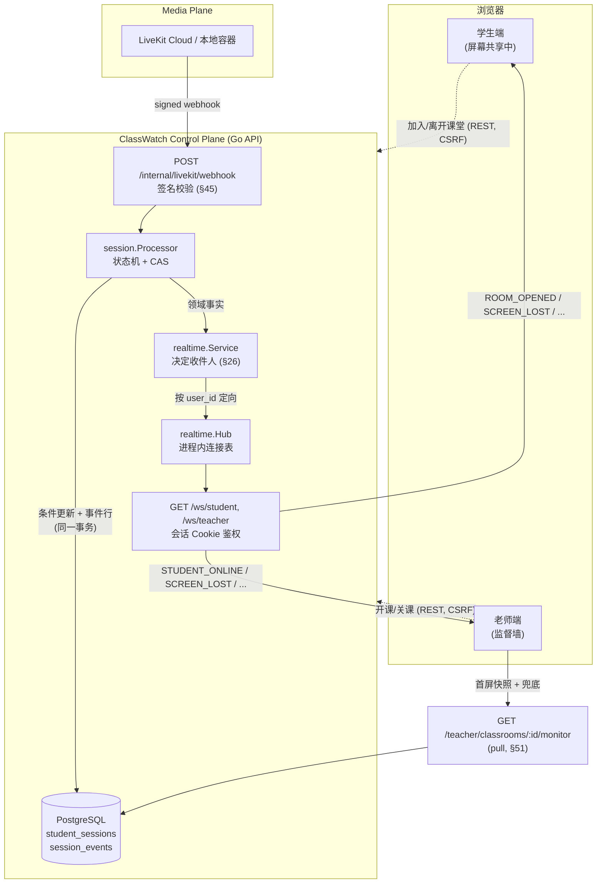
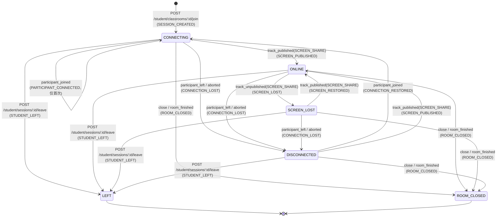
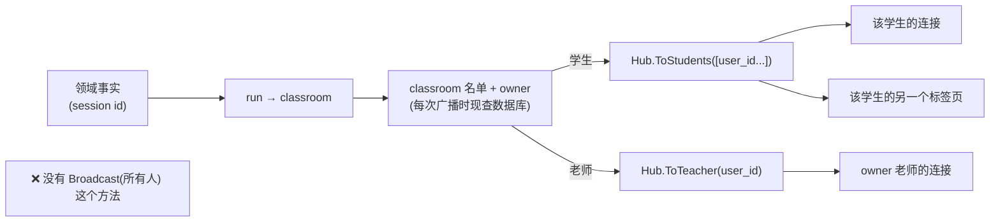

# 实时事件流（Business Realtime）

> 本文档描述 **Phase 8 已实现**的控制面实时链路：LiveKit Webhook 如何变成会话状态、
> `session_events` 如何被写入、业务 WebSocket 如何把变化推给两个前端，以及**谁能收到什么**。
>
> 一句话概括本 Phase 的成败标准（任务书 §74）：
>
> > **会话状态与屏幕状态由服务端权威判定，前端只负责快速反馈。**
>
> 相关文档：[控制面](control-plane.md)、[状态机](../database/state-machines.md)、
> [数据库设计](../database/schema.md)、[LiveKit 架构](../media/livekit-architecture.md)、
> [Track 权限](../media/track-permissions.md)。

---

## 1. 为什么业务消息不走 WebRTC DataChannel（§47）

LiveKit 自带 DataChannel，看起来"顺手"就能把 `SCREEN_LOST` 塞进去。**明确不做**，原因有三层：

| 问题 | 走 DataChannel | 走独立 WebSocket |
| --- | --- | --- |
| 需要什么才能收到 | 必须已连上媒体房间、已协商出 DataChannel | 只需一个已登录的会话 Cookie |
| 房间被 `TerminateRoom` 之后 | 消息**送不出去**——而那正是"老师关课了"最需要送达的时刻 | 照常送达 |
| 媒体面故障时 | 控制面消息随媒体面一起消失 | 控制面独立于媒体面（§33） |
| 学生之间的隔离（§26） | DataChannel 是房间级广播，隔离靠客户端自觉 | 服务端按 `user_id` 定向投递，**没有"广播给所有人"的 API** |

最后一条是决定性的：DataChannel 的可见范围是"房间里的每个人"，而本项目的核心业务规则是
"每个学生只能看到自己的状态"。把业务消息放进一个房间级通道，等于把 §26 的隔离交给客户端实现。

结论：**控制面消息走 `/ws/student`、`/ws/teacher`；WebRTC 只搬音视频。** 两条链路各自独立失败、
独立恢复。

---

## 2. 双通道分工：客户端 = 快 UX，服务端 = 权威（§46）

`SCREEN_LOST` 有两套检测，它们**不是冗余**，而是分工：

```text
第一层（浏览器）  MediaStreamTrack.onended / getSettings().displaySurface
                  ↓
                  立刻改 UI："⚠ 已停止屏幕共享 [重新共享整个屏幕]"
                  ↓
                  不发任何"我已经掉了"的请求 —— 服务端没有这种接口可调

第二层（服务端）  LiveKit webhook: track_unpublished (source=SCREEN_SHARE)
                  ↓
                  student_sessions.status: ONLINE → SCREEN_LOST
                  session_events: SCREEN_LOST
                  ↓
                  WebSocket 广播 SCREEN_LOST（老师 + 该学生本人）
```

|  | 客户端事件 | 服务端观测 |
| --- | --- | --- |
| 触发者 | 浏览器（可以被改写、可以撒谎） | LiveKit（签名保护，客户端无法伪造） |
| 作用 | **快**：本地 UI 立刻反应，不等网络往返 | **权威**：写数据库、写事件、决定监督墙 |
| 能不能改状态 | ❌ 不能。学生端**没有**"上报我的状态"的接口 | ✅ 只有它能 |
| 丢了会怎样 | 老师端晚几百毫秒看到 | 状态与事件缺失 → 监督墙说谎 |

这条规则在代码里的落点：`session.Service` 的 Join/Leave 只做"进入/离开"这两个**用户主动动作**，
所有"媒体层面的状态"都由 `session.Processor` 从 webhook 推导（`internal/session/processor.go`）。
学生前端能调的只有"我要进入"和"我要离开"，**没有任何字段可以让它声明自己 ONLINE**。

---

## 3. 完整数据流



要点：

1. **推（push）与拉（pull）并存**。WebSocket 只负责"变化很快地到达"；`/monitor` 仍然是权威快照，
   用于首屏渲染、断线重连、以及事件丢失时的兜底。前端不变量：**任何时刻都可以只靠 pull 恢复正确画面。**
2. **状态先落库，再广播**。广播失败只记 Warn，数据库才是事实（§33）。
3. **webhook 是唯一能把会话推进到 ONLINE 的入口**。

---

## 4. 状态迁移图（含幂等 / 乱序 / 终态规则）



逐条规则与"为什么"写在 [状态机文档](../database/state-machines.md) §5。这里只强调三条工程约束：

### 4.1 每一次写入都是 CAS（compare-and-set）

webhook 是**至少一次投递、且可能乱序**的。所以处理器从不"读出来判断、再写回去"，而是发出
一条带前置状态的语句：

```sql
UPDATE student_sessions
   SET status = $3, ...
 WHERE id = $1
   AND status = ANY($2::text[])      -- 前置状态守卫（CAS）
   AND (NOT $7 OR connected_at IS NULL)
RETURNING ...
```

- **重复投递**：第二次 `track_published` 发现会话已经是 `ONLINE`，而 `ONLINE` 不在前置集合里 →
  匹配 0 行 → **不产生第二次状态迁移，也不写第二条事件**。
- **乱序**：`track_unpublished` 先于 `track_published` 到达时，会话还是 `CONNECTING`，
  守卫不匹配 → 什么也不做（不会凭空产生"屏幕丢了"）；随后真正到达的 `track_published` 把它推进到
  `ONLINE`，得到正确终局。
- **终态不可逆**：`LEFT` / `ROOM_CLOSED` **从不出现在任何 `From` 集合里**，所以迟到的事件
  不可能把会话改回 `ONLINE`。

事件行与状态更新在**同一个事务**里写入（`ApplyTransition`）：状态变了而事件丢了，等于"没人能解释
墙上为什么变成这样"。

### 4.2 唯一的例外与它的守卫

`participant_joined` 在 `CONNECTING` 上**不改变状态**（只记 `connected_at`）。状态没变，CAS 就
无法区分"第一次"和"重复投递"，因此它的守卫是时间戳：

```sql
AND (NOT $7 OR connected_at IS NULL)   -- OnlyIfNeverConnected
```

`connected_at` 只写一次（`COALESCE(connected_at, now())`），于是重复投递匹配 0 行。

### 4.3 关课与 `room_finished` 的竞态

```text
老师 close：  事务提交（classroom CLOSED / run CLOSED）
              → 会话批量置 ROOM_CLOSED（一条 UPDATE + 每行一条事件）
              → TerminateRoom（媒体面清理）
              → 广播 ROOM_CLOSED
LiveKit：     room_finished webhook 随后到达（谁先谁后是竞态）
              → 同一批量语句：活跃会话已经没有了 → 匹配 0 行 → 无事件、无广播
```

两条路径**共用同一个批量语句**，守卫是"活跃状态集合"，因此天然幂等：谁先到谁生效，后到的什么也不做。
（对应测试：`TestSignedWebhookDrivesTheSessionStateMachineEndToEnd` 的最后一节。）

---

## 5. WebSocket：鉴权、作用域与契约

### 5.1 鉴权：复用登录 Cookie，**绝不**把 token 放进 URL

```text
GET /ws/student   Cookie: classwatch_session_student=...
GET /ws/teacher   Cookie: classwatch_session_teacher=...
```

握手用的是**和所有 REST 路由完全相同的判定函数**（`authMiddleware.authenticate`，REST 中间件与
socket 处理器共用同一份实现，不存在第二套授权逻辑）。失败时有两种表现，取决于**请求本身**：

| 请求 | 失败表现 | 为什么 |
| --- | --- | --- |
| 真正的 WebSocket 握手（浏览器） | **升级成功，随即用 close code 关闭**：`4401`（无有效会话）/ `4403`（会话属于另一个入口） | 浏览器**读不到**握手失败的 HTTP 状态码——它只知道"连接失败"，401/403/地址写错完全一样。close code 是唯一能到达前端的通道 |
| 普通 GET（curl、运维探针、健康检查） | 标准错误信封：`401 AUTH_REQUIRED` / `403 ROLE_FORBIDDEN` | 探针不会说 WebSocket，给它 JSON 才可读；也避免"任何 GET 都被升级" |

被拒绝的 socket **从不注册进 Hub**、没有读协程、收不到任何消息，它只为那一帧 close 存在。
`4401/4403` 属于 RFC 6455 的私有区间（4000-4999），是冻结契约的一部分（见 §5.6）。

为什么不在 URL 里带 token（`/ws/student?token=...`）：URL 会进入 access log、代理日志、
浏览器历史与 Referer。**凭据只能待在 Cookie 和 Authorization 头里。**

浏览器不会对 WebSocket 握手施加 CORS，所以"跨站 WebSocket 劫持"是真实威胁：本项目的第二道防线是
**Origin 白名单**（与 `CORS_ALLOWED_ORIGINS` 同一份配置）。攻击页面无法伪造 `Origin`，
白名单之外的握手一律 `403`；非浏览器客户端（探针、脚本）不带 `Origin`，因此不受影响。

### 5.2 消息信封（**冻结契约**）

```json
{ "type": "SCREEN_LOST", "at": "2026-10-03T19:31:42Z", "data": { "sessionId": "..." } }
```

- `at` 是服务端产生消息的 UTC 时间（RFC3339）。
- `data` **永远是对象**，即使没有内容也是 `{}`（客户端可以无条件写 `msg.data.x`）。

| type | 收件人 | data |
| --- | --- | --- |
| `ROOM_OPENED` | **只发该课堂被授权的学生**（老师端不接收，见下方说明） | `{classroomId, classroomName, runId, openedAt}` |
| `ROOM_CLOSED` | 该课堂学生 + owner 老师 | `{classroomId, runId, closedAt}` |
| `STUDENT_ONLINE` | owner 老师 | `{studentId, displayName, sessionId}` |
| `STUDENT_OFFLINE` | owner 老师 | `{studentId, sessionId, reason}`，reason ∈ `DISCONNECTED`/`LEFT`/`ROOM_CLOSED` |
| `SCREEN_LOST` | owner 老师 **+ 该学生本人** | 老师侧 `{studentId, sessionId}`；学生侧 **只有** `{sessionId}` |
| `SCREEN_RESTORED` | owner 老师 **+ 该学生本人** | 同上 |
| `CAMERA_CHANGED` / `MIC_CHANGED` | owner 老师 | `{studentId, sessionId, active}`（Phase 9/10 才产生，常量已冻结） |
| `PRIVATE_TALK_REQUEST` / `STARTED` / `ENDED` | 指定学生 | Phase 10（本 Phase 只定义常量） |
| `PING` → `PONG` | 请求方 | `{}` |

**同一个 `type` 给两个角色时，`data` 可以不同**，而且必须不同：老师需要知道这块磁贴是谁，
学生**不需要也不允许**知道别人是谁。学生侧的 `SCREEN_LOST` 因此只带自己的 `sessionId`。

`ROOM_OPENED` **只发学生**：老师是发出开课请求的那个人，HTTP 响应已经告诉他结果了。
由此产生一个已知限制：老师在**另一个标签页**开课时，本页不会自动刷新（它不会收到 `ROOM_OPENED`）。
前端把开课/关课当作"本页动作的返回值"处理即可；跨标签页的一致性由下一次页面加载或
`/monitor` 轮询兜底。如果将来要消除这个限制，做法是给 `ROOM_OPENED` 增加老师收件人
（契约变更，需要前后端同时改），而不是在前端轮询猜测。

### 5.3 作用域隔离（§26）：靠类型系统，而不是靠自觉



四道防线，每一道都有测试：

1. **Hub 的 API 只有 `ToStudents(ids)` 和 `ToTeacher(id)`** —— 不存在"发给所有人"的方法，
   因此"把 A 的状态发给 B"必须先谎报 A 是谁。
2. **收件人每次广播时从数据库现查**（`classroom_students` 名单 + `classrooms.owner_teacher_id`），
   而不是连接建立时缓存。学生被移出名单后立刻收不到；课堂中途加入的学生立刻收得到。
3. **不在名单上的人不产生消息**：一个已经离开名单的学生，其残留会话不会让老师的墙上多出一张
   没有名单依据的卡片。
4. **学生侧消息不带任何他人标识**（上表的 `data` 只有 `sessionId`）。

测试：`internal/realtime/hub_test.go`（连接级隔离）、`internal/realtime/service_test.go`（受众级隔离）、
`internal/httpapi/runtime_state_integration_test.go`（真实 socket：学生 A 掉屏时，学生 B 的 socket
**一条消息都收不到**）。

### 5.4 客户端 → 服务端：只有一个消息

```json
{ "type": "PING" }   →   { "type": "PONG", "at": "...", "data": {} }
```

其余任何消息**忽略并记 Debug 日志**，不做业务解析。原因：状态变更只能从 REST 入口发起
（那里有 CSRF、限流、所有权校验）。如果 socket 也能改状态，就等于在服务端开了第二条授权路径，
而它没有经过任何一层校验。

### 5.5 心跳、超时与慢消费者

| 机制 | 值 | 为什么 |
| --- | --- | --- |
| 服务端控制帧 `PING` | 25s | 浏览器**无需任何 JS** 自动回 `PONG`；这是真正检测死连接的手段 |
| 读超时 `PongWait` | 60s | 客户端静默超过它即认为已死（休眠的笔记本、被 NAT 丢弃的流） |
| 应用级 `PING`/`PONG` | 客户端发起 | 契约的一部分：前端可以测 RTT、可以同步探测链路 |
| 写超时 `WriteWait` | 5s | 一次写不允许拖住广播 |
| 单连接写队列 | 32 条 | 吸收突发；**队列满 → 丢弃该消息并断开这条连接** |

**为什么队列满就断开，而不是阻塞或静默丢弃**：

- 阻塞 → 一个不读的客户端会拖住整个进程的广播；而 webhook 处理是同步广播的，
  最终连 webhook 也会被拖住。
- 静默丢弃 → 这个客户端会拿着一份过期的画面**并且以为自己是最新的**，正是本 Phase 要消灭的
  "墙与事实不一致"。
- 断开 → 客户端走重连逻辑，重连后第一件事是拉 `/monitor` 快照——**权威状态，而不是它错过的消息**。
  慢消费者测试（`TestASlowConsumerIsDisconnectedInsteadOfBlockingTheBroadcast`）证明：慢的那个被断开，
  同房间健康的那个**不受影响**。

### 5.6 失败与重连语义

**close code 契约**（两侧都要按它分支）：

| close code | 含义 | 客户端应做 |
| --- | --- | --- |
| `4401` | 没有有效会话（Cookie 缺失、过期、被吊销，或账号被停用） | **停止重连**，跳登录页 |
| `4403` | 会话有效，但属于另一个入口（学生 Cookie 连老师 socket，或反之） | 跳对应入口；这是前端的实现 bug，重连无用 |
| `1008`（Policy Violation） | 服务端判定这个消费者太慢，主动断开 | 退避重连；顺便检查自己的消费速度 |
| `1001`（Going Away） | 服务端滚动发布（优雅关闭先发 Close 帧） | 退避重连，不要当作网络故障 |
| 其它 / `1006` | 网络中断、休眠、代理切断 | 指数退避重连 + **先拉一次 `/monitor` / `/student/classrooms` 快照** |

| 场景 | 服务端 | 客户端应做 |
| --- | --- | --- |
| socket 断开（网络、休眠） | 连接表里移除 | 指数退避重连 + 拉快照 |
| 握手失败（HTTP 层） | 见上表：升级后 close，或非握手请求回信封 | 按 close code 分支 |
| 从未连上 | —— | 纯 pull 轮询仍然可用（Phase 7 的行为被保留） |

心跳方向：**客户端每 25s 发 `{"type":"PING"}`**，服务端**立即**回 `{"type":"PONG"}`（同一个读循环里
入队，不经过任何业务逻辑）。服务端另外每 25s 发一个 WebSocket 控制帧 PING（浏览器自动回 PONG，
无需 JS），读超时 60s —— 因此一个正常的前端**不会**因为"没发业务消息"被断开，而一个真正死掉的
连接（休眠、NAT 断流）会在一分钟内被回收。

**"事件丢失"是设计内的**：WebSocket 是**加速器**，不是事实来源。任何一次页面加载、
任何一次重连、任何一次怀疑，都用 pull 覆盖。

---

## 6. 接入点：广播从哪里发出

| 时机 | 广播 | 代码位置 |
| --- | --- | --- |
| 开课事务**提交后** | `ROOM_OPENED` → 该课堂学生 | `classroom.Service.announceOpen` |
| 关课事务**提交后** | 会话批量 `ROOM_CLOSED` → 广播 `ROOM_CLOSED` → 学生 + owner | `classroom.Service.closeRunSessions` / `announceClose` |
| webhook 迁移后（ONLINE） | `STUDENT_ONLINE` → owner | `session.Processor.notifyOnline` |
| webhook 迁移后（掉屏/恢复） | `SCREEN_LOST` / `SCREEN_RESTORED` → owner + 本人 | `session.Processor.notifyScreen` |
| webhook 迁移后（断线） | `STUDENT_OFFLINE(DISCONNECTED)` → owner | `session.Processor.notifyOffline` |
| `room_finished` | 每行 `STUDENT_OFFLINE(ROOM_CLOSED)` + 一次 `ROOM_CLOSED` | `session.Processor.roomFinished` |
| 学生主动离开 | `STUDENT_LEFT` 事件 + `STUDENT_OFFLINE(LEFT)` | `session.Processor.SessionLeft` |

共同原则（沿用 Phase 6）：

```text
数据库 → 媒体面 → 广播
   ↑         ↑        ↑
 唯一事实   尽力而为   尽力而为（失败只 Warn，不回滚）
```

---

## 7. 部署前提：LiveKit Cloud 的 webhook 必须指向一个**公网可达**地址

`POST /internal/livekit/webhook` 是 LiveKit 主动回调的入口。本地 `localhost:8080` 对 LiveKit Cloud
是不可见的，因此：

- **本地/CI**：用自签名的 webhook 请求验证整条链路（测试里就是这么做的：
  `auth.NewAccessToken(key, secret).SetSha256(sha256(body))`，与 LiveKit 的 `URLNotifier` 完全一致）。
- **真实环境**：必须在 LiveKit 项目里配置 webhook URL，指向一个 HTTPS 可达的 API 地址
  （反向代理/隧道均可），并把 `LIVEKIT_API_KEY` / `LIVEKIT_API_SECRET` 与该项目对齐。
  签名校验用的是同一对密钥，因此密钥不一致的表现是"所有 webhook 都是 401"，
  日志里会出现 `livekit webhook rejected`。

没有这条配置时，系统**不会坏**：会话会停在 `CONNECTING`（学生已进入但没有"屏幕已确认"的观测），
老师端靠 `/monitor` 的 pull 观测仍能看到画面。这是有意的降级，而不是故障。

---

## 8. 演进接缝：进程内 Hub → Redis fan-out

**Phase 8 的 Hub 在进程内**，这一点在任务书 §52 的单实例假设下是正确的：一个 API 实例，
一张连接表。

```go
// internal/realtime/service.go
type Broadcaster interface {
    ToStudents(students []uuid.UUID, msg Message)
    ToTeacher(teacherID uuid.UUID, msg Message)
}
```

`Hub` 只是这个接口的一个实现。多实例部署（Phase 11/12）时：

```text
实例 A 处理 webhook → 广播 → Redis pub/sub channel  "classwatch:events"
实例 B 订阅该 channel → 本地 Hub → 连在 B 上的浏览器
```

需要一并解决的两件事（本 Phase 不做，但接缝已经留好）：

1. **受众解析仍在每个实例上做**（每个实例都有数据库连接），所以 Redis 上发布的是
   **已定址的消息**（学生 id 列表 + 信封），而不是领域事实——避免订阅方各自解释一遍授权。
2. **连接表不共享**：`Connections(role, userID)` 只反映本实例。任何"某人在线吗"的判断
   都不能用它，必须是数据库里的 `student_sessions`。

因此：**Hub 换成 Redis 适配器是 `cmd/api` 的接线改动，而不是服务层改动。**

---

## 9. 相关测试（可执行的规则清单）

| 规则 | 测试 |
| --- | --- |
| webhook 签名失败 → 401，且不写状态 | `internal/httpapi/runtime_routes_test.go`、`runtime_state_integration_test.go` |
| 只有 `track_published(SCREEN_SHARE)` 能让会话 ONLINE | `internal/session/processor_test.go` |
| 重复投递只迁移一次、只写一条事件 | `processor_test.go`、`events_integration_test.go`、`runtime_state_integration_test.go` |
| 乱序（unpublished 早于 published）不产生错误状态 | `processor_test.go`、`events_integration_test.go` |
| 终态（LEFT / ROOM_CLOSED）不被迟到事件改回 | `processor_test.go`、`events_integration_test.go` |
| 未知 identity / 未知事件类型 → 200 且不写状态 | `processor_test.go`、`runtime_state_integration_test.go` |
| 学生连接收不到其他学生的任何事件 | `internal/realtime/hub_test.go`、`runtime_state_integration_test.go` |
| 学生侧 `SCREEN_LOST` 不含他人标识 | `internal/realtime/service_test.go` |
| 慢消费者被断开且不影响他人 | `internal/realtime/hub_test.go` |
| 关课时先结束会话、再广播；`room_finished` 幂等 | `internal/classroom/runtime_hooks_test.go`、`runtime_state_integration_test.go` |
| 迁移幂等、CHECK 覆盖 §13、`payload` 是 jsonb | `internal/session/events_integration_test.go` |
