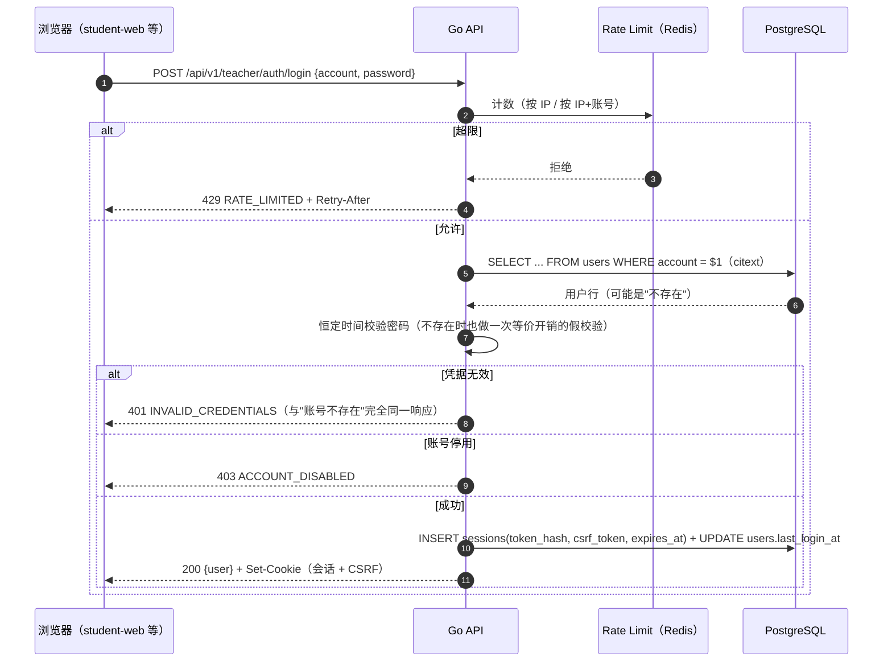
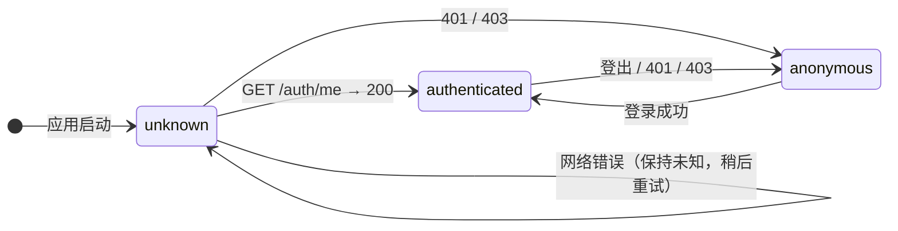

# 认证机制（Authentication）

> 本文档说明 ClassWatch 的登录、会话与凭据处理方式，以及**为什么**这样设计。
> 相关：授权规则见 [rbac.md](rbac.md)，表结构见 [../database/schema.md](../database/schema.md)。

---

## 1. 三种登录方式

| 入口 | 接口 | 请求体 | 服务端校验顺序 |
| --- | --- | --- | --- |
| 学生 | `POST /api/v1/student/auth/login` | `{"account":"S10086"}` | 账号存在 → `role == STUDENT` → `status == ACTIVE` |
| 老师 | `POST /api/v1/teacher/auth/login` | `{"account":"teacher001","password":"..."}` | 账号存在 → `role == TEACHER` → Argon2id 校验 → `status == ACTIVE` |
| 管理员 | `POST /api/v1/admin/auth/login` | `{"account":"admin","password":"..."}` | 同上，`role == ADMIN` |

- 账号是 **citext**（大小写不敏感）：`S10086` 与 `s10086` 是同一个人。否则"大小写打错就进不去课堂"会成为最常见的现场故障。
- 学生**没有注册入口**，老师与管理员同样**不能自助注册**：账号只能由管理员创建（任务书 §2.2/§3/§4）。
- 登录成功后统一返回 `{"user": {...}}`，**从不返回** `password_hash`、会话 token 或 CSRF token（后者通过可读 Cookie 下发）。

### 1.1 学生为什么没有密码

这是任务书 §2.2 明确接受的业务模型，不是"还没做"：

- 优点：零门槛进入课堂。远程课堂真正的失败模式是"学生进不来"，而不是"有人冒名顶替"。
- 代价：**知道某个学生账号的人，理论上可以冒充该学生。**
- 因此必须用工程手段补偿（这些是硬性要求，不是可选项）：
  - IP / API 限流（防止批量枚举账号）
  - 服务端 Classroom Authorization（就算冒充成功，也只能进"这个学生被授权的课堂"）
  - Session 管理（可过期、可撤销，管理员可强制下线）
  - Disabled account 检查（停用后立刻失效）
  - 全部操作留 `session_events` 审计（Phase 8）

> 严禁把这套模型包装成"强身份认证"。文档与产品文案都不得暗示学生登录是可信的身份证明。

---

## 2. 密码存储：Argon2id

| 项 | 值 | 说明 |
| --- | --- | --- |
| 算法 | Argon2id | 抗 GPU/ASIC 暴力破解，且对侧信道攻击有抵抗力 |
| 内存 | 64 MiB | 让并行破解的显存成本急剧上升 |
| 迭代 | 3 | 与内存参数共同决定单次校验成本（约几十毫秒） |
| 并行度 | 2 | 单次校验使用 2 条 lane |
| 盐 | 16 字节，`crypto/rand` | 每个密码独立随机盐，杜绝彩虹表 |
| 输出 | 32 字节 | |
| 存储格式 | PHC 字符串 `$argon2id$v=19$m=65536,t=3,p=2$<salt>$<hash>` | 参数随哈希一起存，未来升级参数不需要迁移脚本 |

明确禁止（任务书 §3）：明文、MD5、裸 `SHA256(password)`、可逆加密。

其它规则：

- **参数透明升级**：校验成功时若发现哈希参数低于当前策略（例如内存从 64MiB 提到 128MiB），
  立即用新参数重新哈希并写回，用户无感知。这就是"参数存进哈希里"的价值。
- **密码策略**：长度 12–128，不能全是空白，不能等于账号本身。
  上限 128 是为了防止"超长密码"变成 CPU 消耗型 DoS。
- **比较是常量时间的**：`subtle.ConstantTimeCompare`，避免通过响应时间推断哈希前缀。
- 密码**永不进日志**：错误信息、结构化日志、panic 上下文都不允许出现明文密码（§59）。

---

## 3. 会话（Session）：opaque token + 服务端存 hash

任务书 §41 要求：256-bit 随机 opaque token，浏览器用 HttpOnly Cookie 保存，服务端只保存 `hash(token)`。

```text
登录成功
   │
   ├─ 生成 32 字节 crypto/rand → base64url（43 字符）        ← 只在这一刻存在于响应中
   ├─ 计算 SHA-256(raw) → 存 sessions.token_hash (bytea)     ← 数据库里永远没有原始 token
   ├─ 生成 CSRF token → 存 sessions.csrf_token
   └─ Set-Cookie × 2（会话 Cookie + CSRF Cookie）
```

为什么是 opaque token 而不是 JWT：

| | opaque + 服务端记录（本项目） | 自包含 JWT |
| --- | --- | --- |
| 撤销 | `UPDATE sessions SET revoked_at = now()`，**立即生效** | 需要黑名单或等过期，否则撤销不生效 |
| 停用账号 | 每次请求 JOIN `users` 即可立即失效 | Token 内的角色/状态是签发时的快照，停用后仍可用到过期 |
| 泄漏影响 | 数据库里只有 hash，拖库也拿不到可用 token | 签名密钥泄漏 = 可伪造任意身份 |
| 代价 | 每个请求一次数据库查询（课堂规模下完全可接受） | 无状态 |

课堂监督系统里"能立刻把某个学生踢下线"比"省一次数据库查询"重要得多。

### 3.1 Cookie 属性

| 属性 | 会话 Cookie | CSRF Cookie |
| --- | --- | --- |
| 名称 | `classwatch_session_{student\|teacher\|admin}` | 同名 + `_csrf` |
| `HttpOnly` | ✅（JS 读不到，XSS 也偷不走） | ❌（前端要读出来放进请求头） |
| `Secure` | 跟随 `SESSION_COOKIE_SECURE`（生产必须 true） | 同左 |
| `SameSite` | `Lax` | `Lax` |
| `Path` | `/` | `/` |
| `Max-Age` | `SESSION_TTL`（默认 24h） | 同左 |

**按入口区分 Cookie 名**的原因：Cookie 的隔离维度是"域 + 路径"，**端口不隔离**。
开发环境三个前端共用 `localhost` 这一个 Cookie 域，若共用一个名字，
在老师端登录会把学生端的会话覆盖掉（表现为"另一个入口莫名其妙掉线"）。

### 3.2 生命周期

- **固定 TTL**（默认 24h）：不做"滑动续期"。监督系统的目标是"课堂期间连接稳定"，
  而不是"会话永不掉线"；固定过期更可预测，也让"上课前重新登录一次"成为正常操作。
- **到期判定**：`expires_at <= now()` 即无效；判定在 SQL 里完成，不依赖应用时钟一致性。
- **撤销**：登出、停用账号、重置密码都会撤销（重置密码撤销该用户全部会话，见 §6）。
- **清理**：过期/已撤销的行由 `DeleteExpired` 机会式清理（例如用户下次登录时），
  不引入额外的后台任务——课堂规模下不需要更复杂的机制。
- **`last_seen_at` 节流写入**：默认最多每 5 分钟更新一次，避免"每个请求一次写"造成的写放大。

### 3.3 登录时序



注意上面那条"**账号不存在时也做一次等价开销的假校验**"：
否则响应时间会泄露账号是否存在，让限流之外又多出一条枚举通道。

---

## 4. CSRF 防护

会话基于 Cookie，浏览器会自动携带，因此**必须**防跨站请求伪造（任务书 §63）。

采用**双提交 + 服务端比对**：

```text
1. 登录时服务端生成 csrf_token，同时：
     - 存进 sessions.csrf_token
     - 通过**非 HttpOnly** Cookie 下发给前端
2. 前端对每个非安全方法（POST/PUT/PATCH/DELETE）读取该 Cookie，
   放进请求头 X-CSRF-Token
3. 服务端用常量时间比较：请求头 == 该会话记录中的 csrf_token
   不匹配或缺失 → 403 CSRF_INVALID
```

为什么 `SameSite=Lax` 不够：它只覆盖"跨站携带 Cookie"这一类场景，
对同站子域、历史浏览器行为、以及未来可能的 `SameSite=None` 需求都不构成保证。
双提交 + 服务端存储比对把"攻击者能构造请求"与"攻击者能读到 token"彻底分开。

登录端点本身不需要 CSRF（此时还没有会话），但**必须**经过 Origin allowlist 与限流。

### 4.1 CSRF 失败时的处理（已认证请求）

```text
已认证 + X-CSRF-Token 缺失或不匹配
    → 403 CSRF_INVALID
    → 清除该入口的会话 Cookie 与 CSRF Cookie（Max-Age=0）
    → **不撤销**服务端 session（仍按 TTL 过期）
```

两处取舍要说明白：

- **为什么清 Cookie**：CSRF 失败意味着浏览器端的 Cookie 状态已经自相矛盾
  （例如只剩会话 Cookie、CSRF Cookie 被单独删掉）。留着会话 Cookie 会让前端
  陷入"看起来还登录着，但每个写操作都失败"的僵尸状态。
- **为什么不撤销 session**：客户端状态不一致 ≠ 会话被盗。撤销会让"用户手动删了一个
  Cookie"升级成"被迫重新登录"，而且无法区分这两者。真正的会话撤销走 logout /
  停用账号 / 重置密码三条明确路径。

---

## 5. 限流（Rate Limit）

| 层 | 维度 | 默认 | 目的 |
| --- | --- | --- | --- |
| 登录（IP） | 客户端 IP | 10 次/分钟 | 阻止单机暴力尝试 |
| 登录（IP + 账号） | IP + account | 5 次/10 分钟 | 阻止针对某个账号的慢速撞库 |
| API（全局） | 客户端 IP | 300 次/分钟 | 阻止接口滥用与爬取 |

- 实现：Redis 固定窗口计数（`INCR` + `EXPIRE`，Lua/pipeline 保证原子）。
- **客户端 IP 的信任边界**：只有当 `RemoteAddr` 落在 `TRUSTED_PROXIES`（可配置 CIDR 列表）内时，
  才采用 `X-Forwarded-For` / `X-Real-IP`；否则一律使用 `RemoteAddr`。
  否则任何人都能伪造 `X-Forwarded-For` 把限流绕过去。
- **Redis 故障时降级到进程内计数器**（而不是直接放行）：
  既保住可用性（课堂期间不能因为 Redis 抖动就把所有人挡在门外），
  又保住基本的单机防护。降级会打 Warn 日志。
- 超限响应：`429 RATE_LIMITED` + `Retry-After: <秒>`。

---

## 6. 账号枚举与错误语义

| 情况 | 返回 | 说明 |
| --- | --- | --- |
| 账号不存在 | `401 INVALID_CREDENTIALS` | **与密码错误完全相同的响应体** |
| 密码错误 | `401 INVALID_CREDENTIALS` | |
| 角色与入口不匹配（如老师账号登录学生端） | `401 INVALID_CREDENTIALS` | 同样不透露"这个账号存在但不是这个角色" |
| 账号已停用 | `403 ACCOUNT_DISABLED` | 这是唯一允许"确认账号存在"的响应：停用账号本人需要知道自己为什么进不去 |
| 缺少/错误 CSRF | `403 CSRF_INVALID` | |
| 触发限流 | `429 RATE_LIMITED` | |

`INVALID_CREDENTIALS` 是为认证场景**新增**的错误码（任务书 §58 的清单之外）。
理由：用 `AUTH_REQUIRED` 表示"凭据错误"会让前端无法区分"会话过期"与"密码打错了"，
而这两者的正确 UX 完全不同。

---

## 7. 破窗工具：`adminctl`

第一个管理员必须由初始化命令创建（任务书 §4），且后续也需要"忘记密码"的兜底手段。

```bash
# 交互式创建初始管理员（密码不回显）
make create-admin

# 创建老师 / 学生
make create-user ROLE=TEACHER
make create-user ROLE=STUDENT

# 重置密码（会撤销该用户全部会话）
make reset-password ACCOUNT=teacher001

# 查看账号
make list-users
make list-users ROLE=STUDENT
```

规则：

- 密码**只能**从 stdin 传入（`--password-stdin`），不支持命令行明文参数：
  命令行会进 shell history、`ps` 输出与 CI 日志。
- `STUDENT` 必须不提供密码，`ADMIN`/`TEACHER` 必须提供——这条规则同时由数据库约束兜底
  （`users_password_by_role`），所以即使有人直接写 SQL 也造不出"有密码的学生"。
- 容器内以 `docker compose run --rm adminctl ...` 调用（`tools` profile，不会随 `make up` 启动）。

---

## 8. 运维手册

| 场景 | 操作 | 效果 |
| --- | --- | --- |
| 学生账号疑似被冒用 | 停用账号（Phase 2 管理员界面 / SQL） | 该账号所有会话立即 403，无法再进入课堂 |
| 老师密码泄漏 | `make reset-password ACCOUNT=...` | 新密码生效 + **该老师所有会话被撤销**（Phase 2 起由管理端 API 同样处理） |
| 需要全员强制重新登录 | `UPDATE sessions SET revoked_at = now() WHERE revoked_at IS NULL` | 所有入口立即失效 |
| 排查某次登录 | 结构化日志中的 `request_id`、`user_id`、`role` | 日志里**没有**密码、token、Cookie 值 |

---

## 9. 前端会话生命周期（三个 SPA）

每个入口的前端只关心**自己那一个 Cookie**，`packages/api-client` 负责把 CSRF Cookie 变成请求头。



设计要点：

1. **三态而不是布尔值**。`unknown`（还没问过服务端）与 `anonymous`（问过，确实没登录）
   必须区分：把网络抖动当成"未登录"会把用户莫名其妙弹回登录页，而且怎么点都回不去。
   网络错误时保持 `unknown` 并放行，页面显示"正在确认登录状态"，网络恢复后自动重试。
2. **bootstrap 幂等**：`/auth/me` 在应用启动、路由跳转时可能被触发多次，
   用 in-flight Promise 去重 + 短保鲜期，保证同一时刻只有一次请求。
3. **路由守卫**（`apps/*/src/router/guard.ts`）：
   - 受保护路由未登录 → 重定向到本入口登录页，并带上 `?redirect=`（白名单校验，防开放重定向）
   - 已登录访问登录页 → 跳 dashboard
   - 已登录但角色与本入口期望不符 → 撤销本入口会话并回登录页（并有防无限重定向的保护）
   - **前端守卫只是 UX**：真正的授权边界是服务端的 Session + Role 中间件（§37/§63）
4. **CSRF 头的产生**：前端每次写请求实时读取 `classwatch_session_<entry>_csrf` Cookie
   并放入 `X-CSRF-Token`；不缓存空值（登录前读不到），Cookie 缺失时不发送空头
   （让服务端明确返回 `CSRF_INVALID`，而不是无法区分"空头"与"没头"）。
5. **绝不使用 Web Storage 保存凭证**：会话只存在于 HttpOnly Cookie 中（§38）。
   前端 store 里的用户信息只是渲染用的副本，刷新即从 `/auth/me` 重新获取。

---

## 10. 未做（属后续 Phase）

| 项 | Phase |
| --- | --- |
| 管理员用户管理 HTTP API（创建/停用/重置密码的界面化操作） | 2 |
| Classroom 授权检查（`classroom_students`） | 3 |
| 学生端会话与课堂进入（PreJoin、整屏 Gate） | 4–5 |
| WebSocket 鉴权（复用同一套会话与会话 Cookie） | 8 |
| HTTPS、HttpOnly+Secure 强制、CSRF 覆盖全站写接口、限流参数按环境调优 | 11 |
| MFA、密码找回、登录验证码 | 明确不在 V1（任务书 §54：不得自行增加） |
