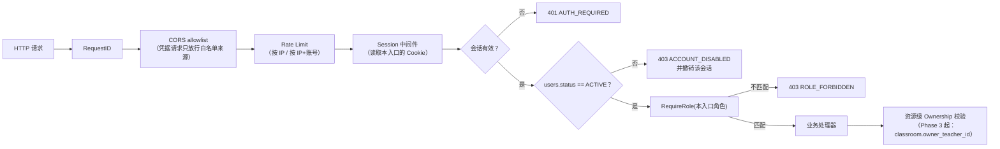

# 授权模型（RBAC 与资源边界）

> 一句话总纲（任务书 §37）：
> **前端隐藏按钮只是 UX；真正的授权边界永远在服务端。**

---

## 1. 三类角色

| 角色 | 中文 | 入口 | 认证方式 | 能做什么（V1 全貌） |
| --- | --- | --- | --- | --- |
| `ADMIN` | 管理员 | admin-web | account + password | 创建/停用账号、重置老师密码、查看账号列表。**不参与课堂操作** |
| `TEACHER` | 老师 | teacher-web | account + password | 创建与管理**自己拥有的**课堂、添加学生、开启/关闭课堂、监督学生、与指定学生私密语音 |
| `STUDENT` | 学生 | student-web | 仅 account（无密码） | 查看**被授权**的课堂、在课堂 OPEN 时进入并共享整块屏幕 |

角色定义在数据库 `users.role`（`CHECK (role IN ('ADMIN','TEACHER','STUDENT'))`）。
角色**不存在**于 Cookie、Token 或前端状态中，每次请求都从数据库读取当前值 —— 这样管理员改角色/停用账号才会**立即**生效。

---

## 2. 请求授权链

每个受保护请求都要依次穿过下面这条链，任何一环失败都立即终止：



关键点：

1. **会话 → 用户 是一次数据库 JOIN**，角色与状态都取当前值，不取签发时的快照。
2. **停用账号立即失效**：`status = DISABLED` 的请求一律 403，并顺手撤销该会话，
   避免"管理员先停用、后重新启用"时旧会话复活。
3. **Ownership 校验在角色校验之后**（Phase 3 才有资源），
   顺序不能反：先确认"你是谁、你属于哪类角色"，再判断"这个东西是不是你的"。

---

## 3. 入口隔离（三个 Web 应用 = 三条独立的认证通道）

会话 Cookie **按入口区分名字**：

```text
student-web  →  classwatch_session_student   (+ classwatch_session_student_csrf)
teacher-web  →  classwatch_session_teacher   (+ ..._teacher_csrf)
admin-web    →  classwatch_session_admin     (+ ..._admin_csrf)
```

为什么必须分开：

- **开发环境**：三个前端跑在 `localhost:5173/5174/5175`。Cookie 的隔离维度是**域 + 路径**，**端口不隔离**。
  若共用一个名字，老师端登录会覆盖学生端的会话（"我在老师端登录，学生端就掉线了"）。
- **生产环境**：三个域名本就互不共享 Cookie，但分开命名能让日志、抓包、排障时一眼看出这条会话属于哪个入口。
- **纵深防御**：即使某个入口的会话 Cookie 泄漏到另一个入口的请求里，
  另一个入口的 Session 中间件根本不会去读它，而 `RequireRole` 也会拒绝。

跨入口拒绝是**必须测试**的行为（任务书 §67 重点测试项）：

| 请求 | 期望 |
| --- | --- |
| 学生会话 → `GET /api/v1/teacher/auth/me` | `403 ROLE_FORBIDDEN` |
| 老师会话 → `GET /api/v1/admin/auth/me` | `403 ROLE_FORBIDDEN` |
| 无任何会话 → 任意入口的受保护端点 | `401 AUTH_REQUIRED` |
| 停用账号的有效会话 → 任意受保护端点 | `403 ACCOUNT_DISABLED` |

注意前两行与第三行的区别，这不是随手定的：

- 浏览器里**只有本入口**的会话 Cookie 时（例如只登录了学生端），
  访问老师端会得到 `401 AUTH_REQUIRED` —— 对前端来说就是"请登录"。
- 浏览器里**存在另一个入口的有效会话**时（例如同一台电脑上老师也登录过），
  该会话会被服务端真正验证，但角色与本入口不符，因此返回 `403 ROLE_FORBIDDEN`。
  返回 401 会告诉一个"已经登录的老师"说"你没登录"，前端会陷入无法自救的登录循环。
- 两种情况下都**只清除本入口的 Cookie**：另一个入口的会话不受影响
  （在老师端误开学生端页面，不应该把老师踢下线）。

---

## 4. 401 与 403 的语义（前端据此决定行为）

| 状态 | 错误码 | 含义 | 前端应做什么 |
| --- | --- | --- | --- |
| 401 | `AUTH_REQUIRED` | 没有会话、会话过期或已被撤销 | 视为未登录：跳登录页（不要弹出"错误"提示，这是正常路径） |
| 403 | `ACCOUNT_DISABLED` | 账号被管理员停用 | 跳登录页并提示"账号已停用，请联系管理员" |
| 403 | `ROLE_FORBIDDEN` | 已认证，但角色不允许该操作 | 提示无权限；**不要**跳登录页（用户账号没问题） |
| 403 | `CSRF_INVALID` | 写请求缺少或携带了错误的 CSRF token | 服务端会同时清除本入口的两个 Cookie，因此用户需要**重新登录**；这是被跨站构造请求或浏览器 Cookie 状态异常的典型信号 |
| 429 | `RATE_LIMITED` | 触发限流 | 提示稍后重试，遵守 `Retry-After` |

**"没登录" 与 "没权限" 必须严格区分**：把 403 当 401 处理会让用户在"账号正常但没权限"时被反复踢回登录页，这是最常见的授权 UX Bug。

---

## 5. 资源级授权（Phase 3 起，此处先立规矩）

角色只回答"这类用户能不能调用这类接口"，不回答"这个资源是不是他的"。后者必须逐端点显式校验：

```text
POST /api/v1/teacher/classrooms/:id/open
  1. 已认证                    （Session 中间件）
  2. status == ACTIVE          （Session 中间件）
  3. role == TEACHER           （RequireRole）
  4. classroom.owner_teacher_id == principal.UserID   ← 必须显式校验，否则 403 CLASSROOM_NOT_OWNER
```

即使 `ADMIN` 也不能通过普通业务 API 开关别人的课堂（任务书 §4）——
管理员的能力边界是"账号管理"，不是"代替老师上课"。

---

## 6. 反模式清单（评审时逐条检查）

| ❌ 反模式 | 为什么错 |
| --- | --- |
| 前端根据 `role` 隐藏按钮就当作授权 | 攻击者直接用 curl 调用接口；前端代码对攻击者没有约束力 |
| 把角色写进 Cookie / JWT 并信任它 | 客户端可修改；改角色或停用账号后也无法立即失效 |
| 用 401 表示"没权限" | 前端会把有权限问题的用户反复踢回登录页 |
| 在 handler 里手写 `if user.Role != ...` | 漏写一个端点就是一个授权漏洞；统一走中间件才好审计 |
| 用 `GET /all-classrooms` 再让前端筛选 | 越权数据已经下发到浏览器（任务书 §14 明确禁止） |
| 学生端能查到其他学生的任何信息 | §26 要求学生之间完全隔离（姓名、屏幕、摄像头、麦克风都不允许） |
| 把 `LiveKit Room 存在` 当作"可以进入课堂"的依据 | 授权依据只能是 PostgreSQL 中的 `classroom.status` 与 `classroom_students`（§33） |

---

## 7. 相关文档与代码位置

| 内容 | 位置 |
| --- | --- |
| 登录方式与 Session 机制 | [authentication.md](authentication.md) |
| 角色与密码的数据库约束 | [../database/schema.md](../database/schema.md) §4.1 |
| 会话/角色中间件 | `services/api/internal/httpapi/middleware.go`、`services/api/internal/auth/service.go` |
| 跨入口拒绝测试 | `services/api/internal/httpapi/*_test.go`、`apps/*/src/router/__tests__/` |
| 前端守卫（仅 UX） | `apps/*/src/router/index.ts` |
