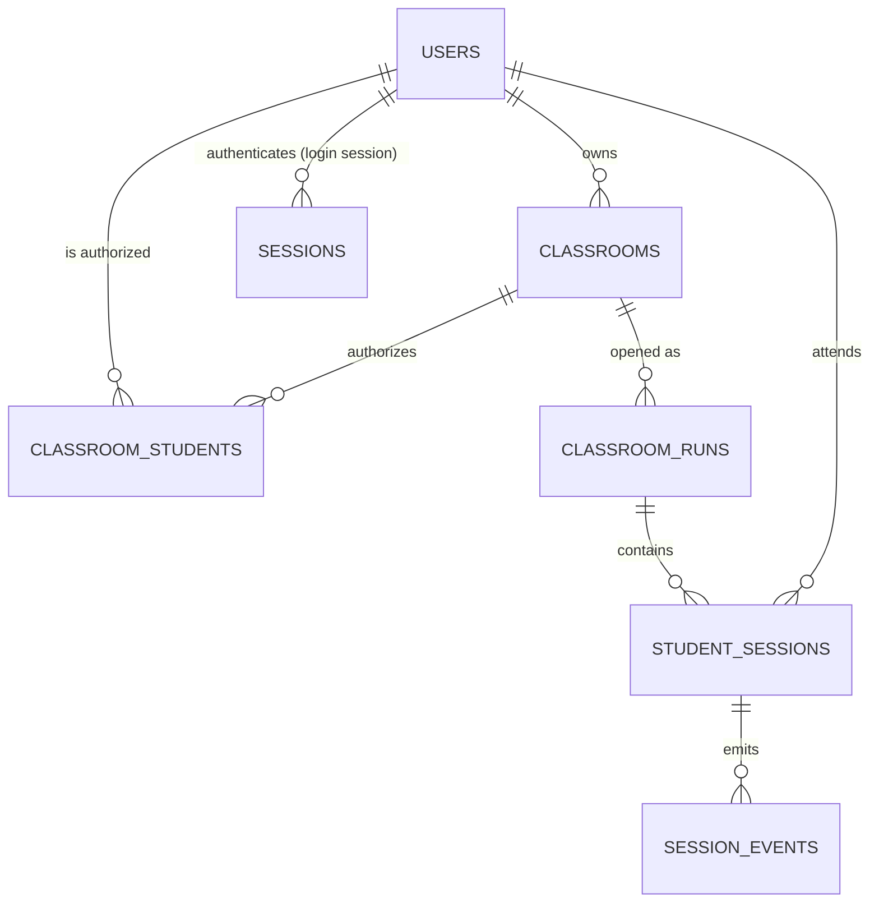

# 数据库设计（PostgreSQL）

> **状态**：本文档描述 V1 的**完整目标 schema**，并按 Phase 逐步落地。
> 截至 Phase 1，已创建 `users`、`sessions` 两张表（见 §6）；
> 课堂相关四张表在 Phase 3 创建。
>
> PostgreSQL 是 ClassWatch 的唯一 Source of Truth。LiveKit Room 的有无**不代表**任何业务状态。

---

## 1. 设计原则

| 原则 | 具体做法 | 原因 |
| --- | --- | --- |
| 主键一律 UUID | `id uuid PRIMARY KEY DEFAULT gen_random_uuid()` | ID 会出现在 API、URL、LiveKit identity 中；自增整数会泄露规模并可被枚举 |
| 时间为 UTC `timestamptz` | 所有时间列用 `timestamptz`，服务端统一存 UTC | 服务器时区/夏令时不能影响「谁什么时候断线」 |
| 状态用受约束的字符串 | `varchar` + `CHECK (status IN (...))`，不用 PostgreSQL ENUM | ENUM 增删值需要 `ALTER TYPE` 且难以回滚；`CHECK` 与代码常量可一一对应 |
| 业务不变量下沉到数据库 | `CHECK`、`UNIQUE`、部分唯一索引、外键 | 应用层校验会被绕过（新脚本、人工 SQL、并发）；数据库约束是最后一道防线 |
| 不物理删除历史 | Classroom 只改状态，Run/Session 只追加 | 课堂监督系统必须能回答「当时发生了什么」，删除会破坏审计能力 |
| 事件与状态分离 | 状态列表达「现在」，`session_events` 表达「过程」 | 便于排查与后续统计，且不需要在状态列里塞历史 |

---

## 2. 迁移策略

```text
services/api/migrations/
├── 0001_bootstrap.sql           ← Phase 0：仅创建扩展（pgcrypto / citext）
├── 0002_users.sql               ← Phase 1：users（角色-密码约束、账号格式约束）
├── 0003_sessions.sql            ← Phase 1：sessions（登录会话，只存 token 的 SHA-256）
├── 0004_classrooms.sql          ← Phase 3：classrooms（含 owner 必须是 TEACHER 的触发器）
├── 0005_classroom_students.sql  ← Phase 3：classroom_students（谁有权进入哪个课堂）
├── 0006_classroom_runs.sql      ← Phase 3：classroom_runs（一次开启 = 一条 Run）
├── 0007_student_sessions.sql    ← Phase 6/8：学生在某个 Run 中的课堂连接
└── 0008_session_events.sql      ← Phase 8：会话事件（只追加）
```

> 编号与任务书 §60 的示例（`0001_users.sql` …）相差 2：本项目把"扩展与迁移机制"独立成
> `0001_bootstrap.sql`、把"登录会话"独立成 `0003_sessions.sql`，因此课堂三张表落在 0004–0006。
> **编号只增不改**，对不上号时以本表为准。

规则：

1. **versioned SQL migration，禁止启动时 `AutoMigrate everything`**（任务书 §60）。
   迁移通过独立二进制执行：`make migrate-up` / `docker run ... /app/migrate up`。
   生产发布流程中显式执行，`DB_AUTO_MIGRATE` 默认 `false`。
2. 文件名格式 `NNNN_snake_case.sql`，编号单调递增、**永不修改已合并的迁移**。
3. 每个迁移在**独立事务**中执行；失败即回滚，并报出文件名与版本号。
4. 执行器用 `pg_advisory_lock` 串行化，避免多实例同时迁移。
5. 已应用记录写入 `schema_migrations(version, name, applied_at)`，重复执行为幂等操作。
6. 迁移必须**向前兼容一个版本**：先加列（可空）→ 回填 → 再加约束，避免发布过程中旧代码崩溃。

为什么不用 ORM 的 AutoMigrate：它会根据当前模型结构「猜」出 DDL，
在重命名/收紧约束/加索引这类操作上行为不可预测，且没有可评审的 SQL 变更记录。
课堂状态机的正确性依赖精确的约束与索引，这些必须由人写下来并进代码评审。

---

## 3. 实体关系



> 注意区分两张"session"表：
> `sessions` 是**登录会话**（Phase 1，一个浏览器一次登录一行，与课堂无关）；
> `student_sessions` 是**课堂会话**（Phase 3/8，一个学生一次 `ClassroomRun` 一行）。

---

## 4. 表定义

### 4.1 `users`

```sql
CREATE TABLE users (
    id            uuid PRIMARY KEY DEFAULT gen_random_uuid(),
    account       citext      NOT NULL UNIQUE,
    display_name  text        NOT NULL,
    role          text        NOT NULL CHECK (role IN ('ADMIN', 'TEACHER', 'STUDENT')),
    password_hash text        NULL,
    status        text        NOT NULL DEFAULT 'ACTIVE' CHECK (status IN ('ACTIVE', 'DISABLED')),
    created_by    uuid        NULL REFERENCES users (id) ON DELETE SET NULL,
    created_at    timestamptz NOT NULL DEFAULT now(),
    updated_at    timestamptz NOT NULL DEFAULT now(),
    last_login_at timestamptz NULL,

    -- 角色与密码的对应关系是业务规则（任务书 §9），必须由数据库兜底：
    -- 学生永不存在密码（无密码登录是明确的业务模型，不是“还没做”）；
    -- 老师/管理员必须能证明自己是谁，因此必须有 hash。
    CONSTRAINT users_password_by_role CHECK (
        (role = 'STUDENT' AND password_hash IS NULL) OR
        (role <> 'STUDENT' AND password_hash IS NOT NULL)
    )
);

CREATE INDEX users_role_status_idx ON users (role, status);
```

设计说明：

- `citext` 让 `account` 大小写不敏感唯一：`S10086` 与 `s10086` 是同一个学生。
  否则「输入大小写不对就进不去课堂」会成为最常见的现场故障。
- `password_hash` 只存 **Argon2id** 输出（任务书 §3）。禁止明文、MD5、裸 SHA256。
- 老师/管理员重置密码时更新 `updated_at`，并把该用户的所有 Session 撤销（Phase 1）。
- `created_by` 指向创建者（管理员），`ON DELETE SET NULL`：
  即使管理员账号被删除，学生记录也必须保留。
- **没有** 学生注册流程、邮箱、手机号、验证码字段——V1 明确不引入（任务书 §2.2/§54）。

### 4.2 `classrooms`

```sql
CREATE TABLE classrooms (
    id               uuid PRIMARY KEY DEFAULT gen_random_uuid(),
    name             text        NOT NULL CHECK (length(btrim(name)) > 0),
    description      text        NULL,
    owner_teacher_id uuid        NOT NULL REFERENCES users (id) ON DELETE RESTRICT,
    status           text        NOT NULL DEFAULT 'CLOSED' CHECK (status IN ('OPEN', 'CLOSED')),
    current_run_id   uuid        NULL,   -- 外键在 classroom_runs 建表后补充（见迁移顺序）
    created_at       timestamptz NOT NULL DEFAULT now(),
    updated_at       timestamptz NOT NULL DEFAULT now(),

    -- 不变式：OPEN 必须有当前 Run，CLOSED 必须没有。
    CONSTRAINT classrooms_run_consistency CHECK (
        (status = 'OPEN' AND current_run_id IS NOT NULL) OR
        (status = 'CLOSED' AND current_run_id IS NULL)
    )
);

CREATE INDEX classrooms_owner_idx ON classrooms (owner_teacher_id, created_at DESC);
```

设计说明：

- **`owner_teacher.role == TEACHER` 无法用普通外键表达**，用触发器或服务端事务保证；
  Phase 3 采用触发器 + 服务端双重校验（触发器兜底人工 SQL，服务端负责返回可读错误）。
- `current_run_id` 与 `status` 的一致性约束是关键：它让「开着但没有 Run」这种
  中间态在数据库层就不可能存在，也就不会出现「学生进入了一个没有 Run 的课堂」。
- 创建课堂后状态固定为 `CLOSED`（任务书 §7），老师点击开启才变成 `OPEN`。

### 4.3 `classroom_students`

```sql
CREATE TABLE classroom_students (
    classroom_id uuid        NOT NULL REFERENCES classrooms (id) ON DELETE CASCADE,
    -- student_id 用 RESTRICT 而不是 CASCADE：删除一个学生账号不应该悄悄抹掉
    -- "他曾经被授权进入哪些课堂"这段历史。要移除授权就显式调用移除接口（会留下可审计的动作）。
    student_id   uuid        NOT NULL REFERENCES users (id) ON DELETE RESTRICT,
    added_at     timestamptz NOT NULL DEFAULT now(),
    added_by     uuid        NULL REFERENCES users (id) ON DELETE SET NULL,

    PRIMARY KEY (classroom_id, student_id)
);

CREATE INDEX classroom_students_student_idx ON classroom_students (student_id);
```

设计说明：

- 联合主键天然防止重复授权。
- 「学生只能看到自己被授权的课堂」这条产品规则的执行点是**服务端 JOIN 这张表**，
  绝不允许 `GET /all-classrooms` 再让前端筛（任务书 §14）。
- `student_idx` 支持学生端的「我的课堂」查询（按 `student_id` 反查）。
- 老师只能向**自己拥有的** Classroom 添加学生，且只能选 `role = STUDENT AND status = ACTIVE`
  的账号（服务端校验，任务书 §11）。

### 4.4 `classroom_runs`

```sql
CREATE TABLE classroom_runs (
    id                uuid PRIMARY KEY DEFAULT gen_random_uuid(),
    classroom_id      uuid        NOT NULL REFERENCES classrooms (id) ON DELETE RESTRICT,
    status            text        NOT NULL DEFAULT 'OPEN' CHECK (status IN ('OPEN', 'CLOSED')),
    livekit_room_name text        NOT NULL UNIQUE,   -- lk_<run_uuid>
    opened_at         timestamptz NOT NULL DEFAULT now(),
    closed_at         timestamptz NULL,
    created_at        timestamptz NOT NULL DEFAULT now(),

    CONSTRAINT classroom_runs_closed_at CHECK (
        (status = 'OPEN' AND closed_at IS NULL) OR
        (status = 'CLOSED' AND closed_at IS NOT NULL)
    )
);

-- 同一课堂同时最多只能有一个进行中的 Run。
CREATE UNIQUE INDEX classroom_runs_one_open_idx
    ON classroom_runs (classroom_id) WHERE status = 'OPEN';
```

设计说明：

- `livekit_room_name` 使用 `lk_<run_uuid>`：**opaque、唯一、不可反推个人信息**
  （任务书 §8）。禁止使用学生姓名、老师姓名、班级名作为 room name 或 identity。
- 部分唯一索引 `classroom_runs_one_open_idx` 把「一个课堂不能同时开两次」
  变成数据库级保证：即使两个老师并发点击开启，也只会有一个事务成功。
- `ON DELETE RESTRICT`：有历史 Run 的课堂不能被删除（保留审计能力）。

### 4.5 `student_sessions`

```sql
CREATE TABLE student_sessions (
    id                 uuid PRIMARY KEY DEFAULT gen_random_uuid(),
    classroom_run_id   uuid        NOT NULL REFERENCES classroom_runs (id) ON DELETE RESTRICT,
    student_id         uuid        NOT NULL REFERENCES users (id) ON DELETE RESTRICT,
    livekit_identity   text        NOT NULL UNIQUE,   -- = student_sessions.id
    status             text        NOT NULL CHECK (status IN (
                           'CONNECTING', 'ONLINE', 'SCREEN_LOST',
                           'DISCONNECTED', 'LEFT', 'ROOM_CLOSED')),
    connected_at       timestamptz NULL,
    screen_started_at  timestamptz NULL,
    screen_lost_at     timestamptz NULL,
    left_at            timestamptz NULL,
    created_at         timestamptz NOT NULL DEFAULT now(),
    updated_at         timestamptz NOT NULL DEFAULT now()
);

-- 同一学生在同一 Run 中最多只有一条活跃会话（任务书 §50：新连接取代旧连接）。
CREATE UNIQUE INDEX student_sessions_active_idx
    ON student_sessions (classroom_run_id, student_id)
    WHERE status IN ('CONNECTING', 'ONLINE', 'SCREEN_LOST', 'DISCONNECTED');

CREATE INDEX student_sessions_run_idx ON student_sessions (classroom_run_id, status);
```

设计说明：

- `livekit_identity = student_sessions.id`：媒体层只认 UUID。
  即使 SDK 把 identity 暴露给其他人，也无法从中得到账号或姓名（任务书 §26/§44）。
- 部分唯一索引保证老师在监督墙上**永远只会看到一个「张三」**；
  学生刷新页面时是新连接取代旧连接（旧记录转 `LEFT`/`DISCONNECTED`），而不是插入第二条活跃记录。
- `DISCONNECTED` 计入「活跃」是有意的：断线重连仍在同一 Run 内，重连成功后复用同一条会话记录。
- 状态语义：`CONNECTING`（已建记录，等 webhook 确认 screen）、`ONLINE`（screen 已确认）、
  `SCREEN_LOST`（人还在房间，但屏幕没在共享）、`DISCONNECTED`（媒体连接中断）、
  `LEFT`（学生主动离开）、`ROOM_CLOSED`（老师关课导致的终结状态）。
- **不存**屏幕截图、摄像头截图、音频内容——V1 不录像（任务书 §13/§53）。

### 4.6 `session_events`

```sql
CREATE TABLE session_events (
    id         uuid PRIMARY KEY DEFAULT gen_random_uuid(),
    session_id uuid        NOT NULL REFERENCES student_sessions (id) ON DELETE CASCADE,
    type       text        NOT NULL CHECK (type IN (
                   'SESSION_CREATED', 'PARTICIPANT_CONNECTED',
                   'SCREEN_PUBLISHED', 'SCREEN_LOST', 'SCREEN_RESTORED',
                   'CAMERA_STARTED', 'CAMERA_STOPPED',
                   'MIC_STARTED', 'MIC_STOPPED',
                   'CONNECTION_LOST', 'CONNECTION_RESTORED',
                   'TEACHER_TALK_STARTED', 'TEACHER_TALK_ENDED',
                   'STUDENT_LEFT', 'ROOM_CLOSED')),
    payload    jsonb       NOT NULL DEFAULT '{}'::jsonb,
    created_at timestamptz NOT NULL DEFAULT now()
);

CREATE INDEX session_events_session_idx ON session_events (session_id, created_at);
CREATE INDEX session_events_type_time_idx ON session_events (type, created_at DESC);
```

设计说明：

- 事件表是**只追加**的：它记录了状态变化的过程，用于排查「老师看到屏幕断掉的那一刻发生了什么」。
- `payload` 只放**诊断元数据**（`displaySurface`、分辨率、track sid、错误分类、耗时等）。
  明确禁止：屏幕/摄像头图像、音频内容、完整 token、Cookie、密码（任务书 §13/§59）。
- `type` 用 `CHECK` 与代码常量、前端 `SessionEventType` 三处对齐；
  新增事件类型必须同时改这三处（迁移 + 常量 + 类型契约）。

---

### 4.7 `sessions`（登录会话，Phase 1）

```sql
CREATE TABLE sessions (
    id           uuid        PRIMARY KEY,          -- 由应用生成：INSERT 失败也要能记进日志
    user_id      uuid        NOT NULL REFERENCES users (id) ON DELETE CASCADE,
    token_hash   bytea       NOT NULL UNIQUE,      -- sha256(原始 token)，原始值只在客户端 Cookie 里
    csrf_token   text        NOT NULL,             -- 双提交 CSRF 的服务端副本
    issued_at    timestamptz NOT NULL DEFAULT now(),
    expires_at   timestamptz NOT NULL,             -- 固定 TTL，不滑动续期
    revoked_at   timestamptz NULL,                 -- 软撤销：行保留作为审计记录
    last_seen_at timestamptz NOT NULL DEFAULT now(),
    user_agent   text        NULL,
    ip           inet        NULL,

    CONSTRAINT sessions_expires_after_issued CHECK (expires_at > issued_at)
);

CREATE INDEX sessions_user_idx    ON sessions (user_id) WHERE revoked_at IS NULL;
CREATE INDEX sessions_expires_idx ON sessions (expires_at);
```

设计说明：

- **只存 `sha256(token)`**：原始 token 只存在于用户的 HttpOnly Cookie 中。
  因此数据库被拖库、备份泄漏、只读副本泄漏都**无法**重放成一次登录。
  这里用 SHA-256 而不是 Argon2 是正确的：输入是 256 位 CSPRNG 随机数，不存在被猜解的问题。
- **软撤销（`revoked_at`）而不是删除**：登出、停用账号、重置密码都只是打时间戳，
  行本身保留下来作为"谁在什么时候登录过"的审计痕迹。
- **授权不读会话里的任何声明**：每次请求都用 `sessions ⋈ users` 现取 `role` 与 `status`，
  所以管理员改角色或停用账号会在**下一个请求**生效（§37）。
- **固定的 `expires_at`**：不做滑动续期。监督系统里"永不掉线"不是目标；
  固定的会话寿命让"14:05 时谁还可能在线"这种问题有确定答案。
- **没有后台清理任务**：过期行在下次登录时机会式清理，`sessions_expires_idx` 让这件事很便宜。

---

## 5. 关键查询与索引对应关系

| 场景 | 查询 | 依赖索引 |
| --- | --- | --- |
| 学生「我的课堂」 | `classroom_students` JOIN `classrooms` WHERE `student_id = $1` | `classroom_students_student_idx` |
| 老师「我的课堂」 | `classrooms` WHERE `owner_teacher_id = $1` | `classrooms_owner_idx` |
| 老师监督墙 | `student_sessions` WHERE `classroom_run_id = $1` + JOIN `users` | `student_sessions_run_idx` |
| 每个请求的会话校验 | `sessions` JOIN `users` WHERE `token_hash = $1` AND `revoked_at IS NULL` AND `expires_at > now()` | `sessions_token_hash_key`（唯一索引） |
| 开启课堂（加锁） | `SELECT ... FROM classrooms WHERE id = $1 FOR UPDATE` | 主键 |
| 事件回放 | `session_events` WHERE `session_id = $1` ORDER BY `created_at` | `session_events_session_idx` |

并发控制要点：**开启/关闭课堂必须在事务中对 `classrooms` 行加 `FOR UPDATE` 锁**，
顺序为「锁行 → 校验 owner → 校验状态 → 写 Run → 改 status/current_run_id → 提交」。
这样即使老师双击按钮或两个标签页并发，也只有一个事务能成功（任务书 §48/§49）。

---

## 6. 迁移历史与当前落地内容

截至 Phase 3，迁移历史如下（完整列表见 §2）：

| 文件 | Phase | 内容 |
| --- | --- | --- |
| `0001_bootstrap.sql` | 0 | 扩展 `pgcrypto`、`citext` |
| `0002_users.sql` | 1 | `users`（角色-密码约束、账号格式约束） |
| `0003_sessions.sql` | 1 | `sessions`（登录会话，只存 token 的 SHA-256） |
| `0004_classrooms.sql` | 3 | `classrooms` + owner 必须是 TEACHER 的触发器 |
| `0005_classroom_students.sql` | 3 | `classroom_students`（谁有权进入哪个课堂） |
| `0006_classroom_runs.sql` | 3 | `classroom_runs` + 补 `classrooms.current_run_id` 外键 |

**迁移文件一旦合并就不再修改**，只追加新文件。

### 6.1 Phase 0 为什么没有业务表

1. 表结构必须跟随它所属 Phase 的领域设计一起评审（用户表属于 Phase 1/2，课堂属于 Phase 3）。
2. 迁移一旦合并就不可修改，提前建表只会制造需要靠新迁移来纠正的返工。
3. 迁移执行器（`pg_advisory_lock` + `schema_migrations` + 单文件单事务）在 Phase 0 已经可用，
   后续 Phase 只需新增 SQL 文件。

### 6.2 Phase 1 的两张表

| 表 | 关键约束 / 索引 | 说明 |
| --- | --- | --- |
| `users` | `users_password_by_role`（STUDENT 必须无密码、ADMIN/TEACHER 必须有）、`users_account_format`、`account` citext 唯一、`users_role_status_idx` | 见 §4.1；`updated_at` 由**应用层显式更新**而不是触发器 —— 写入路径只有后端，显式 SQL 更可审计、迁移里更少"魔法" |
| `sessions` | `token_hash` 唯一、`expires_at > issued_at`、`sessions_user_idx (user_id) WHERE revoked_at IS NULL`、`sessions_expires_idx` | 只存 `sha256(token)`，原始 token 只存在于用户的 Cookie 里；授权判定每次 `sessions ⋈ users` 现取角色与状态，因此**停用账号或改角色立即生效** |

会话 Cookie 的名称由 `SESSION_COOKIE_NAME` 作为前缀按入口派生
（`classwatch_session_student` / `_teacher` / `_admin`），原因见
[auth/authentication.md](../auth/authentication.md) §3.1。

### 6.3 Phase 3 的三张表

| 表 | 关键约束 / 索引 | 说明 |
| --- | --- | --- |
| `classrooms` | `classrooms_run_consistency`（`OPEN ⇔ current_run_id IS NOT NULL`，双向）、`owner_teacher_id` 必须是 TEACHER（**触发器** + 服务端双重校验）、`classrooms_owner_idx` | 见 §4.2；`current_run_id` 的外键在 `0006` 才补上（建表顺序的循环依赖，迁移注释有说明） |
| `classroom_students` | 复合主键 `(classroom_id, student_id)`、`classroom_id` CASCADE、`student_id` RESTRICT、`classroom_students_student_idx` | 见 §4.3：这张表就是"哪些学生有权看到并进入该课堂"的唯一答案，授权判定在服务端 JOIN 它 |
| `classroom_runs` | `livekit_room_name` 唯一、`classroom_runs_closed_at` 一致性、**部分唯一索引** `classroom_runs_one_open_idx (classroom_id) WHERE status='OPEN'` | 见 §4.4：一次开启 = 一条 Run；部分唯一索引让"同一课堂同时开两次"在数据库层就不可能 |

状态迁移的完整规则（允许哪些边、谁触发、副作用、并发分析）见
[database/state-machines.md](state-machines.md) 与
[architecture/control-plane.md](../architecture/control-plane.md)。

### 6.4 验证方式

```bash
make up                 # 启动 postgres 等容器（migrate 服务会自动应用迁移）
make migrate-up         # 手动应用迁移（可重复执行，幂等）
make migrate-status     # 查看已应用版本
make db-shell           # 进入 psql 自行检查 \dt
```

当前数据库中的对象：

| 对象 | 说明 |
| --- | --- |
| `schema_migrations` | 迁移执行器自动创建，记录已应用的版本（当前应为 6 行：0001–0006） |
| 扩展 `pgcrypto` / `citext` | `0001_bootstrap.sql` |
| `users` / `sessions` | Phase 1 |
| `classrooms` / `classroom_students` / `classroom_runs` | Phase 3 |
| `student_sessions` / `session_events` | Phase 6/8（媒体接入与 Webhook 就绪之后才有意义） |

---

## 7. 未来可能的变化（明确不在 V1）

- 课堂历史报表 / 出勤统计：会在 `classroom_runs`、`student_sessions` 之上做只读查询或物化视图，
  不改动本 schema 的写入路径。
- 多老师协同管理同一课堂：需要引入 `classroom_teachers` 关联表并放宽
  `owner_teacher_id` 的单点所有权；V1 明确不做（任务书 §4：OPEN/CLOSED 只能由创建者修改）。
- 录音录像：V1 明确不做（存储、带宽、隐私、留存、成本同时引入，任务书 §53）。
