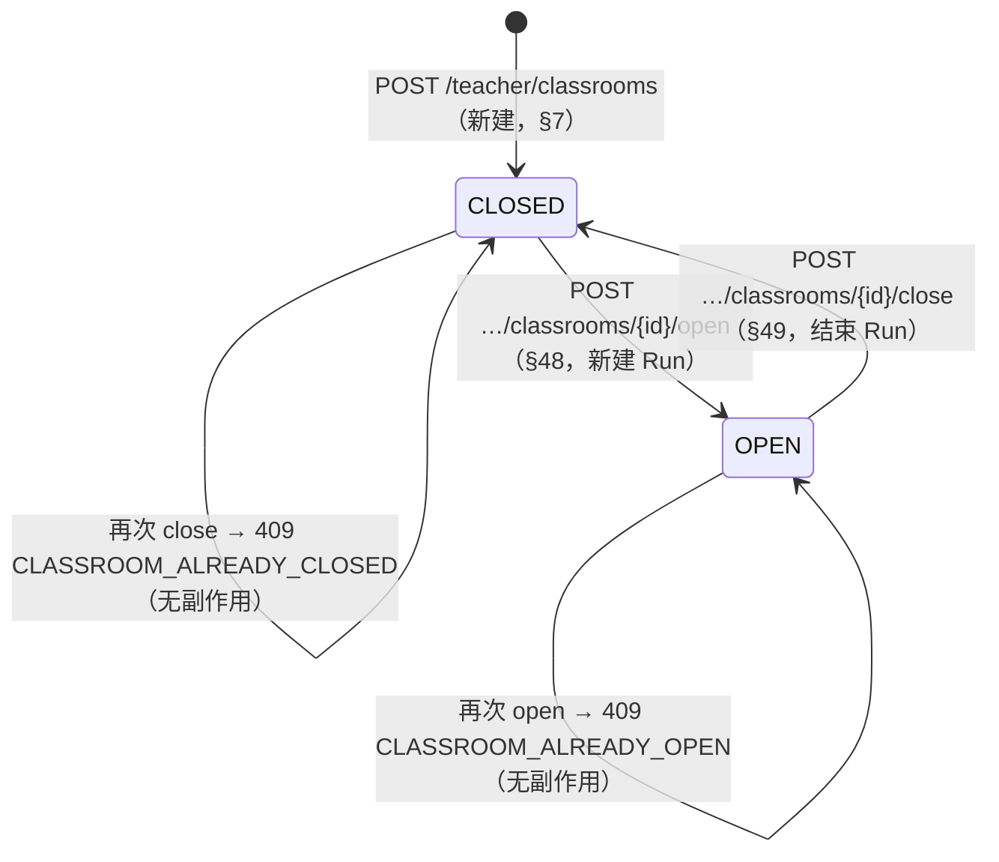
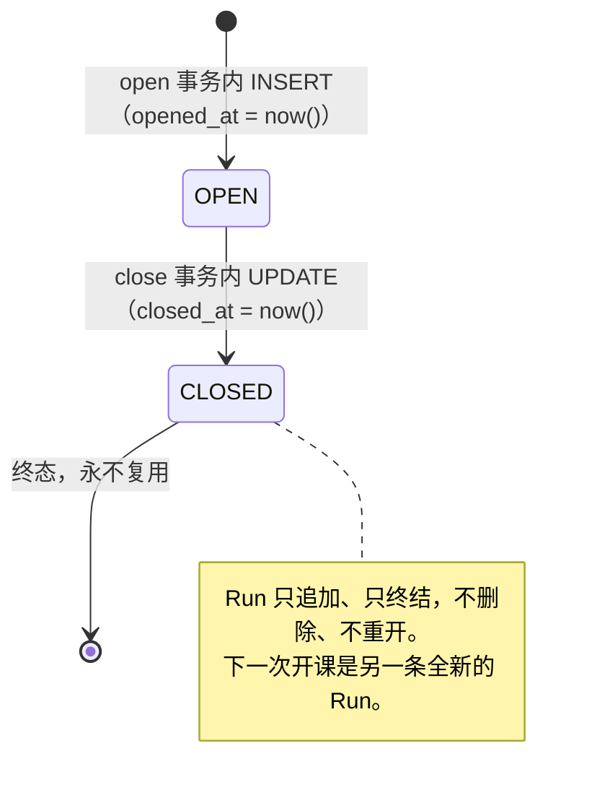

# 状态机（Classroom / ClassroomRun）

> 本文档描述 **Phase 3 已实现**的课堂状态机，以及 **Phase 8 才会实现**的 StudentSession 状态机。
> 文中每一处"未实现"都显式标注，不描述尚未写完的行为。
>
> 状态机的权威在 **PostgreSQL + 后端服务**（任务书 §33）：任何前端路由守卫、LiveKit Room 的
> 有无、Redis 里的短期缓存，都不是状态来源。本文列出的每条规则都能在
> `services/api/migrations/0004…0006`、`internal/classroom/` 与 `internal/httpapi/teacher_classrooms.go`
> 中找到对应实现与注释。

---

## 1. 为什么必须区分 Classroom 与 ClassroomRun

```text
Classroom「C++ 晚自习」   —— 课程容器，存在几个月
   ├── ClassroomRun #1   2026-10-01 19:00 → 21:05
   ├── ClassroomRun #2   2026-10-02 19:00 → 20:40
   └── ClassroomRun #3   2026-10-03 19:00 → （进行中）
```

用户可见的"开 / 关"是 **Classroom** 的状态；一次具体的"上课过程"是 **ClassroomRun**。
如果把两者合成一张表（`classrooms.opened_at / closed_at`），那么第二次开课就会覆盖第一次的
时间戳，"上周二 19:40 谁在线"这个问题将永远无法回答——而课堂监督系统的产品价值恰恰是回答它。

因此有一条硬规则（任务书 §8）：

> **每一次 `CLOSED → OPEN` 都必须新建一条 ClassroomRun，禁止复用旧 Run。**

这条规则在实现上有三个落点：

| 落点 | 位置 | 作用 |
| --- | --- | --- |
| 应用层铸造新 id | `classroom.Service.Open` 调用 `newID()` 并 `RoomName(runID)` | 每次开课都是一个新的 UUID，旧 Run 无法被"选中" |
| 数据库不提供复用路径 | `INSERT INTO classroom_runs`（无 UPSERT、无 ON CONFLICT UPDATE） | 即便有人改代码，也只能插入新行 |
| 历史不可删除 | `classroom_runs.classroom_id ON DELETE RESTRICT` | 有历史 Run 的课堂无法被删除 |

---

## 2. Classroom 状态机（Phase 3，已实现）

用户可见状态**只有两个**（任务书 §7）。`WAITING` / `STARTING` / `PAUSED` / `READY` / `ENDED` /
`ARCHIVED` 一律不允许出现。



### 2.1 允许的迁移

| # | 迁移 | 触发者 | 副作用（同一事务内） | 为什么允许 |
| --- | --- | --- | --- | --- |
| 1 | `∅ → CLOSED` | owner 老师 `POST /teacher/classrooms` | 插入 `classrooms`，`status='CLOSED'`、`current_run_id=NULL` | §7：新建的课堂一定是关闭的。"创建即开课"会让 Run 与课堂状态脱节 |
| 2 | `CLOSED → OPEN` | owner 老师 `POST .../open` | 插入新 `classroom_runs`（`status='OPEN'`, `opened_at=now()`, `livekit_room_name='lk_<run_uuid>'`）+ `classrooms.status='OPEN'`, `current_run_id=<新 run>` | §48：开课就是"开始一次新的执行" |
| 3 | `OPEN → CLOSED` | owner 老师 `POST .../close` | `classroom_runs.status='CLOSED'`, `closed_at=now()` + `classrooms.status='CLOSED'`, `current_run_id=NULL` | §49：关课结束当前执行，历史保留 |
| 4 | `CLOSED → CLOSED` | 重复请求 | 无（409 `CLASSROOM_ALREADY_CLOSED`） | 幂等诉求：老师双击 / 网络重试不应产生第二次写 |
| 5 | `OPEN → OPEN` | 重复请求 | 无（409 `CLASSROOM_ALREADY_OPEN`） | 同上；且绝不能因此产生第二个 Run |

### 2.2 不允许的迁移，以及为什么

| 被拒绝的操作 | 返回 | 为什么不允许 |
| --- | --- | --- |
| `OPEN → OPEN`（再开一次） | 409 `CLASSROOM_ALREADY_OPEN` | 若允许，就必须决定"复用旧 Run"还是"再建一个 Run"。复用违反 §8（历史被覆盖）；再建会让同一课堂同时存在两个进行中的 Run，学生会分裂到两个房间 |
| `CLOSED → CLOSED`（再关一次） | 409 `CLASSROOM_ALREADY_CLOSED` | "关闭"必须有一个明确对象（当前 Run）。没有当前 Run 时"再关一次"没有语义，静默成功会让前端以为自己关掉了什么 |
| `CLOSED → OPEN` 但跳过 Run | 数据库 `classrooms_run_consistency` 直接拒绝 | "开着但没有 Run"意味着学生进入一个不存在媒体会话的课堂。这条不变式下沉到数据库，任何写入路径（含人工 SQL）都无法绕过 |
| 通过 `PATCH /teacher/classrooms/:id` 改 `status` / `current_run_id` | 400 `INVALID_REQUEST`（严格 JSON 绑定拒绝未知字段） | 状态迁移必须走 open/close：只有那里有事务、行锁、Run 与房间名的创建。把 status 做成可编辑字段等于把状态机的入口散落到任意一处 |
| 删除 Classroom | Phase 3 无此 API；人工 SQL 在有 Run 时被 `ON DELETE RESTRICT` 拒绝 | 任务书 §1/§53：不物理删除历史 |
| 非 owner 老师执行 2/3 | 403 `CLASSROOM_NOT_OWNER` | §4/§37：只有 `owner_teacher_id == 当前老师` 才能操作 |
| ADMIN 执行 2/3 | 403 `ROLE_FORBIDDEN` | §4：管理员的身份能力边界是**账号管理**，不是"超级老师"。详见 [control-plane.md](../architecture/control-plane.md) §3 |

### 2.3 不变式与它们的数据库落点

| 不变式 | 落点 |
| --- | --- |
| `status ∈ {OPEN, CLOSED}` | `CHECK classrooms_status_valid` |
| `name` 去空白后非空 | `CHECK classrooms_name_not_blank` |
| `status='OPEN' ⇔ current_run_id IS NOT NULL` | `CHECK classrooms_run_consistency`（双向，两个方向都拒绝） |
| `owner_teacher_id` 必须是 TEACHER | 触发器 `classrooms_owner_is_teacher_trigger`（§10）+ 服务端校验（提供可读错误） |
| 一个课堂最多一条 OPEN Run | 部分唯一索引 `classroom_runs_one_open_idx (classroom_id) WHERE status='OPEN'` |
| `run.status='OPEN' ⇔ closed_at IS NULL` | `CHECK classroom_runs_closed_at` |
| 房间名唯一且不可反推身份 | `UNIQUE (livekit_room_name)` + 应用层固定生成 `lk_<run_uuid>` |

---

## 3. ClassroomRun 生命周期（Phase 3，已实现）



| 迁移 | 触发者 | 副作用 | 为什么 |
| --- | --- | --- | --- |
| `∅ → OPEN` | owner 老师的 open 请求 | 分配 `lk_<run_uuid>`，写 `opened_at` | §8：Run 代表"这一次执行"，房间名在此时确定并写库，Phase 6 直接用它创建 LiveKit Room |
| `OPEN → CLOSED` | owner 老师的 close 请求 | 写 `closed_at` | §49：结束这次执行 |
| `CLOSED → OPEN` | **不存在这条迁移** | — | 复用旧 Run 会让上一次课的 `student_sessions`、事件与本次混在一起，"当时发生了什么"不再可回答 |
| 删除 Run | Phase 3 无此 API；`classrooms_current_run_fk` / 学生会话外键均为 RESTRICT | — | 历史不可删 |

补充说明：

- **Run 的 `status` 与 `Classroom.status` 同步**，但它们不是同一个字段：Run 的状态表达"这一次执行是否还在进行"，
  Classroom 的状态表达"这门课现在能不能进"。`close` 在一个事务里同时改两者，所以外部永远看不到
  "课堂已关但 Run 还开着"的中间态。
- **Phase 6 的接缝**：关课时调用 LiveKit `TerminateRoom` 的位置在事务 **提交之后**（见 control-plane.md §5）。
  控制面先变 CLOSED，媒体面再消失；反过来会出现"数据库说已关，但房间还在，学生还能连进来"。
- **Phase 3 不联系 LiveKit**：房间名只是分配并落库（§69）。

---

## 4. 并发与幂等

### 4.1 并发

```mermaid
sequenceDiagram
    participant A as 老师（标签页 A）
    participant B as 老师（标签页 B）
    participant API as Go API
    participant PG as PostgreSQL

    A->>API: POST /classrooms/:id/open
    B->>API: POST /classrooms/:id/open
    A->>PG: BEGIN; SELECT … FOR UPDATE  ← 获得行锁
    B->>PG: BEGIN; SELECT … FOR UPDATE  ← 阻塞
    A->>PG: INSERT classroom_runs(OPEN) / UPDATE classrooms(OPEN)
    A->>PG: COMMIT
    B->>PG: （锁释放）读到 status='OPEN'
    B-->>API: 状态校验失败
    API-->>B: 409 CLASSROOM_ALREADY_OPEN
```

两道独立防线：

1. **行锁**（`SELECT … FROM classrooms WHERE id = $1 FOR UPDATE`）：把"读状态 → 写 Run → 改状态"
   变成一个串行区间。第二个请求在拿到锁之后重新读到 `OPEN`，直接返回冲突。
2. **部分唯一索引**（`classroom_runs_one_open_idx`）：即便未来某个调用点忘了加锁、或有人手工 SQL，
   数据库也不允许同一课堂出现两条 OPEN Run。此时唯一索引冲突 `23505` 被映射为
   `CLASSROOM_ALREADY_OPEN`（409），而不是 500 —— 输了竞争不是故障。

`open` 与 `close` 之间的竞争同样被行锁串行化：全部交错结束后，"`status='OPEN'`"与
"存在且仅存在一条 OPEN Run"必然同时成立（集成测试
`TestConcurrentOpenAndCloseNeverLeaveInconsistentState` 断言这一点）。

### 4.2 幂等

| 操作 | 重复执行的结果 | 说明 |
| --- | --- | --- |
| `open`（已 OPEN） | 409 `CLASSROOM_ALREADY_OPEN`，**无任何写入** | 不产生第二个 Run，不刷新 `opened_at` |
| `close`（已 CLOSED） | 409 `CLASSROOM_ALREADY_CLOSED`，**无任何写入** | 不保留"幽灵 Run" |
| `POST .../students`（同一批账号） | 200，`rejected: []`，名单长度不变 | 名单主键 `(classroom_id, student_id)` + `ON CONFLICT DO NOTHING`；已在本课堂视为成功（§11 的批量导入语义） |
| `DELETE .../students/:id`（已移除） | 404 `STUDENT_NOT_ASSIGNED` | 移除是"撤销一项具体授权"，必须知道它是否真的存在 |

失败的重试**不会**产生新的 Run：`open` 只在状态校验通过后才插入 Run，且插入与状态翻转在同一事务中，
任一失败即整体回滚（集成测试 `TestOpenCreatesTheRunAtomicallyEndToEnd` 断言失败路径不留痕）。

---

## 5. StudentSession 状态机（**Phase 8 实现，此处只说明边界**）

`student_sessions` 表属于 Phase 8（任务书 §12/§50/§74），Phase 3 **没有**创建它，也**没有**任何
读写它的代码。本节的目的是把"关课时谁负责通知学生"这件事的归属写清楚，避免后来者把它塞进 Phase 3 的
关课事务里。

Phase 8 将补上：

- **表**（`docs/database/schema.md` §4.5）：`student_sessions` 与 `session_events`，
  其中部分唯一索引 `student_sessions_active_idx (classroom_run_id, student_id) WHERE status IN
  ('CONNECTING','ONLINE','SCREEN_LOST','DISCONNECTED')` 保证"同一学生在同一 Run 最多一条活跃会话"（§50：
  新连接取代旧连接，而不是出现三个"张三"）。
- **状态集合**：`CONNECTING → ONLINE → SCREEN_LOST / DISCONNECTED → ONLINE（重连）`，
  以及两个终结态 `LEFT`（学生主动离开）、`ROOM_CLOSED`（老师关课导致）。
- **关课时的动作**（§49）：`close` 事务提交后，把该 Run 下所有活跃会话置为 `ROOM_CLOSED` 并写入
  `session_events`，然后广播 `ROOM_CLOSED`。Phase 3 的关课代码里为此留了注释接缝，但**没有**空函数占位。
- **开课时的动作**（§47/§48）：广播 `ROOM_OPENED`，学生首页据此自动更新。

在 Phase 8 落地之前，系统的正确行为是：

- 关课 = 控制面状态变更 + Run 结束。此时**没有**任何学生连接需要清理（媒体接入是 Phase 6）。
- 任何"LiveKit 房间里还有人"的事实**不代表**课堂还开着（§33）：控制面已经说 CLOSED，前端必须以
  控制面为唯一依据。

---

## 6. 相关测试（可执行的规则清单）

| 规则 | 测试 |
| --- | --- |
| 创建即 CLOSED、无 Run | `internal/classroom/service_test.go` `TestCreateClassroomStartsClosedAndOwned` |
| 每次 open 产生新 Run、旧 Run 保留 | `TestOpenCreatesANewRunOnEveryOpen`、`internal/classroom/postgres_integration_test.go` `TestOpenCloseLifecycle` |
| 已 OPEN 再 open / 已 CLOSED 再 close | `TestOpenCreatesANewRunOnEveryOpen`、`TestCloseIsRejectedWhenAlreadyClosed` |
| 非 owner 全部被拒 | `TestOpenIsRejectedForAnotherTeacher`、`internal/httpapi/teacher_classrooms_integration_test.go` `TestTeacherClassroomOwnershipEndToEnd` |
| ADMIN 被 teacher 路由拒绝 | `internal/httpapi/teacher_classrooms_integration_test.go` `TestTeacherClassroomRoutesRefuseOtherEntriesEndToEnd` |
| 并发 open 只有一个成功 | `internal/classroom/postgres_integration_test.go` `TestConcurrentOpenOnlyOneSucceeds` |
| `OPEN ⇔ current_run_id NOT NULL` 不可绕过 | `TestRunConsistencyConstraint` |
| 一个课堂最多一条 OPEN Run | `TestOneOpenRunPerClassroomIndex` |
| owner 必须是 TEACHER | `TestOwnerTriggerRejectsNonTeachers` |
| 房间名不透明、每次不同 | `TestLivekitRoomNameIsUniqueAndOpaqueForEveryRun` |
