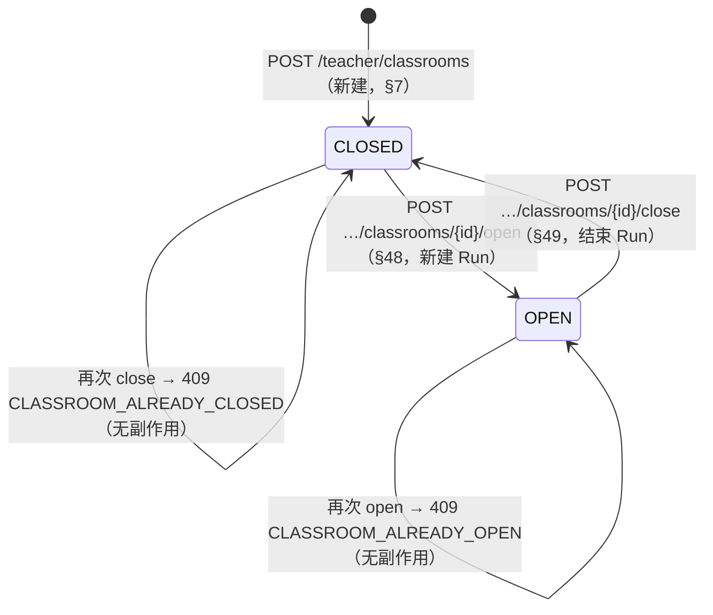
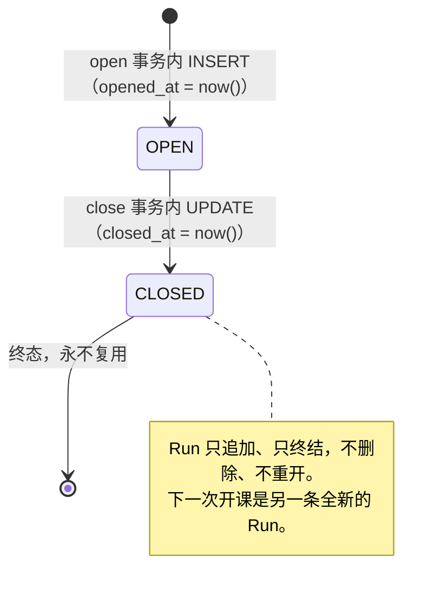
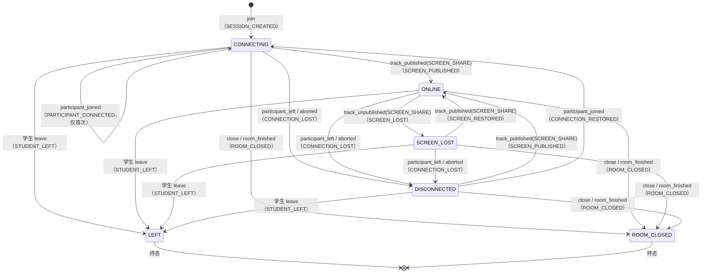

# 状态机（Classroom / ClassroomRun / StudentSession）

> 本文档描述 **Phase 3 已实现**的课堂状态机（Classroom / ClassroomRun），以及 **Phase 8 已实现**的
> StudentSession 状态机。文中每一处"未实现"都显式标注，不描述尚未写完的行为。
>
> 状态机的权威在 **PostgreSQL + 后端服务**（任务书 §33）：任何前端路由守卫、LiveKit Room 的
> 有无、Redis 里的短期缓存，都不是状态来源。本文列出的每条规则都能在
> `services/api/migrations/0004…0008`、`internal/classroom/`、`internal/session/` 与
> `internal/httpapi/` 中找到对应实现与注释。
>
> 相关文档：[数据库设计](schema.md)、[控制面](../architecture/control-plane.md)、
> [实时事件流](../architecture/realtime-flow.md)。

---

## 1. 为什么必须区分 Classroom 与 ClassroomRun

```text
Classroom「C++ 晚自习」   —— 课程容器，存在几个月
   ├── ClassroomRun #1   2026-10-01 19:00 → 21:05
   ├── ClassroomRun #2   2026-10-02 19:00 → 20:40
   └── ClassroomRun #3   2026-10-03 19:00 → （进行中）
```

用户可见的"开 / 关"是 **Classroom** 的状态；一次具体的"上课过程"是 **ClassroomRun**。
如果把两者合成一张表（`classrooms.opened_at / closed_at`），那么第二次开课就会覆盖第一次的
时间戳，"上周二 19:40 谁在线"这个问题将永远无法回答——而课堂监督系统的产品价值恰恰是回答它。

因此有一条硬规则（任务书 §8）：

> **每一次 `CLOSED → OPEN` 都必须新建一条 ClassroomRun，禁止复用旧 Run。**

这条规则在实现上有三个落点：

| 落点 | 位置 | 作用 |
| --- | --- | --- |
| 应用层铸造新 id | `classroom.Service.Open` 调用 `newID()` 并 `RoomName(runID)` | 每次开课都是一个新的 UUID，旧 Run 无法被"选中" |
| 数据库不提供复用路径 | `INSERT INTO classroom_runs`（无 UPSERT、无 ON CONFLICT UPDATE） | 即便有人改代码，也只能插入新行 |
| 历史不可删除 | `classroom_runs.classroom_id ON DELETE RESTRICT` | 有历史 Run 的课堂无法被删除 |

---

## 2. Classroom 状态机（Phase 3，已实现）

用户可见状态**只有两个**（任务书 §7）。`WAITING` / `STARTING` / `PAUSED` / `READY` / `ENDED` /
`ARCHIVED` 一律不允许出现。



### 2.1 允许的迁移

| # | 迁移 | 触发者 | 副作用（同一事务内） | 为什么允许 |
| --- | --- | --- | --- | --- |
| 1 | `∅ → CLOSED` | owner 老师 `POST /teacher/classrooms` | 插入 `classrooms`，`status='CLOSED'`、`current_run_id=NULL` | §7：新建的课堂一定是关闭的。"创建即开课"会让 Run 与课堂状态脱节 |
| 2 | `CLOSED → OPEN` | owner 老师 `POST .../open` | 插入新 `classroom_runs`（`status='OPEN'`, `opened_at=now()`, `livekit_room_name='lk_<run_uuid>'`）+ `classrooms.status='OPEN'`, `current_run_id=<新 run>` | §48：开课就是"开始一次新的执行" |
| 3 | `OPEN → CLOSED` | owner 老师 `POST .../close` | `classroom_runs.status='CLOSED'`, `closed_at=now()` + `classrooms.status='CLOSED'`, `current_run_id=NULL` | §49：关课结束当前执行，历史保留 |
| 4 | `CLOSED → CLOSED` | 重复请求 | 无（409 `CLASSROOM_ALREADY_CLOSED`） | 幂等诉求：老师双击 / 网络重试不应产生第二次写 |
| 5 | `OPEN → OPEN` | 重复请求 | 无（409 `CLASSROOM_ALREADY_OPEN`） | 同上；且绝不能因此产生第二个 Run |

### 2.2 不允许的迁移，以及为什么

| 被拒绝的操作 | 返回 | 为什么不允许 |
| --- | --- | --- |
| `OPEN → OPEN`（再开一次） | 409 `CLASSROOM_ALREADY_OPEN` | 若允许，就必须决定"复用旧 Run"还是"再建一个 Run"。复用违反 §8（历史被覆盖）；再建会让同一课堂同时存在两个进行中的 Run，学生会分裂到两个房间 |
| `CLOSED → CLOSED`（再关一次） | 409 `CLASSROOM_ALREADY_CLOSED` | "关闭"必须有一个明确对象（当前 Run）。没有当前 Run 时"再关一次"没有语义，静默成功会让前端以为自己关掉了什么 |
| `CLOSED → OPEN` 但跳过 Run | 数据库 `classrooms_run_consistency` 直接拒绝 | "开着但没有 Run"意味着学生进入一个不存在媒体会话的课堂。这条不变式下沉到数据库，任何写入路径（含人工 SQL）都无法绕过 |
| 通过 `PATCH /teacher/classrooms/:id` 改 `status` / `current_run_id` | 400 `INVALID_REQUEST`（严格 JSON 绑定拒绝未知字段） | 状态迁移必须走 open/close：只有那里有事务、行锁、Run 与房间名的创建。把 status 做成可编辑字段等于把状态机的入口散落到任意一处 |
| 删除 Classroom | Phase 3 无此 API；人工 SQL 在有 Run 时被 `ON DELETE RESTRICT` 拒绝 | 任务书 §1/§53：不物理删除历史 |
| 非 owner 老师执行 2/3 | 403 `CLASSROOM_NOT_OWNER` | §4/§37：只有 `owner_teacher_id == 当前老师` 才能操作 |
| ADMIN 执行 2/3 | 403 `ROLE_FORBIDDEN` | §4：管理员的身份能力边界是**账号管理**，不是"超级老师"。详见 [control-plane.md](../architecture/control-plane.md) §3 |

### 2.3 不变式与它们的数据库落点

| 不变式 | 落点 |
| --- | --- |
| `status ∈ {OPEN, CLOSED}` | `CHECK classrooms_status_valid` |
| `name` 去空白后非空 | `CHECK classrooms_name_not_blank` |
| `status='OPEN' ⇔ current_run_id IS NOT NULL` | `CHECK classrooms_run_consistency`（双向，两个方向都拒绝） |
| `owner_teacher_id` 必须是 TEACHER | 触发器 `classrooms_owner_is_teacher_trigger`（§10）+ 服务端校验（提供可读错误） |
| 一个课堂最多一条 OPEN Run | 部分唯一索引 `classroom_runs_one_open_idx (classroom_id) WHERE status='OPEN'` |
| `run.status='OPEN' ⇔ closed_at IS NULL` | `CHECK classroom_runs_closed_at` |
| 房间名唯一且不可反推身份 | `UNIQUE (livekit_room_name)` + 应用层固定生成 `lk_<run_uuid>` |

---

## 3. ClassroomRun 生命周期（Phase 3，已实现）



| 迁移 | 触发者 | 副作用 | 为什么 |
| --- | --- | --- | --- |
| `∅ → OPEN` | owner 老师的 open 请求 | 分配 `lk_<run_uuid>`，写 `opened_at` | §8：Run 代表"这一次执行"，房间名在此时确定并写库，Phase 6 直接用它创建 LiveKit Room |
| `OPEN → CLOSED` | owner 老师的 close 请求 | 写 `closed_at` | §49：结束这次执行 |
| `CLOSED → OPEN` | **不存在这条迁移** | — | 复用旧 Run 会让上一次课的 `student_sessions`、事件与本次混在一起，"当时发生了什么"不再可回答 |
| 删除 Run | Phase 3 无此 API；`classrooms_current_run_fk` / 学生会话外键均为 RESTRICT | — | 历史不可删 |

补充说明：

- **Run 的 `status` 与 `Classroom.status` 同步**，但它们不是同一个字段：Run 的状态表达"这一次执行是否还在进行"，
  Classroom 的状态表达"这门课现在能不能进"。`close` 在一个事务里同时改两者，所以外部永远看不到
  "课堂已关但 Run 还开着"的中间态。
- **Phase 6 的接缝**：关课时调用 LiveKit `TerminateRoom` 的位置在事务 **提交之后**（见 control-plane.md §5）。
  控制面先变 CLOSED，媒体面再消失；反过来会出现"数据库说已关，但房间还在，学生还能连进来"。
- **Phase 3 不联系 LiveKit**：房间名只是分配并落库（§69）。

---

## 4. 并发与幂等

### 4.1 并发

```mermaid
sequenceDiagram
    participant A as 老师（标签页 A）
    participant B as 老师（标签页 B）
    participant API as Go API
    participant PG as PostgreSQL

    A->>API: POST /classrooms/:id/open
    B->>API: POST /classrooms/:id/open
    A->>PG: BEGIN; SELECT … FOR UPDATE  ← 获得行锁
    B->>PG: BEGIN; SELECT … FOR UPDATE  ← 阻塞
    A->>PG: INSERT classroom_runs(OPEN) / UPDATE classrooms(OPEN)
    A->>PG: COMMIT
    B->>PG: （锁释放）读到 status='OPEN'
    B-->>API: 状态校验失败
    API-->>B: 409 CLASSROOM_ALREADY_OPEN
```

两道独立防线：

1. **行锁**（`SELECT … FROM classrooms WHERE id = $1 FOR UPDATE`）：把"读状态 → 写 Run → 改状态"
   变成一个串行区间。第二个请求在拿到锁之后重新读到 `OPEN`，直接返回冲突。
2. **部分唯一索引**（`classroom_runs_one_open_idx`）：即便未来某个调用点忘了加锁、或有人手工 SQL，
   数据库也不允许同一课堂出现两条 OPEN Run。此时唯一索引冲突 `23505` 被映射为
   `CLASSROOM_ALREADY_OPEN`（409），而不是 500 —— 输了竞争不是故障。

`open` 与 `close` 之间的竞争同样被行锁串行化：全部交错结束后，"`status='OPEN'`"与
"存在且仅存在一条 OPEN Run"必然同时成立（集成测试
`TestConcurrentOpenAndCloseNeverLeaveInconsistentState` 断言这一点）。

### 4.2 幂等

| 操作 | 重复执行的结果 | 说明 |
| --- | --- | --- |
| `open`（已 OPEN） | 409 `CLASSROOM_ALREADY_OPEN`，**无任何写入** | 不产生第二个 Run，不刷新 `opened_at` |
| `close`（已 CLOSED） | 409 `CLASSROOM_ALREADY_CLOSED`，**无任何写入** | 不保留"幽灵 Run" |
| `POST .../students`（同一批账号） | 200，`rejected: []`，名单长度不变 | 名单主键 `(classroom_id, student_id)` + `ON CONFLICT DO NOTHING`；已在本课堂视为成功（§11 的批量导入语义） |
| `DELETE .../students/:id`（已移除） | 404 `STUDENT_NOT_ASSIGNED` | 移除是"撤销一项具体授权"，必须知道它是否真的存在 |

失败的重试**不会**产生新的 Run：`open` 只在状态校验通过后才插入 Run，且插入与状态翻转在同一事务中，
任一失败即整体回滚（集成测试 `TestOpenCreatesTheRunAtomicallyEndToEnd` 断言失败路径不留痕）。

---

## 5. StudentSession 状态机（**Phase 8 已实现**）

`student_sessions`（迁移 `0007`）与 `session_events`（迁移 `0008`）属于 Phase 6/8
（任务书 §12/§13/§45/§74）。本节是**已实现行为**的完整描述。

### 5.1 它是什么

一个学生**在一次 ClassroomRun 中**的实际课堂连接（§12）。它不是登录会话（§41，见
`auth/sessionstore`）：登录会话认证一个浏览器，StudentSession 记录"这个浏览器正在（或曾经在）
这一节课的媒体房间里"。两者都是 UUID，但只有前者是凭据。



`PRE_JOIN` **不存在于数据库**（§12）：它属于浏览器（§16 的 screen gate）。把它写进表里等于
记录了一次还没人尝试过的媒体连接。

### 5.2 允许的迁移

| # | 迁移 | 触发者 | 副作用（同一事务内） | 为什么允许 |
| --- | --- | --- | --- | --- |
| 1 | `∅ → CONNECTING` | 学生 `POST /student/classrooms/:id/join` | 插入 `student_sessions`（`livekit_identity = id`），写 `SESSION_CREATED` 事件 | 学生**请求**进入课堂；token 已签发，连接可能成功也可能失败。这是唯一诚实的初始状态 |
| 2 | `CONNECTING → CONNECTING` | webhook `participant_joined` | 写 `connected_at`（`COALESCE`，只写第一次）+ `PARTICIPANT_CONNECTED` | 记录"这个人到过房间"，但**不**改状态：§21/§45 规定 ONLINE 必须由 screen track 证明 |
| 3 | `CONNECTING/DISCONNECTED → ONLINE` | webhook `track_published`（`source=SCREEN_SHARE`） | `connected_at`、`screen_started_at`（都只写第一次）+ `SCREEN_PUBLISHED` | §45：**只有服务端观测到屏幕轨道**才叫在线。这是全系统唯一能把会话推进到 ONLINE 的迁移 |
| 4 | `ONLINE → SCREEN_LOST` | webhook `track_unpublished`（`source=SCREEN_SHARE`） | `screen_lost_at = now()`（覆盖）+ `SCREEN_LOST` | §22：人还在房间，被监督的画面没了。老师必须看到"屏幕共享已停止 + 时间" |
| 5 | `SCREEN_LOST → ONLINE` | webhook `track_published`（`source=SCREEN_SHARE`） | `screen_started_at`（若为空则写）+ `SCREEN_RESTORED` | §22：学生重新共享整个屏幕后恢复；`SCREEN_RESTORED` 回答"他修好了吗" |
| 6 | `CONNECTING/ONLINE/SCREEN_LOST → DISCONNECTED` | webhook `participant_left` / `participant_connection_aborted` | `CONNECTION_LOST` 事件 + `STUDENT_OFFLINE(DISCONNECTED)` | §45：媒体连接断了。仍然是**活跃**状态（§50），重连复用同一行 |
| 7 | `DISCONNECTED → CONNECTING` | webhook `participant_joined` | `CONNECTION_RESTORED` 事件 | 人回到房间但还没共享屏幕。留在 DISCONNECTED 会让墙上写着"已断开"而人明明在房间里 |
| 8 | `CONNECTING/ONLINE/SCREEN_LOST/DISCONNECTED → LEFT` | 学生 `POST /student/sessions/:id/leave` | `left_at`（`COALESCE`，只写第一次）+ `STUDENT_LEFT` + `STUDENT_OFFLINE(LEFT)` | §43/§50：离开是学生的决定。**终态** |
| 9 | 任意活跃态 → `ROOM_CLOSED` | 老师 `close`（提交后）／webhook `room_finished` | 批量更新 + 每行一条 `ROOM_CLOSED` + `STUDENT_OFFLINE(ROOM_CLOSED)` + 一次 `ROOM_CLOSED` 广播 | §49：老师结束了这节课。**终态** |
| 10 | 重复投递同一 webhook | LiveKit（至少一次投递） | **无**（CAS 守卫不匹配） | 幂等：重复事件不产生第二次迁移，也不写第二条事件 |
| 11 | `LEFT`/`ROOM_CLOSED` 上收到任何 webhook | LiveKit（迟到事件） | **无** | 终态不可逆（§74）。见 5.4 |

### 5.3 不允许的迁移，以及为什么

| 被拒绝的操作 | 结果 | 为什么不允许 |
| --- | --- | --- |
| 客户端声明 `ONLINE` | 没有这个接口 | §45/§46：客户端只能"快 UX"，权威观测来自 LiveKit webhook。学生端**不存在**"上报我的状态"的端点，所以没有可撒谎的对象 |
| `track_published(CAMERA/MICROPHONE)` → `ONLINE` | 无变化（记 Debug 日志） | §21：ONLINE 的含义是"正在共享屏幕"。摄像头/麦克风是 Phase 9/10 的能力，它们各自有 `CAMERA_CHANGED`/`MIC_CHANGED` 消息 |
| `participant_joined` → `ONLINE` | 无变化 | 同上：进房间不等于在被监督 |
| `track_unpublished` 在非 `ONLINE` 状态 → `SCREEN_LOST` | 无变化 | 没有屏幕可丢。若允许，**乱序**到达的 unpublish 会让会话永久停在 SCREEN_LOST（见 5.4） |
| `LEFT`/`ROOM_CLOSED` → 任何其它状态 | 无变化 | 终态：离开与关课是已经发生的决定。允许复活会让"这节课谁在线"永远无法回答 |
| 非本人调用 `leave`（改别人的会话） | 404 `SESSION_NOT_FOUND` | §58：`student_id` 是 WHERE 的一部分，"不是我的"和"不存在"给同一个答案 |
| 同一 `(run, student)` 出现第二条活跃会话 | 数据库拒绝（部分唯一索引） | §50：新连接取代旧连接，而不是墙上出现两个"张三" |
| 直接 DELETE 会话行 | 无此 API；`session_events.session_id` 为 `ON DELETE CASCADE` | 历史不可删（schema §1）。关课/离开是状态，不是删除 |

### 5.4 幂等与乱序：为什么每条规则都是 CAS

LiveKit webhook 是**至少一次投递、且不保证顺序**的（§45）。因此本状态机的每条写入都是
"带前置状态的更新"（compare-and-set），而不是"读出来判断再写回去"：

```sql
UPDATE student_sessions
   SET status = $3, ...
 WHERE id = $1
   AND status = ANY($2::text[])       -- 前置状态守卫
   AND (NOT $7 OR connected_at IS NULL)
RETURNING ...
```

| 场景 | 结果 | 机制 |
| --- | --- | --- |
| 同一 `track_published` 到达两次 | 第二次匹配 0 行 → 状态不变、**不写第二条事件、不再广播** | `ONLINE` 不在 `From` 集合里 |
| `track_unpublished` 早于 `track_published` | 第一次什么也不做（会话还是 CONNECTING）；随后 `track_published` 正确进入 ONLINE | `From = {ONLINE}` |
| `participant_left` 早于 `track_published` | 会话变 DISCONNECTED；迟到的 publication 让它回到 ONLINE | §45：屏幕轨道**证明人在场**；这是有意的，不是 bug |
| 迟到事件在 `LEFT`/`ROOM_CLOSED` 之后 | 什么也不做 | 终态从不出现在任何 `From` 集合里 |
| `close` 与 `room_finished` 竞态 | 先到的把活跃会话置 `ROOM_CLOSED`，后到的匹配 0 行 | 两者共用同一个批量语句 |
| 重复 `join` / 重复 `leave` | 复用同一行 / `STUDENT_LEFT` 只写一次 | 部分唯一索引 + `NOT EXISTS (session_id, type)` 守卫 |

`participant_joined` 是唯一的"状态不变但仍要记录"的迁移，它的守卫是 `connected_at IS NULL`
—— 状态没变，CAS 无法区分首次与重复，时间戳可以。

事件行与状态更新**在同一事务内**写入：状态变了而事件丢了，等于墙上出现了没人能解释的变化。

### 5.5 身份映射（webhook 怎么找到会话）

```text
学生 identity = student_sessions.id  = livekit_identity（数据库 CHECK 强制相等，§44）
老师 identity = 登录会话 UUID（**不落库**，因为老师不是监督对象）

webhook 的查找语句：
  student_sessions ss JOIN classroom_runs r ON r.id = ss.classroom_run_id
  WHERE r.livekit_room_name = $1 AND ss.livekit_identity = $2
```

- 查不到 → **记日志 + 200，不写任何状态**。老师自己的 participant 就是这种情况，
  另一个部署的房间、过期房间也是。回 4xx 会让 LiveKit 无限重试一个永远不会成功的事件。
- 房间条件不能省：没有它，上周房间的重放事件可以改这周会话的状态。

### 5.6 不变式与它们的数据库落点

| 不变式 | 落点 |
| --- | --- |
| `status ∈ {CONNECTING, ONLINE, SCREEN_LOST, DISCONNECTED, LEFT, ROOM_CLOSED}` | `CHECK student_sessions_status_valid` |
| `livekit_identity = id` | `CHECK student_sessions_identity_is_id` |
| 同一 `(run, student)` 最多一条活跃会话 | 部分唯一索引 `student_sessions_active_idx`（排除两个终态） |
| `session_events.type` 属于 §13 的 15 种 | `CHECK session_events_type_check` |
| 事件只追加、不修改 | 没有任何 UPDATE/DELETE 路径；`session_id` 为 `ON DELETE CASCADE` |
| 时间戳只由控制面写、只由服务端观测驱动 | `connected_at`/`screen_started_at` 用 `COALESCE` 只写第一次；`screen_lost_at` 覆盖；全部来自 webhook 或 REST，永不来自客户端声明 |

---

## 6. 相关测试（可执行的规则清单）

| 规则 | 测试 |
| --- | --- |
| 创建即 CLOSED、无 Run | `internal/classroom/service_test.go` `TestCreateClassroomStartsClosedAndOwned` |
| 每次 open 产生新 Run、旧 Run 保留 | `TestOpenCreatesANewRunOnEveryOpen`、`internal/classroom/postgres_integration_test.go` `TestOpenCloseLifecycle` |
| 已 OPEN 再 open / 已 CLOSED 再 close | `TestOpenCreatesANewRunOnEveryOpen`、`TestCloseIsRejectedWhenAlreadyClosed` |
| 非 owner 全部被拒 | `TestOpenIsRejectedForAnotherTeacher`、`internal/httpapi/teacher_classrooms_integration_test.go` `TestTeacherClassroomOwnershipEndToEnd` |
| ADMIN 被 teacher 路由拒绝 | `internal/httpapi/teacher_classrooms_integration_test.go` `TestTeacherClassroomRoutesRefuseOtherEntriesEndToEnd` |
| 并发 open 只有一个成功 | `internal/classroom/postgres_integration_test.go` `TestConcurrentOpenOnlyOneSucceeds` |
| `OPEN ⇔ current_run_id NOT NULL` 不可绕过 | `TestRunConsistencyConstraint` |
| 一个课堂最多一条 OPEN Run | `TestOneOpenRunPerClassroomIndex` |
| owner 必须是 TEACHER | `TestOwnerTriggerRejectsNonTeachers` |
| 房间名不透明、每次不同 | `TestLivekitRoomNameIsUniqueAndOpaqueForEveryRun` |

Phase 8（StudentSession，§5）：

| 规则 | 测试 |
| --- | --- |
| 只有 `track_published(SCREEN_SHARE)` 能让会话 ONLINE | `internal/session/processor_test.go` `TestScreenPublishedIsWhatMakesASessionOnline` |
| 重复投递只迁移一次、只写一条事件 | `processor_test.go` `TestScreenPublishedTwiceTransitionsOnce`、`internal/session/events_integration_test.go` |
| 乱序（unpublished 早于 published）不产生错误状态 | `processor_test.go` `TestUnpublishedBeforePublishedLeavesTheSessionInTheRightState` |
| 终态不被迟到事件改回 | `processor_test.go` `TestLateEventsCannotResurrectATerminalSession` |
| `participant_joined` 不产生 ONLINE，且只记一次 | `processor_test.go` `TestParticipantJoinedRecordsTheArrivalWithoutGoingOnline`、`TestParticipantJoinedTwiceRecordsOneEvent` |
| 未知 identity / 未知事件 → 200 且不写状态 | `processor_test.go`、`internal/httpapi/runtime_state_integration_test.go` |
| 关课时会话批量转 ROOM_CLOSED，`room_finished` 幂等 | `internal/classroom/runtime_hooks_test.go`、`runtime_state_integration_test.go` |
| `session_events` 的 CHECK / jsonb / 迁移幂等 | `internal/session/events_integration_test.go` |
