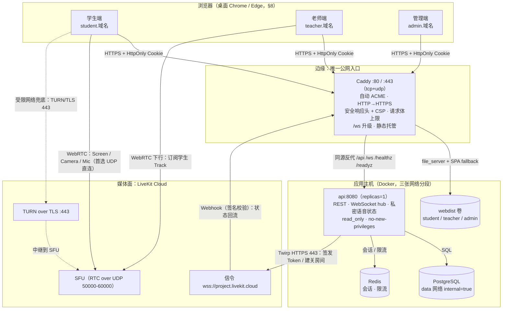

# 生产部署与网络加固（Phase 11）

> **这份文档回答"为什么这样部署"，[`deploy/README.md`](../../deploy/README.md) 回答"手怎么动"。**
> 上线操作步骤（10 步）在 README；网络原理、TURN 验证、测试矩阵、容量估算、故障排查在这里。
>
> 任务书依据：§62（Production 拓扑与多网络测试）、§63（Security Checklist）、§77（Phase 11）。
> 本地开发环境见 [setup.md](setup.md)，实时链路见 [realtime-flow.md](../architecture/realtime-flow.md)，
> 媒体面见 [livekit-architecture.md](../media/livekit-architecture.md)。

## 0. 怎么读本文的"验证状态"

生产网络的问题几乎都不是"报错"，而是"看起来正常但行为不对"（限流被绕过、实时通道
静默降级、受限网络下课堂直接不能用）。因此本文对每条结论标注状态：

| 标记 | 含义 |
| --- | --- |
| 【已测】 | 本次 Phase 11 集成阶段用真实目标/真实 LiveKit Cloud 实测过，下文给出方法与观测值 |
| 【已验】 | 用 `caddy validate` / `docker compose config` / 脚本真跑等**静态或路径级**验证过 |
| 【待测】 | 需要真实网络环境或真实浏览器，**没有**实测，已写成待办清单（§6.2） |

诚实标注比"全部通过"有用：把没测的写成测过，等于把风险留给第一次真实课堂。

---

## 1. 生产拓扑

### 1.1 拓扑图



图里有三个容易看错的地方，都是设计决定：

1. **三个前端站点自己也反代 `/api` 与 `/ws`**（不是让浏览器直连 `api.域名`）。
   前端代码用的是**同源相对路径**（`/api/v1/...`、`/ws/student`，见
   `packages/api-client/src/realtime-socket.ts` 与 `apps/*/vite.config.ts` 的注释）。
   同源带来三件事：不触发 CORS 预检、Cookie 的 SameSite 语义最简单、少一次 DNS/TLS 建连。
2. **`api.域名` 仍然独立存在**，因为 LiveKit Cloud 的 webhook 需要一个稳定的服务端入口
   （`https://api.域名/internal/livekit/webhook`），而且排障时可以只打 API、绕开前端。
3. **媒体包不经过这台服务器**。它走浏览器 ↔ LiveKit Cloud（UDP 或 TURN/TLS 443）。
   所以本机的带宽需求很小，而"课堂卡不卡"取决于**学生所在网络**能不能直连 SFU（§5）。

### 1.2 暴露面与网络分段

`deploy/docker-compose.prod.yml` 的 `docker compose config` 实测结论（【已验】）：

| 服务 | 发布的端口 | 所在网络 | 说明 |
| --- | --- | --- | --- |
| `caddy` | **80/tcp、443/tcp、443/udp** | `edge`（有网关）+ `app`（固定 `172.31.0.2`） | 唯一对公网暴露的容器。443/udp 是 HTTP/3，云防火墙不允许时删掉即可 |
| `api` | **无** | `app` + `data` | 由 Caddy 通过 `app` 网络以服务名 `api:8080` 访问；`app` 提供出网能力（调 LiveKit Cloud） |
| `postgres` | **无** | `data`（`internal: true`） | 无网关：不能被公网访问，也**不能主动出网** |
| `redis` | **无** | `data`（`internal: true`） | 同上（会话索引 + 限流计数器） |
| `migrate` | **无** | `data` | 一次性服务，`restart: "no"`，退出码 0 才算发布成功 |
| `adminctl` | **无** | `data` | `profiles: ['tools']`，只有显式 `run --rm` 才会启动 |
| `web-dist` | **无**（`network_mode: none`） | 无网络 | 一次性把静态产物写进 `webdist` 卷 |

**为什么把"公网可达"压缩到一个容器上**：只写"不发布端口"是默认值，不是边界——
排障时顺手加一行 `ports: 5432:5432` 就足以让数据库在几分钟内被扫描到。
把 `postgres`/`redis` 放在**没有网关**的网络里，这类误操作不会立刻变成互联网可达的数据库，
而且被入侵的 API 也没有可直接外传数据的路径。

### 1.3 启动顺序（顺序本身就是设计）

```text
postgres(healthy) ─┐
redis(healthy)    ─┼─► migrate（一次性，Exited 0）─┐
web-dist（一次性，Exited 0）──────────────────────┴─► api(healthy) ─► caddy(running)
```

- **迁移是发布动作，不是启动副作用**（§60）：`DB_AUTO_MIGRATE=false`，迁移失败时
  `api` 根本不会启动，不会出现"服务起来了、schema 还是旧的"。
- **`web-dist` 失败则 `caddy` 不启动**：`publish-web.sh` 会校验三个 `index.html` 是否存在。
  宁可部署失败，也不要对外提供一个白屏站点（bind mount 空目录的典型症状）。
- **`api` 的健康检查用 `/readyz`，镜像自带的 `HEALTHCHECK` 仍是 `/healthz`**，这是刻意的：
  compose 的健康状态决定"要不要放流量进来"（readiness），而镜像层决定"要不要重启容器"
  （liveness）。用 readiness 做重启判断会把一次数据库抖动放大成重启风暴。

---

## 2. HTTPS、Cookie 与代理信任

### 2.1 为什么生产必须 `Secure`

`SESSION_COOKIE_SECURE` 由 `deploy/docker-compose.prod.yml` **写死为 true**，
`.env.production` 无法覆盖。原因不是洁癖：

- 不带 `Secure` 的会话 Cookie 会被浏览器在**明文 HTTP 请求**里带上。校园网/公共 Wi-Fi
  里的任何一个监听者拿到它就能直接冒用会话（Cookie 就是 bearer 凭据）。
- 反过来，带了 `Secure` 而在 HTTP 上访问，浏览器**直接丢弃**这个 Cookie，
  表现是"登录成功但立刻变回未登录"——这条路必须靠 HTTPS 走通，没有折中。
- HSTS（`max-age=31536000; includeSubDomains`）把这条规则固化到浏览器里，
  连"用户手输 http://"这条降级路径也一起堵上。注意 HSTS **无法撤回**，
  所以首次上线前必须确认四个子域证书都能签发（README 步骤 5 的日志检查）。

### 2.2 `SameSite=Lax`：跨子域的取舍

代码里固定为 `SameSite=Lax`（`services/api/internal/httpapi/auth.go`），**没有环境变量**。
这是有意的：`SameSite` 是一个容易被"顺手改成 None 让联调通过"的安全开关。

关键事实：**SameSite 判断的是"站点"（site），不是"来源"（origin）**。
`student.域名` 与 `api.域名` 是同一个 registrable domain 的兄弟子域，属于**同一个 site**，
所以即使前端直连 `api.域名`（跨 origin），浏览器仍然会带上 `Lax` 的 Cookie。

| 场景 | SameSite=Lax 是否带 Cookie | 说明 |
| --- | --- | --- |
| 本站同源请求（生产主路径，Caddy 同源反代） | 带 | 最简单、最不容易错 |
| 兄弟子域之间的 XHR（如 `student.` → `api.`） | 带 | same-site 判定 |
| 第三方站点发起的跨站请求 | 不带 | 这正是 CSRF 防线之一 |
| 顶级导航 GET（从邮件/书签点进来） | 带 | Lax 的语义 |

什么时候真的需要 `SameSite=None; Secure`：把课堂嵌进**完全不同的站点**
（例如学校的第三方平台用 iframe 承载）。那时必须同时满足：

1. 改 `services/api/internal/httpapi/auth.go` 的 `SameSite` 为 `None`；
2. Caddy CSP 的 `frame-ancestors` 放开到那个站点（当前是 `'none'`）；
3. 认清代价：跨站请求会带上会话 Cookie，CSRF 防线只剩"CSRF Token + 同源校验"，
   这个组合仍然有效（见 [authentication.md](../auth/authentication.md)），但必须重新评审。

### 2.3 `TRUSTED_PROXIES`：配错的两个后果

`TRUSTED_PROXIES` 告诉 API："当 TCP 对端在这个网段里时，可以去读
`X-Forwarded-For` / `X-Real-IP` 判断真实客户端 IP"。这份编排里它由
`CADDY_APP_IP`（默认 `172.31.0.2`）派生成 `<IP>/32`，因为只有 Caddy 需要被信任。

**两个方向的配错都会出事，而且症状完全不同**：

| 配法 | 发生了什么 | 症状（怎么发现的） |
| --- | --- | --- |
| 空 / 写错（不包含 Caddy 的地址） | API 只看到 TCP 对端 = Caddy 容器地址，**所有请求的"客户端 IP"都是同一个** | 全站共用一个限流桶：一个学生在登录页刷新几次，**全校收到 429**；日志与 `sessions.ip` 全变成代理地址，审计失去意义 |
| 写太宽（`0.0.0.0/0`、整个 `172.16.0.0/12`） | 任何能连到 API 的进程都能用 `X-Forwarded-For` 指定自己的 IP | 限流被**彻底绕过**：轮换这个头就能无限重试登录；`sessions.ip` 变成客户端虚构的数据 |

所以：**只填真实代理地址**。`parseTrustedProxies` 对格式错误（既不是 IP 也不是 CIDR）
采取**启动即失败**，因为"静默不生效的安全配置"比启动失败危险得多。

### 2.4 客户端 IP 的真实传递链（【已测】）

用两个 Caddy（一个 `respond` 出收到的头、一个反代）实测了 Caddy 2.10 的行为：

| 配置 | 客户端发 `X-Forwarded-For: 1.2.3.4` 后，上游收到 |
| --- | --- |
| Caddy **默认**（未配置 Caddy 自身的 `trusted_proxies`） | `X-Forwarded-For` = Caddy 观察到的对端地址（伪造的 `1.2.3.4` **被整个丢弃**） |
| 显式 `header_up X-Forwarded-For {remote_host}` | 结果**完全相同**（因此 `deploy/Caddyfile` 不写它，写了会让 `caddy validate` 报一片 "Unnecessary header_up" 警告） |
| `X-Real-IP`（默认行为） | **原样透传**（上面实验里上游收到了伪造的 `5.6.7.8`）→ 所以 Caddyfile 里**必须**显式 `header_up X-Real-IP {remote_host}` 覆盖它 |

叠加 API 侧的解析策略（`services/api/internal/httpapi/clientip.go`：**从右往左**遍历
转发链、跳过可信跳数），最终结论是：

> 在这个拓扑里，客户端无法伪造自己的客户端 IP；限流桶与 `sessions.ip` 都以
> "Caddy 实际看到的对端地址"为准。

**如果以后在 Caddy 前面再加一层 CDN/WAF（Cloudflare 等）**，这条链会变成两跳，必须同时改两处，
否则会出现"全世界共用一个限流桶"：

1. Caddy 侧改成信任 CDN 网段（并改读 CDN 的真实 IP 头），
2. API 侧把 CDN 网段也加入 `TRUSTED_PROXIES`，或改回追加语义并依赖"从右往左"的解析。

---

## 3. 安全响应头与 CSP

### 3.1 一次给全的头（`deploy/Caddyfile` 的 `security_headers` 片段）

| 头 | 值 | 为什么 |
| --- | --- | --- |
| `Strict-Transport-Security` | `max-age=31536000; includeSubDomains` | 一年内只允许 HTTPS，且覆盖所有子域。少了 `includeSubDomains`，攻击者可以对 `http://api.域名` 做一次明文请求 |
| `X-Content-Type-Options` | `nosniff` | 防止"看起来像图片、其实是 HTML/JS"的响应被执行 |
| `Referrer-Policy` | `strict-origin-when-cross-origin` | 跨站跳转只发 origin；URL 里有 classroom/session 的 UUID |
| `Permissions-Policy` | `camera=(self), microphone=(self), display-capture=(self), geolocation=(), payment=(), usb=(), serial=(), midi=()` | **前三个是课堂功能的前提**：删掉任何一个，`getUserMedia`/`getDisplayMedia` 会抛 `NotAllowedError`，而报错不会提到"是响应头禁止的" |
| `-Server` | 移除 | 不回显 Caddy 版本号，少一个"按版本挑漏洞"的入口 |

### 3.2 CSP 逐条：为什么需要这个来源

CSP 写错**不会报错**，只会静默让课堂不可用（请求被浏览器拦掉，服务端日志里什么都看不到）。
完整策略与 14 条理由写在 `deploy/Caddyfile` 的 `(csp)` 片段旁边，这里是"改的时候看哪一条"的索引：

| 指令 | 关键来源 | 少了它会怎样 |
| --- | --- | --- |
| `default-src` | `'self'` | 默认拒绝一切外部来源；后面的每条都是显式开口子 |
| `script-src` | `'self'`（**故意没有** `'unsafe-inline'`/`'unsafe-eval'`） | 这是唯一真正挡 XSS 的指令；Vite 生产构建没有内联脚本，所以不需要妥协 |
| `style-src` | `'self' 'unsafe-inline'` | Vue 的 `:style` 绑定与组件过渡会写内联样式；这是**有意识**的折中（CSS 注入不能直接执行 JS，而脚本注入已被上一条堵死）。收紧路径：确认无内联样式后去掉 `'unsafe-inline'` |
| `img-src` | `'self' data: blob:` | `data:` 给内联图标；`blob:` 给 canvas 抓帧/本地预览 |
| `font-src` | `'self' data:` | 打包字体 + 内联 base64 字体 |
| `connect-src` | `'self' https://api.域名 wss://api.域名 https://*.livekit.cloud wss://*.livekit.cloud blob:` | **课堂能不能用几乎全看这一条**（见下表） |
| `media-src` | `'self' blob:` | 摄像头/麦克风走 `srcObject`，不触发 CSP 取流；`blob:` 覆盖抓帧回放/本地预览 |
| `worker-src` | `'self' blob:` | `livekit-client` 会创建 Web Worker（E2EE / Insertable Streams 路径）。缺了它，加密房间或部分浏览器会建连后立刻抛错 |
| `frame-src` | `'self' blob:` | 预留：个别预览实现用 iframe 承载 blob。**发现黑屏时第一个要检查这里** |
| `object-src` | `'none'` | 彻底禁用 `<object>`/`<embed>` |
| `base-uri` | `'self'` | 阻止注入 `<base>` 把相对路径劫持到攻击者域名（绕过 `script-src` 偷 API 请求的经典手法） |
| `form-action` | `'self'` | 表单只能提交回本站 |
| `frame-ancestors` | `'none'` | 防点击劫持（比 `X-Frame-Options` 更彻底）；被嵌入的页面本来也拿不到摄像头/屏幕共享权限 |
| `upgrade-insecure-requests` | — | 把残留的 `http://` 子资源自动升级为 https，兜住"某处硬编码了 http" |

`connect-src` 逐来源：

| 来源 | 为什么需要 | 删掉的症状 |
| --- | --- | --- |
| `'self'` | 生产主路径：三个前端用相对路径 `/api`、`/ws`，由 Caddy 同源反代 | 所有接口与实时通道失效 |
| `https://api.域名` / `wss://api.域名` | 一旦某个前端改成**直连** `api.域名`（跨 origin） | 请求被浏览器拦掉，只在 DevTools 控制台报错，页面表现是"点了没反应" |
| `https://*.livekit.cloud` / `wss://*.livekit.cloud` | LiveKit Cloud 的信令（wss）与服务端 Twirp（https）会落在项目域与区域域（`<project>.livekit.cloud`、`<region>.livekit.cloud`） | 浏览器连不上媒体面，一直停在"连接中"，而服务端一切正常。**换自建 LiveKit 时必须改成自建信令域名** |
| `blob:` | `livekit-client` 从 Blob 构造 Worker 并与之通信；屏幕共享本地回放预览也走 blob URL | "能进房间但看不到自己的画面"，或加密房间直接失败 |

> ⚠️ **重要边界**：WebRTC 的媒体包（SRTP over UDP/TCP）**不受 CSP 管辖**，
> TURN/TLS 的 443 连接由浏览器内核发起、同样不经 `connect-src`。
> 所以"CSP 配通了"**绝不等于**"媒体面通了"——TURN 必须单独验证（§5）。

### 3.3 手工校验 Caddyfile 的正确姿势（含一个真实的坑）

**坑（校验时踩到过）**：直接 `caddy validate` 且**不传环境变量**时，
`{$ACME_EMAIL}` 展开成空 → `email` 变成没有参数的空指令 → Caddy 报：

```text
parsing caddyfile tokens for 'email': wrong argument count
```

这个报错完全看不出是"少了一个环境变量"。**生产路径上不会遇到**：
compose 里是 `ACME_EMAIL: ${ACME_EMAIL:?...}`，缺值时会在更早的一步给出中文提示。
但手工校验必须带上环境变量：

```bash
# 1) 用模板里的占位值导出全部变量（模板里没有真实密钥，可以放心 source）
set -a; . deploy/.env.production.example; set +a

# 2) 校验（含 adapt：把 Caddyfile 展开成最终 JSON，可以顺便检查 CSP 展开后的样子）
docker run --rm -i \
  -e STUDENT_HOST -e TEACHER_HOST -e ADMIN_HOST -e API_HOST -e RTC_HOST \
  -e ACME_EMAIL -e WEB_ROOT -e API_UPSTREAM -e HTTP_MAX_BODY_BYTES \
  -v "$PWD/deploy/Caddyfile:/etc/caddy/Caddyfile:ro" \
  caddy:2.10-alpine caddy validate --config /etc/caddy/Caddyfile

docker run --rm -i \
  -e STUDENT_HOST -e TEACHER_HOST -e ADMIN_HOST -e API_HOST -e RTC_HOST \
  -e ACME_EMAIL -e WEB_ROOT -e API_UPSTREAM -e HTTP_MAX_BODY_BYTES \
  -v "$PWD/deploy/Caddyfile:/etc/caddy/Caddyfile:ro" \
  caddy:2.10-alpine caddy adapt --config /etc/caddy/Caddyfile --pretty | grep -i "content-security-policy"
```

本次校验结果【已验】：`Valid configuration`，退出码 0，**0 条警告**；
`caddy adapt` 确认了 4 个站点主机、`"max_size": 1048576`、`flush_interval`，
以及展开后的 CSP 里确实包含 `wss://api.<域名>`、`wss://*.livekit.cloud`、`blob:`、
`display-capture`、`upgrade-insecure-requests`。

---

## 4. 实时通道 `/ws/*`：最容易被静默配坏的地方

### 4.1 握手与 101

业务 WebSocket（`/ws/student`、`/ws/teacher`，§47）承载的是**课堂实时状态**：
谁进来了、谁掉线了、私密语音邀请。它和视频/语音是两条独立的链路。

代理层如果丢了 `Connection: Upgrade` / `Upgrade: websocket`，浏览器拿到的不是
`101 Switching Protocols` 而是普通 `200`，前端只会看到"连不上，正在重连"。
**最坑的形态**：ICE/TURN 打得通时视频/语音仍然是好的，于是现象被误判成"媒体面故障"。

Caddy 的 `reverse_proxy` **默认**识别 Upgrade 并完成协议切换，也会正确处理
hop-by-hop 的 `Connection` 头；因此 `deploy/Caddyfile` **故意不**手写
`header_up Upgrade` / `header_up Connection "upgrade"`（照抄 nginx 的做法有害：
`Connection` 是 hop-by-hop 头，HTTP/2 下不允许出现）。显式声明的只有：

- `flush_interval -1`：关闭响应缓冲，保证 101 与之后每一帧立即透传（默认缓冲会让状态帧
  攒起来批量发送，表现为"实时状态延迟好几秒"）；
- `transport http { read_timeout 0 write_timeout 0 }`：**不设空闲超时**。一节课 45 分钟，
  任何"顺手加个 30s 超时"都会让连接在课中被服务端单方面切断（周期性重连 + 丢帧）。
  （`0` 本来就是 Caddy 的默认值，显式写出来是为了让"这里不要加超时"成为一处可审阅的声明；
  `caddy adapt` 的 JSON 里看不到它，因为零值被省略。）

### 4.2 怎么验证（`net-check.sh` 第 5 节，【已测】）

```bash
deploy/scripts/net-check.sh api.域名
```

脚本会做一次真实的 WebSocket 握手，并利用一个 API 侧的重要特性：
**未认证的 `/ws/student` 也会先完成 101，然后立刻发一个关闭帧**
（`services/api/internal/httpapi/ws.go`：`reject` 只在"握手失败"时才回 HTTP 错误码）。
因此：

| 观测 | 结论 |
| --- | --- |
| `HTTP/1.1 101 Switching Protocols` | Upgrade 头被完整转发到 API ✅ |
| `200` / `401` / `403` | 反代很可能没转发 Upgrade → **实时通道已静默降级** |

本次实测（本地 dev API + 真实 LiveKit Cloud）：

```text
5. 实时通道（WebSocket Upgrade）
  ✓ 控制面 http://localhost:8090/ws/student → HTTP/1.1 101 Switching Protocols
  ✓ 媒体面信令 https://moniter-class-...livekit.cloud/rtc → HTTP/1.1 401 Unauthorized
```

LiveKit 的 `/rtc` 需要鉴权，**401 就是"可达且说话正常"的证明**；连不上或 404/502 才是问题。

---

## 5. TURN 与受限网络（§62 重点）

### 5.1 什么时候会走 TURN

WebRTC 的第一选择永远是**直连**（UDP 打洞）。下面这些网络里它打不通，必须靠 TURN 中继：

| 网络条件 | 直连是否可行 | 实际路径 |
| --- | --- | --- |
| 普通家庭 NAT + 另一侧也普通 | 通常可行 | UDP 直连 SFU |
| **对称 NAT**（企业/校园常见） | 打洞失败 | TURN（Cloud 提供 TURN/TLS 443） |
| **UDP 被完全封**（只放 TCP 443） | 不可行 | TURN over TLS 443 |
| 运营商级 NAT（CGNAT，手机热点常见） | 看 NAT 类型，常失败 | 多半走 TURN |
| 同一 Wi-Fi / 内网 | 可行 | 直连，延迟最低 |

**用 LiveKit Cloud 时，TURN/TLS 由 LiveKit Cloud 提供**（`<project>.turn.livekit.cloud` 之类的
TURN 域，5126/443 等端口），本机**不需要**自建 coturn、也**不需要** `rtc.域名` 记录
（`RTC_HOST` 留空）。本机对外的出站需求只有：TCP 443（信令 + TURN/TLS）、
UDP 50000-60000（直连 SFU，最理想）。

### 5.2 如何验证 TURN 真的在工作

**只验证"信令能通"是不够的**——很多受限网络里信令（HTTPS/WSS）完全正常，
而媒体包一发就丢。必须验证"媒体真的经 TURN 走通了"。

#### 方法 A：真实浏览器看候选类型【待测】

1. 在受限网络下的浏览器里打开课堂（学生端进入房间、开始共享屏幕）。
2. 新开一个标签页打开 `chrome://webrtc-internals`，选中有教室流量的那个 tab。
3. 看 `ICE candidate pair` / `candidate` 列表里的 **candidate type**：
   - `relay` → **确实走了 TURN**（这是受限网络下我们要的结果）；
   - 只有 `host` / `srflx` → 没走 TURN，说明直连成功了（在受限网络里不太可能），
     或者 TURN 配置根本没下发给客户端；
   - `prflx` 是打洞过程中的对端反射候选，不是 TURN。
4. 再看 `framesReceived` / `framesSent` 是否在持续增长——**有候选不等于有媒体**。

本次**没有**在真实浏览器里做这一步（需要真实受限网络 + 两台真实设备），已列为待办（§6.2）。

#### 方法 B：relay-only 端到端跑一次【已测】

强制 ICE 只用 relay 候选（`ICETransportPolicyRelay`），等价于"UDP 被封 / 对称 NAT"的
最坏情况，然后用**真实 LiveKit Cloud** 跑一次真实的媒体流：

本次集成阶段的实测结论：

| 观测项 | 结果 |
| --- | --- |
| 学生端（relay-only）发布**屏幕轨道** | 成功 |
| 老师端（同样 relay-only）订阅该轨道 | 成功，**收到 2168 帧真实视频** |
| 服务端观测到的会话状态 | `status=ONLINE` / `screen=true` / `connection=GOOD` |

结论：**TURN/TLS 路径确实能承载真实媒体，不只是"信令能过"。**
这是本次 Phase 11 在媒体面连通性上最强的一条证据，也说明"LiveKit Cloud 的 TURN
在 UDP 被封锁时是可用兜底"这个前提成立。

> 说明：这个实验用的是 Go 探针（强制 relay）而不是浏览器，因此**不能**替代
> 方法 A 中"真实浏览器 + `chrome://webrtc-internals`"的验证；两者互补：
> 探针证明链路，浏览器验证客户端行为与权限。

#### 一个值得记住的诊断现象：用错角色的 Token 发轨道 = publish 超时

同一组实验里发现：拿**老师 Token 去发布屏幕轨道**（该 Token 的权限位只有 `microphone`，
没有 `screen_share`）时，SFU 的表现是 **publish 超时**（`timed out publishing track`），
**而不是一个干净的错误码**；同一网络、同一时刻换成学生 Token 立刻成功。

也就是说：**"发布轨道卡住/超时"很可能不是网络问题，而是 Token 的发布权限不够。**
排查顺序应该是"先确认 Token 的 `canPublishSources`，再怀疑网络"：

```bash
# 后端签发的 Token 里，屏幕共享权限位来自 TokenService（见 docs/media/track-permissions.md）
# 老师与学生的可发布来源不同：老师 = microphone（+ 需要时 camera）；
# 学生 = screen_share（+ 可选 camera/microphone）。
grep -n "CanPublishSources" services/api/internal/media/*.go
```

### 5.3 自建 LiveKit 时的 TURN 配置要点【待测·方案未验证】

只有在"不用 LiveKit Cloud、自己跑 SFU"时才需要这一节。**必须三件事一起做**，
缺一件的表现都是"ICE 里永远只有 host/srflx 候选、连不上或只能同网段用"：

1. **DNS 与公网地址**：`rtc.<域名>` 指向本机；LiveKit 配置里
   `rtc.use_external_ip: true` 并固定 `node_ip`（否则容器/云主机会把自己看到的私网地址
   当成候选发给客户端，客户端根本连不上）。
2. **LiveKit 侧的 TURN 开关**（`deploy/livekit/livekit.yaml` 是开发用的最小配置，
   生产需要另写）：打开 `turn.enabled`、指定 `turn.domain` 与证书，
   或把 `turn` 指到独立部署的 coturn（`turn.external_tls_port` / `turn.tls_port`）。
3. **防火墙**（见下表），以及上面第 1 点的"公网 IP 正确性"。

coturn（独立部署时）的最小要点：

```conf
# /etc/turnserver.conf —— 只列关键项
listening-port=3478            # STUN/TURN over UDP/TCP
tls-listening-port=5349        # TURN over TLS（受限网络下的主力）
fingerprint
lt-cred-mech
# 与 LiveKit 共用一个共享密钥（不要用静态用户名/密码）
use-auth-secret
static-auth-secret=<与 LiveKit 相同的密钥，来自密钥管理系统，不写进仓库>
realm=rtc.<域名>
external-ip=<服务器公网 IP>     # 多网卡/NAT 主机必须写，否则返回私网候选
cert=/etc/letsencrypt/live/rtc.<域名>/fullchain.pem
pkey=/etc/letsencrypt/live/rtc.<域名>/privkey.pem
no-multicast-peers
no-cli
```

| 端口 | 协议 | 用途 | 少了它的症状 |
| --- | --- | --- | --- |
| 443 | TCP | 信令（WSS）+ TURN/TLS 复用 | 全面不可用 |
| 7881 | TCP | RTC over TCP 兜底 | UDP 被封时无兜底 |
| 50000-60000 | UDP | RTC 媒体（可调小范围） | 只能靠 TURN 中继，成本与延迟上升 |
| 5349 | TCP | **TURN over TLS** | 受限网络（只放 443 的环境除外）无法中继；若把 TURN/TLS 也放到 443 则由 443 承担 |
| 3478 | UDP/TCP | STUN/TURN 明文 | NAT 类型探测与 UDP 中继退化 |

### 5.4 为什么 TURN/TLS 不能用 HTTP 反代（重要）

TURN over TLS 是把 **TLS 之上的字节流交给 TURN 协议解析**，本质不是 HTTP。
用 Caddy/nginx 做 HTTP 反代转发必然失败，而且**服务器侧看不到任何错误**，
客户端侧表现为"ICE 里只有 host/srflx、永远选不到 relay"。

之所以专门写这一条：`deploy/Caddyfile` 里有 `rtc.域名` 的站点块（给信令用的，
`wss://` 是标准 WebSocket，可以正常反代），很容易顺手把 TURN 也指过来。
自建时 TURN **必须**由 coturn（或 LiveKit 内置 TURN）自己监听 5349/tcp 并持有证书。

---

## 6. 多网络环境测试矩阵（§62）

### 6.1 矩阵

| # | 环境 | 怎么测 | 预期现象 | 本次状态 |
| --- | --- | --- | --- | --- |
| 1 | **受限网络：UDP 被封 / 对称 NAT** | Go 探针强制 `ICETransportPolicyRelay` 连真实 LiveKit Cloud：学生发布屏幕轨道、老师端订阅 | 走 TURN/TLS 443；老师端应收到**持续增长的真实视频帧** | **【已测】** 学生发布成功；老师端收到 **2168 帧**；服务端 `status=ONLINE / screen=true / connection=GOOD` |
| 2 | **仅放行 TCP 443** | 同上（relay-only 强制走 TURN/TLS 443）；在真实只放 443 的防火墙后重复 | 课堂可用（媒体走 TURN/TLS） | **【部分已测】** relay-only 实验走的就是 TURN/TLS 443；但**未**在真实"只放行 443"的防火墙后重复，标为待复核 |
| 3 | 同一 Wi-Fi / 内网 | 两台机器在同一网段，学生共享屏幕 | 直连（host/srflx 候选），不经 TURN，延迟最低 | **【待测】** 生产域名下的同网段验证 |
| 4 | 校园网 | 在校园网出口（通常对称 NAT / 有 UDP 限制）跑一次完整课堂 | 多半走 TURN；若同时限制 UDP 与非 443，必须走 TURN/TLS 443 | **【待测】** 需要真实校园网环境 |
| 5 | 家庭 NAT | 家用宽带 + 家用路由器（默认 NAT） | 直连或 TURN 皆可；应能正常上课 | **【待测】** 需要真实家庭网络 |
| 6 | 手机热点 | 手机 4G/5G 热点（常见 CGNAT） | 直连可能失败 → 走 TURN；**这是最常见的真实家长/学生场景** | **【待测】** 需要真实移动网络 |
| 7 | 不同 ISP | 老师与学生在两家不同运营商 | 协商路径不同（可能一方直连、一方中继） | **【待测】** 需要两处真实环境 |
| 8 | 真实浏览器 relay 候选类型 | `chrome://webrtc-internals` 确认 candidate type = `relay`（方法 A） | 受限网络下应看到 relay 且有持续帧数 | **【待测】** 需要真实受限网络 + 真实设备 |

补充：`deploy/scripts/net-check.sh` 覆盖的是**路径级**检查（DNS/TLS/证书/WSS/Twirp/UDP-STUN），
它**不能**证明 TURN 在课堂里生效——脚本自己的输出里也这么写。上面第 1 行才是媒体面证据。

### 6.2 待办清单（谁、在什么环境、做什么）

| 待办 | 环境要求 | 完成标准 |
| --- | --- | --- |
| 真实浏览器 relay 候选验证 | 受限网络 + 两台真实设备（Chrome/Edge） | `chrome://webrtc-internals` 中出现 `relay` 候选，且 `framesReceived` 持续增长 |
| 只放行 443 的防火墙验证 | 能配置出站规则的环境（可用云安全组模拟） | 学生共享屏幕、老师能看到画面，`readyz` 正常，无"连接中"卡死 |
| 校园网实测 | 真实校园网出口 | 完整走一次"登录 → 进课堂 → 共享 → 老师看到 → 断网恢复" |
| 家庭 NAT 实测 | 家用宽带 | 同上 |
| 手机热点实测 | 4G/5G 热点 | 同上（重点观察是否走 TURN） |
| 跨 ISP 实测 | 两家运营商各一台 | 同上 |
| 生产域名下的 WS 长连接 | 生产环境 | 45 分钟不掉线（net-check 只验证握手，不验证长连接存活） |

建议把"学生端进课堂 + 共享 + 老师端看到画面"做成一份固定的手工验收清单，
每次上线后按它跑一遍——WebRTC 不允许用 mock 宣布完成（§64）。

---

## 7. 升级、回滚与迁移

### 7.1 升级流程

```text
1. CI 构建并推送**不可变标签**（不要 latest）→ 2. 改 .env.production 的 API_IMAGE / WEB_IMAGE
3. $COMPOSE run --rm migrate status      ← 先看清单，确认将要发生什么
4. $COMPOSE up -d --build                ← migrate 先跑完，api 才换
5. net-check + 真实课堂走一遍            ← 验证（§4.2 / §5.2）
6. 保留上一个标签至少一周                ← 回滚的抓手
```

为什么坚持不可变标签：回滚的第一步是"知道要回到哪个二进制"。`latest` 会让
"回滚"变成一个不可知动作。`APP_VERSION` / `APP_COMMIT` 会写进启动日志与 `/api/v1/meta`，
排障时用来确认线上跑的到底是哪个构建。

### 7.2 迁移的向前兼容原则

本项目的迁移（`services/api/migrations/NNNN_name.sql`）遵循：

- **只增不改**：编号只增，已发布的迁移文件不再修改；
- **向前兼容**：新增列可空或有默认值，不删列、不改语义、不重命名；
- **不做 down migration**：回滚靠"旧代码 + 新 schema"，而不是把 schema 退回去。

这条原则的直接好处：**回滚代码不需要动数据库**。代价是 schema 只会向前演进，
因此每次发布都必须确认"旧版本代码在新 schema 上仍然能跑"（只增列天然满足）。

### 7.3 回滚

```bash
# 1) 改回上一个不可变标签
$EDITOR deploy/.env.production          # API_IMAGE / WEB_IMAGE / APP_VERSION
$COMPOSE up -d --no-deps api caddy
$COMPOSE exec -T api wget -qO- http://127.0.0.1:8080/readyz
```

| 情况 | 做法 |
| --- | --- |
| 新版本 API 有 Bug，schema 已前向迁移 | **只回滚代码**（上面的步骤）；schema 保持不动 |
| 新版本前端有 Bug | 只回滚 `WEB_IMAGE` 并 `up -d --no-deps caddy`（`web-dist` 会重新发布产物） |
| 备份的 `schema_version` **大于**当前镜像已知的迁移 | **不要**直接启动旧镜像：先换回与备份同版本的镜像，否则新 schema 上的代码路径不存在 |
| 数据被错误迁移破坏 | 走 §8 的恢复流程（先停 api，再恢复，再校验版本） |

---

## 8. 备份与恢复演练

### 8.1 `backup-db.sh` 做了什么

| 步骤 | 为什么 |
| --- | --- |
| `pg_dump --format=custom`（`-Fc`） | 压缩、可校验、可选择性恢复；SQL 文本格式恢复时遇到一个语法错误就停在半路，留下半截 schema |
| **不备份数据卷目录** | 数据库运行中拷贝文件级快照得到的是**损坏的备份**（文件在事务边界之间不一致） |
| 先写 `.partial` 再 `mv` | 任务被中断时目录里不会留下一个"看起来正常、其实半截"的 `.dump`——恢复一个坏备份比没有备份更糟 |
| PGDMP 魔数 + 最小体积校验 | 挡住"pg_dump 报错但 shell 仍然生成了文件"和"stderr 被重定向进备份文件" |
| `.dump.meta` 记录 `schema_version` / PostgreSQL 版本 / sha256 | 恢复时校验"恢复出来的库就是这份备份的状态"；sha256 用于跨机器完整性校验 |
| 保留最近 N 份 | 备份把磁盘写满会让**数据库先挂**（它要写 WAL）——这是备份系统最经典的自杀方式 |

### 8.2 `restore-db.sh` 的三道闸门

| 闸门 | 拦住的错误 |
| --- | --- |
| 文件不存在 / 魔数不对 / sha256 与 `.meta` 不一致 | 拿错文件、文件损坏、拷贝不完整 |
| 目标库上还有**其它活动连接** → 拒绝恢复 | 服务在线时恢复会造成"恢复完成后应用又把它改回去"的**静默数据损坏**（结果既不是备份状态、也不是当前状态） |
| 恢复后 `schema_version` 必须与备份记录一致 | 恢复"看起来成功"但实际没成功（磁盘满、权限不足） |

它还要求显式确认（`CONFIRM=restore`）：恢复是破坏性动作，CI/cron 里误触发一次的代价是
整个课堂数据被回滚。`--single-transaction` 保证失败即整体回滚，不会留下半截 schema。

### 8.3 演练记录（【已测】，本次真实跑过）

用本地开发库做的完整往返（**不碰生产库**）：

```text
==> 备份 classwatch/classwatch → /tmp/cw-backup-test/classwatch-20261003T133556Z.dump
    大小：45326 字节
    schema_version：8
    sha256：c61010e6...cee4b6                 ← meta 内容
format=custom / created_at=... / schema_version=8 / postgres_version=postgres (PostgreSQL) 18.6

# 保留策略：连续跑 3 次（BACKUP_RETENTION=2）
==> 已删除超出保留份数的旧备份：.../classwatch-20261003T133556Z.dump

# 恢复到临时库 classwatch_restore_test
==> 恢复后 schema_version=8
==> schema 版本校验通过
# 校验：public 下 8 张表、schema_migrations 最大版本 8、6 个账号全部在
```

三道闸门也分别实测过：无 `CONFIRM=restore` → 只打印计划并退出 1；
篡改过的备份 → sha256 不一致并退出 1；目标库有 2 个活动连接 → 拒绝并列出连接。

**上线前请在生产上再做一次同样的演练**（README 步骤 9），
只是把临时库换成 `classwatch_restore_drill`。

### 8.4 保留与异地

- 备份目录（`BACKUP_DIR`）必须与数据卷在**不同的物理磁盘/挂载点**上；
- `.dump` + `.meta` **必须成对**复制到另一台机器（只在本机保留 = 磁盘坏掉时数据与备份一起消失）；
- 保留份数按 `BACKUP_RETENTION`（默认 7，配合每日 cron 约覆盖一周）；
- 建议每月做一次恢复演练，并记录耗时（恢复时间是 RTO 的唯一真实依据）。

---

## 9. 日志与指标

### 9.1 日志

| 项 | 事实 |
| --- | --- |
| 格式 | 由 `APP_ENV=production` 决定为 **JSON**（`services/api/internal/infrastructure/logging`）。**没有** `LOG_FORMAT` 变量——格式跟着环境走，避免"调高日志级别时把机器可读的形状改了" |
| 级别 | `LOG_LEVEL`（生产 `info`；`debug` 可能把请求细节写进日志，不要在生产开） |
| 轮转 | compose 里每个服务都是 `json-file` + `max-size`/`max-file`。**docker 默认不轮转**，一个日志死循环能在几小时内写满磁盘，随后数据库写入失败、全线不可用 |
| 绝不能进日志 | 会话 Cookie、密码、LiveKit API secret、完整 auth/media Token（§59）。代码里用 `logging.Redact` 回答"这个密钥配了没有"而不打印值 |
| 采集 | 本机先落到 json-file；接 Loki/ELK 时按字段检索（`request_id`、`user_id`、`classroom_id`、`run_id`、`session_id`）而不是正则啃文本 |

`request_id` 贯穿一次请求的所有日志行并回显在 `X-Request-Id` 响应头里，
这是"用户看到的错误"与"服务端做了什么"之间唯一的连接点。

### 9.2 指标 `/metrics`

API 在 `/metrics` 上暴露 Prometheus 文本格式指标（Phase 11 引入）。

**它故意不经过 Caddy 暴露到公网**：指标里有路由名、依赖状态与课堂规模，
属于内部信息，而且它没有鉴权（为的是让 Prometheus 不带凭据也能抓）。
三种正确的抓取方式：

```bash
# A) 采集器与 api 同处一份 compose 的网络上（推荐）
#    把 Prometheus 加进同一份 compose（或共享 app 网络），抓 http://api:8080/metrics

# B) SSH 隧道（不引入新组件时最省事）
ssh -L 9090:localhost:8080 ops@<server>
curl -sS http://127.0.0.1:9090/metrics | head

# C) 一定要从公网抓？在 Caddyfile 的 api 站点里只对采集器来源放行：
#      @monitor remote_ip <采集器 IP>
#      handle @monitor { ... /metrics ... }     ← 照抄探针那段注释的写法
#    并且**必须**同时限制来源 IP，不要直接 handle /metrics
```

一行自检（不需要额外工具）：

```bash
$COMPOSE exec -T api wget -qO- http://127.0.0.1:8080/metrics | head
```

`METRICS_SESSION_REFRESH_INTERVAL`（默认 15s）控制"在线课堂/在线上课人数"这类
巡检指标的刷新周期：调小更实时，但数据库写入更频繁。

### 9.3 建议告警（按"能提前发现问题"排序）

| 告警 | 判据 | 为什么值得报警 |
| --- | --- | --- |
| 就绪失败 | `/readyz` != 200 持续 1 分钟 | 课堂在所有入口同时不可用 |
| 证书剩余天数 | TLS 证书 < 14 天 | 证书过期 = 四个入口同时不可用，且 Caddy 续期失败通常是静默的 |
| 429 激增 | 限流命中数突增 | 要么被爆破，要么 `TRUSTED_PROXIES`/XFF 配错导致误伤 |
| 磁盘使用率 | > 85% | 数据库需要写 WAL，磁盘满是"全线故障"的常见起点 |
| 备份新鲜度 | 最近一份备份 > 36h | 备份任务失败通常是静默的 |
| 依赖探活 | `livekit` / `postgres` / `redis` 任一非 ok | 早于用户投诉发现 |

---

## 10. 资源建议（1 老师 + 20~30 学生）

### 10.1 服务端

| 组件 | CPU | 内存 | 依据 |
| --- | --- | --- | --- |
| `api` | 2 vCPU 限额 | 1 GB | 负载是 JSON 序列化 + ≤30 条 WebSocket + 数据库往返；编解码全在浏览器，API 几乎不做重活 |
| `postgres` | 2 vCPU 限额 | 1 GB | 课堂是短事务、低并发写；数据量级每节课几十行 `session_events` |
| `redis` | 1 vCPU 限额 | 512 MB | 会话索引 + 限流计数器，值都很小 |
| `caddy` | 1 vCPU 限额 | 256 MB | TLS 终结 + 静态托管；媒体流不经过它 |
| 整机 | **2 vCPU / 4 GB 起步** | | 上面四项之和 + 余量；若把 Prometheus/Grafana/日志采集也放在同一台，建议 4 vCPU / 8 GB |

这些是 `deploy.resources.limits` 的**上限**，不是预留。作用是"把某个服务的内存泄漏
限制在一个容器里"，而不是让整机 OOM 把 PostgreSQL 一起杀掉。

### 10.2 带宽（估算，**不是实测**）

媒体streams**不经过**应用服务器，所以本机带宽需求很小：

| 流量 | 估算 | 依据 |
| --- | --- | --- |
| 静态首屏 | 每次进入 1~3 MB（gzip/br 后） | 三个 SPA 的 JS/CSS；由 Caddy 压缩 + `immutable` 缓存 |
| API / 实时状态 | < 1 Mbps 峰值 | 文本 JSON；实际数据量随课堂规模线性但很小 |
| 老师端**入站**（媒体，经 LiveKit） | 网格低清（约 12 格 × 250~400 kbps）≈ 3~5 Mbps + Focus View 1 路 1.5~2.5 Mbps ≈ **5~8 Mbps** | §52 要求老师端动态订阅、网格降分辨率降帧率，不要 30 × 1080p |
| 若不做动态订阅 | 20~30 × 1~2.5 Mbps ≈ **20~75 Mbps** | 这就是 §52 存在的理由；Phase 12（§78）要实测它 |
| 学生端**上行** | 共享屏幕 1~2.5 Mbps；仅摄像头 0.3~0.6 Mbps | 编码参数与内容运动量决定 |
| TURN 中继 | 与所中继的媒体等量（双向计） | **用 LiveKit Cloud 时按流量计费**，受限网络学生越多、成本越高 |

结论：**本机是 2 vCPU / 4 GB / 40 GB 盘 + 小带宽（≥10 Mbps 出网）就够**，
真正的带宽与 CPU 压力在浏览器与 LiveKit Cloud 侧。上面的数字是**估算 + 依据**，
正式测量属于 Phase 12（§78：1 老师 + 20 学生 → 30 学生，测量老师入站、学生上行、
CPU、内存、SFU CPU/带宽、延迟、重连）。

### 10.3 磁盘

| 项 | 估算 |
| --- | --- |
| PostgreSQL 数据 | 每节课几十行事件；一学年通常 < 1 GB |
| 容器日志 | 每服务 10 MB × 5 份 × 7 个服务 ≈ 350 MB 上限（轮转兜住） |
| 镜像 | api + caddy + postgres + redis + web ≈ 1~2 GB |
| 备份 | 单份几十 MB 起；7 份 + 异地拷贝 |

40 GB 盘足够，但**必须**把 `BACKUP_DIR` 放到与数据卷不同的挂载点（§8.4）。

---

## 11. 故障排查表

| 症状 | 最可能的原因 | 排查命令 / 处理 |
| --- | --- | --- |
| 站点打不开，`caddy` 没起来 | `web-dist` 退出码非 0（静态产物不完整） | `$COMPOSE logs web-dist`；确认构建镜像里有三个 `index.html` |
| 页面白屏 + 控制台一堆 404 | 缓存了旧 `index.html`，或产物没发布 | `$COMPOSE logs web-dist caddy`；确认 `index.html` 是 `no-store`、`/assets/*` 是长缓存 |
| **学生看不到画面** | 受限网络下 TURN 未生效；或学生没有共享权限 | 先在 `chrome://webrtc-internals` 看 candidate type（§5.2 方法 A）；`net-check.sh` 第 6/7 节看 LiveKit 与 UDP |
| **老师收不到轨道** | 学生发布失败（权限位/能力闸门）或订阅未建立 | 后端日志查 `publish`/`subscribe`；确认学生的 Token `canPublishSources` 含 `screen_share` |
| 发布轨道**卡住/超时**（`timed out publishing track`） | **Token 的发布权限位不够**（例如用老师 Token 发屏幕共享，它只有 `microphone`） | 先确认 `canPublishSources`，再怀疑网络（§5.2 末的诊断现象） |
| **实时状态不更新**（点名/掉线/私聊失效），但视频正常 | 反代没转发 WebSocket `Upgrade` → 静默降级 | `net-check.sh` 第 5 节：期望 `101`；若得到 `200/401` 检查 `deploy/Caddyfile` 的 `websocket_proxy` |
| 实时状态延迟好几秒 | 代理在缓冲响应 | 确认 `/ws/*` 走了带 `flush_interval -1` 的片段，而不是普通 `api_proxy` |
| 课堂中途周期性重连 | 代理给长连接设了空闲超时 | 确认 `transport http { read_timeout 0 write_timeout 0 }` |
| **大量 429（限流误伤）** | `TRUSTED_PROXIES` 没配/不匹配 → 全站共用一个限流桶 | 确认 `.env.production` 的 `CADDY_APP_IP` 与 compose 的 app 网段一致；`TRUSTED_PROXIES` 解析失败会启动即报错 |
| 限流完全不起作用 | `TRUSTED_PROXIES` 配得过宽（含 `0.0.0.0/0`） | 收窄到 `<CADDY_APP_IP>/32`；检查 Caddy 前面是否还有别的代理 |
| 日志里客户端 IP 全是同一个内网地址 | 同"限流误伤"（可信代理配置不生效） | 同上；并检查 `sessions.ip` 是否也在记代理地址 |
| **Cookie 不生效/登录后立刻掉线** | `Secure` Cookie + 访问的不是 HTTPS；或有中间设备做 TLS 卸载 | 确认走 `https://`；`SESSION_COOKIE_SECURE` 由 compose 写死为 `true`，不要试图在 http 上登录 |
| Cookie 在跨子域请求里丢失 | 前后端落在**不同 site**（而不是不同子域） | 见 §2.2；确认域名是同一 registrable domain 的兄弟子域 |
| 手工 `caddy validate` 报 `parsing caddyfile tokens for 'email': wrong argument count` | 没传环境变量，`{$ACME_EMAIL}` 展开为空 | `set -a; . deploy/.env.production.example; set +a` 后再 `docker run -e ...`（§3.3）。生产路径由 compose 的 `${ACME_EMAIL:?...}` 提前拦住 |
| `caddy validate` 报 `Unnecessary header_up X-Forwarded-For` | 又手写了 XFF 覆盖（Caddy 默认就会替换掉客户端的值） | 删掉那行，只保留 `header_up X-Real-IP {remote_host}`（§2.4） |
| 证书快到期 / 某个子域证书没签发 | DNS 某条记录没生效，或 ACME 失败进入退避 | `$COMPOSE logs caddy \| grep -i acme`；`net-check.sh` 第 2 节看剩余天数；四条 DNS 都要查 |
| `/readyz` 里 `livekit` 不是 ok | key/secret 不匹配，或 api 出网被拦 | `$COMPOSE exec -T api wget -qO- http://127.0.0.1:8080/readyz`；`net-check.sh` 第 6 节 |
| `readyz` 里 `postgres`/`redis` 报错 | 依赖没起来、密码不对、data 网络没连上 | `$COMPOSE ps`；`$COMPOSE logs postgres redis`；确认 api 同时接了 `app` 与 `data` |
| api 启动即退出，日志提到只读文件系统 | `read_only: true` 下写文件 | 确认没有新增本地写盘（迁移是独立进程）；确实需要写时去掉 `read_only` 并记录原因 |
| `up` 报 `Pool overlaps with other one on this address space` | `172.31.0.0/24` 与服务器上已有 docker 网络冲突 | 改 compose 里 `app` 的网段，**并同步**改 `CADDY_APP_IP` |
| 前端能开但接口全 502 | api 不健康（Caddy 会等它 healthy 才启动） | `$COMPOSE ps api`；`$COMPOSE logs api` |
| 迁移报 `unknown migration` | 服务器上的镜像比数据库旧（或换镜像时跳版本） | `$COMPOSE run --rm migrate status`；换回与备份 `schema_version` 匹配的镜像（§7.3） |
| 磁盘写满后全线故障 | 日志未轮转 / 备份堆积 | `docker system df`；确认每个服务都有 `logging.options.max-size`，备份保留份数合理 |

---

## 12. 当前单实例限制（Phase 11 明确不做多副本）

**这是本 Phase 最重要的一条"已知限制"，不要试图 `--scale api=2`。**

| 状态 | 位置 | 多副本会怎样 |
| --- | --- | --- |
| 业务 WebSocket hub（谁的连接在哪个进程） | `services/api/internal/realtime`（进程内） | 两个副本之间**不转发** WS 消息：老师的连接可能落在副本 A，学生的事件发到副本 B → 老师端随机丢失一半学生的状态更新 |
| 私密语音"正在进行的那一路"状态 | `services/api/internal/session`（进程内） | 开始/结束私聊的请求如果落在不同副本，状态互相看不见，表现为"按钮点了没反应"或"两边说法不一致" |

因此：

- `api` 必须保持 `replicas: 1`（`deploy/docker-compose.prod.yml` 里已显式声明）；
- Caddy 侧**不要**给 api 配多个上游做负载均衡（当前就是单上游 `api:8080`）；
- **粘滞会话不是解决方案**（只能缓解，不能修好：一次重连、一次容器重启就会换副本）。

**真正的修法**（Phase 11 不做，已记录）：把 hub 与私密语音状态做成
"Redis pub/sub fan-out + 每副本只持有自己的连接"，或者把状态外置成带订阅的共享存储。
在那之前，单实例 + 垂直扩容（§10）是唯一被支持的生产形态。

---

## 13. 附：文件与命令速查

| 文件 | 作用 |
| --- | --- |
| [`deploy/Caddyfile`](../../deploy/Caddyfile) | 多站点反代 / 自动 HTTPS / 安全头 / `/ws` 升级 |
| [`deploy/docker-compose.prod.yml`](../../deploy/docker-compose.prod.yml) | 生产编排（网络分段、资源限制、日志轮转、健康检查） |
| [`deploy/.env.production.example`](../../deploy/.env.production.example) | 生产环境变量模板（只有占位值） |
| [`deploy/README.md`](../../deploy/README.md) | 上线 10 步操作手册 |
| [`deploy/docker/web.Dockerfile`](../../deploy/docker/web.Dockerfile) · [`publish-web.sh`](../../deploy/docker/publish-web.sh) | 三个 SPA 的构建镜像与卷发布 |
| [`deploy/scripts/net-check.sh`](../../deploy/scripts/net-check.sh) | DNS/TLS/证书/探针/WSS/Twirp/UDP 检查 |
| [`deploy/scripts/backup-db.sh`](../../deploy/scripts/backup-db.sh) · [`restore-db.sh`](../../deploy/scripts/restore-db.sh) | 备份与恢复（含三道闸门） |
| [`deploy/nginx/README.md`](../../deploy/nginx/README.md) | 为什么没选 nginx + nginx 等价配置要点 |

```bash
COMPOSE="docker compose --env-file deploy/.env.production -f deploy/docker-compose.prod.yml"

$COMPOSE config >/dev/null && echo "配置解析通过"     # 不启动容器先校验
$COMPOSE up -d --build                              # 发布
$COMPOSE ps                                         # 状态与健康
$COMPOSE logs -f --tail=200 api                     # JSON 日志
$COMPOSE run --rm migrate status                    # 迁移状态
$COMPOSE --profile tools run --rm -T adminctl list-users
$COMPOSE exec -T api wget -qO- http://127.0.0.1:8080/readyz
$COMPOSE exec -T api wget -qO- http://127.0.0.1:8080/metrics | head
deploy/scripts/net-check.sh api.域名 <project>.livekit.cloud
deploy/scripts/backup-db.sh
CONFIRM=restore deploy/scripts/restore-db.sh /var/backups/classwatch/<文件>.dump
```
