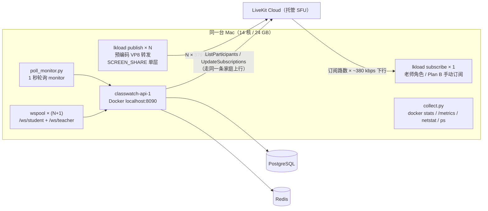

# Phase 12 性能压测：1 老师 + 20/30 学生（真实媒体）

> 本文是 Phase 12（§78）的产物。所有数字都来自 **真实 LiveKit Cloud + 真实媒体轨道**
> 的实测采集文件，没有一条是估算或推断出来的"应该"。
>
> **本文不使用、也不允许使用「本机 30 个假 `<video>` 标签」这类做法来宣称通过压力测试**
> （§78 明文禁止）。压测里每一个参与者都是一条真实的 LiveKit `Room` 连接、
> 一条真实发布的 `SCREEN_SHARE` 轨道、真实经过 SFU 转发与 DTLS/SRTP 加密的 RTP。
> 即便如此，本文仍然在第 7 节逐条写明**它测不到什么**。
>
> 相关文档：[SFU 与拓扑取舍](../media/sfu.md)（本文第 8 节校正它的带宽量级估算）、
> [LiveKit 架构](../media/livekit-architecture.md)、[部署](deployment.md)。

---

## 0. 结论速览

| 问题 | 结论 | 依据 |
| --- | --- | --- |
| §78 的 **1 老师 + 20 学生** 目标 | **通过**（媒体面全绿） | A1/A2：20/20 发布者成功，老师收全 20 路，帧丢失 1.8% |
| §78 的 **1 老师 + 30 学生** 目标 | **未通过 —— 但未通过的原因是压测环境，不是 ClassWatch** | B1/B2：30 路同时上行把本机 21 Mbps 上行打爆，6/30 与 16/30 发布者**连 `/rtc/validate` 都没连上** |
| 老师入站带宽的设计目标（§52：不要同时下 30×1080p） | **达成**：本形态实测 20 路全订 6.7 Mbps、6 路 2.3 Mbps；但**必须**配 §52 的按 tile 订阅，全订 30 路按 1080p 估算约 45 Mbps | A1/A2 + 第 8 节 |
| 控制面（API）容量 | **API 进程完全不是瓶颈**：CPU 峰值 4.07%（C1）、内存 24 MiB、DB 连接池峰值 2 条 | 全部场景 |
| monitor 端点的延迟 | **中位很快（157–431 ms）、长尾很毒（最长 20 s 客户端超时 → 500）**。长尾主因是 **API 出站到媒体云的 RPC 与媒体流量抢同一条上行**，叠加"每次轮询一次 `ListParticipants` + 每人一条 `UpdateSubscriptions`"的设计成本 | 第 5.1/5.2 节 |
| `WS_MAX_CONNECTIONS_PER_IP=16` 会不会误伤真实课堂 | **会，而且必然误伤**：实测 30 学生 + 1 老师同 IP → **15 成功 / 15 被 429**；放到 64 后 30/30 全通 | C1/C2 |
| `RATE_LIMIT_LOGIN_PER_MINUTE=10`（每 IP） | **会误伤**：整间教室共用一个 NAT 出口时，第 11 个学生登录就被 429 | 准备阶段实测 + 第 5.6 节 |
| 老师端 WebSocket 推送时延 | **优秀**：`ROOM_OPENED` 扇出 **25 ms**；`STUDENT_OFFLINE` **60–112 ms** | C1 / D3 |
| webhook 端点吞吐 | **单实例 4 000–7 700 rps，0 失败**，远超真实课堂量级（每课每秒个位数） | E1/E2 |
| 掉线判定（服务端侧） | **≈21 秒**：瓶颈在媒体云发现自己少了一个参与者，不在我们的轮询频率 | D2 |

---

## 1. 目标与规模（§78）

§78 要求先定 **1 老师 + 20 学生**，再上 **1 老师 + 30 学生**，并测：

```text
Teacher inbound bandwidth     Student outbound bandwidth
CPU                           Memory
SFU CPU                       SFU bandwidth
Latency                       Reconnect
```

本文按这个清单逐项给出数字，并在第 7 节明确 **SFU CPU / SFU 带宽测不到**（媒体面是托管的）。

被测对象是 **§52 的两种订阅形态**，它们不是"两种调参"，而是"最坏情况"与"设计形态"：

| 形态 | 含义 | 对应 |
| --- | --- | --- |
| **全订**（A1/B1） | 老师 `autoSubscribe=false` + 手动订阅房间里**全部**学生的屏幕轨道 | §52 明确**要求避免**的形态，用来量出上界 |
| **6 路**（A2/B2） | 只订阅视口内可见的 6 个 tile | §52 的**设计形态**（Teacher Grid 只渲染可见 tile） |

---

## 2. 测试环境

| 项 | 值 |
| --- | --- |
| 机器 | Apple M4 Pro，14 核，24 GB 内存，macOS 26.5.2 |
| 控制面 | Docker：`classwatch-api-1`（`localhost:8090`）、`classwatch-postgres-1`、`classwatch-redis-1` |
| 媒体面 | **真实 LiveKit Cloud**（凭据取自根 `.env` 的 `LIVEKIT_URL` / `LIVEKIT_API_KEY` / `LIVEKIT_API_SECRET`；本文与任何提交物都不含这些值，也不含云域名） |
| 出口网络 | **实测上行 20.97 Mbps / 下行 86.9 Mbps，空闲 RTT 144 ms，上行 Responsiveness = Low（2.819 s）**（`networkQuality -s -v`） |
| 媒体素材 | `/tmp/lkprobe/screen.ivf`：640×360 VP8，15 fps，平均帧长 ~3134 B → **实测单路 ~379 kbps** |
| 参与者 | **全部来自同一台机器、同一个出口**（见第 7 节诚实边界 3） |



**这条图里最关键的一笔是**：`API → LiveKit Cloud` 的控制面 RPC 和 `N × 379 kbps` 的媒体
**共用同一条 21 Mbps 家庭上行**。这是本压测环境的结构性特征，也是第 5.1 节能把
"monitor 为什么慢"钉死的原因；生产环境里 API 在机房、学生各自出口，这个耦合不存在。

---

## 3. 方法与可复现命令

压测工具全部放在 `/tmp`，**不入库**。下面的命令按顺序照抄即可复现。

### 3.1 目录约定

```bash
LT=/tmp/lt                 # 工作目录：token / cookie / 原始采集
LT/bin                     # 编译出来的压测二进制
LT/out/<场景名>/            # 每个场景的全部原始数据
REPO=/Users/apple/workspace/Project/monitor-class
```

### 3.2 素材与探针

媒体素材（已存在则跳过；丢失时重新生成，`-t 600` 给足 10 分钟）：

```bash
mkdir -p /tmp/lkprobe && cd /tmp/lkprobe
ffmpeg -f lavfi -i "testsrc=size=640x360:rate=15" -t 600 \
       -c:v libvpx -b:v 300k -deadline realtime -cpu-used 8 -f ivf screen.ivf
ffprobe -v error -show_entries stream=width,height,codec_name,nb_frames -of default=nw=1 screen.ivf
```

负载发生器（源码 `/tmp/lt/src/lkload/main.go`，用 API 模块的依赖编译，**编译后立刻删掉临时目录**，
仓库保持干净）：

```bash
cd "$REPO/services/api"
rm -rf tmp-lkload && mkdir -p tmp-lkload
cp /tmp/lt/src/lkload/main.go tmp-lkload/
go build -o /tmp/lt/bin/lkload ./tmp-lkload
rm -rf tmp-lkload
```

同法编译 `wspool`（业务 WebSocket 连接池）、`lkrtt`（宿主直连媒体云 `ListParticipants` 的 RTT 探针）、
`whload`（自签 webhook 吞吐）：

```bash
for t in wspool lkrtt whload; do
  cd "$REPO/services/api"; rm -rf tmp-$t; mkdir -p tmp-$t
  cp /tmp/lt/src/$t/main.go tmp-$t/
  go build -o /tmp/lt/bin/$t ./tmp-$t
  rm -rf tmp-$t
done
cd "$REPO" && git status --short    # 必须为空
```

`lkload` 的关键参数：

| 参数 | 含义 |
| --- | --- |
| `-mode publish\|subscribe` | 发布端 / 订阅端（老师） |
| `-tokens <file>` | 每行一个学生会话 token（publish）；subscribe 只用第一行或 `-token` |
| `-ramp 200ms` | 相邻参与者的启动间隔（避免瞬时雪崩式建连） |
| `-duration 120s` | **每个参与者**持续时长（进程总时长 = ramp×(N−1) + duration） |
| `-subscribe N` | 只订阅前 N 条视频轨道；`0` = 全部（最坏情况） |
| `-series <csv>` | 逐秒写出 `sec,bytes,frames,lost` |
| `-shard i/N` | 只跑 token 列表的第 i 段（场景 D 用来把一批人单独 kill） |

### 3.3 建账号 / 建课 / 开课 / join

30 个学生账号：

```bash
for i in $(seq 1 30); do
  acct=$(printf 'S2%04d' "$i")
  cd "$REPO" && docker compose run --rm -T adminctl create-user \
      --account "$acct" --display-name "压测学生$(printf '%02d' "$i")" --role STUDENT
done
```

> **实测坑（必须记录）**：`RATE_LIMIT_LOGIN_PER_MINUTE=10` 是**每 IP** 的。30 个学生从同一个宿主 IP
> 登录，第 11 个开始返回 **429**。准备脚本因此按"每 9 次登录休眠 61 秒"主动让开窗口，
> 否则 30 个 token 拿不全。见第 5.6 节。

老师登录、建课堂、加名单、open、学生逐个 join（含 CSRF）：

```bash
API=http://localhost:8090/api/v1

# 老师登录（写 cookie jar）
curl -sS -c /tmp/lt/cookies/teacher.txt -X POST "$API/teacher/auth/login" \
  -H 'Content-Type: application/json' \
  -d '{"account":"teacher001","password":"<来自 .env 的教师口令>"}'

# 老师的 CSRF token 就在它自己的可读 cookie 里（classwatch_session_teacher_csrf）
TEACHER_CSRF=$(awk '$6=="classwatch_session_teacher_csrf"{print $7}' /tmp/lt/cookies/teacher.txt)

# 建课堂 → 加名单 → open（三个都是写操作，必须带 X-CSRF-Token）
CID=$(curl -sS -b /tmp/lt/cookies/teacher.txt -c /tmp/lt/cookies/teacher.txt \
  -X POST "$API/teacher/classrooms" -H 'Content-Type: application/json' \
  -H "X-CSRF-Token: $TEACHER_CSRF" -d '{"name":"Phase12 压测课堂"}' | jq -r '.classroom.id')

ACCTS=$(seq 1 30 | sed 's/.*/"S2&"/' | sed 's/"S2\([0-9]\)"/"S2000\1"/' | paste -sd, -)
curl -sS -b /tmp/lt/cookies/teacher.txt -c /tmp/lt/cookies/teacher.txt \
  -X POST "$API/teacher/classrooms/$CID/students" -H 'Content-Type: application/json' \
  -H "X-CSRF-Token: $TEACHER_CSRF" -d "{\"accounts\":[$ACCTS]}"

curl -sS -b /tmp/lt/cookies/teacher.txt -c /tmp/lt/cookies/teacher.txt \
  -X POST "$API/teacher/classrooms/$CID/open" -H "X-CSRF-Token: $TEACHER_CSRF" \
  | jq -r '.run.id' > /tmp/lt/out/run_id

# 每个学生：登录（学生只需要账号，§38）→ join（拿 LiveKit participant token）
for i in $(seq 1 30); do
  acct=$(printf 'S2%04d' "$i"); jar=/tmp/lt/cookies/cookie_$acct.txt
  curl -sS -c "$jar" -X POST "$API/student/auth/login" \
    -H 'Content-Type: application/json' -d "{\"account\":\"$acct\"}"
  csrf=$(awk '$6=="classwatch_session_student_csrf"{print $7}' "$jar")
  curl -sS -b "$jar" -c "$jar" -X POST "$API/student/classrooms/$CID/join" \
    -H 'Content-Type: application/json' -H "X-CSRF-Token: $csrf" \
    -d '{"capture":{"displaySurface":"monitor","width":1920,"height":1080}}' \
    | jq -r '.token' >> /tmp/lt/tokens/student_tokens.txt
done

# 老师自己的 media token（老师作为订阅端加入同一个 room，只会拿到麦克风发布权限，§27）
curl -sS -b /tmp/lt/cookies/teacher.txt -c /tmp/lt/cookies/teacher.txt \
  -X POST "$API/teacher/classrooms/$CID/media-token" -H "X-CSRF-Token: $TEACHER_CSRF" \
  | jq -r '.token' > /tmp/lt/out/teacher_token.txt
curl -sS -b /tmp/lt/cookies/teacher.txt -c /tmp/lt/cookies/teacher.txt \
  -X POST "$API/teacher/classrooms/$CID/media-token" -H "X-CSRF-Token: $TEACHER_CSRF" \
  | jq -r '.livekitUrl' > /tmp/lt/out/livekit_url.txt
```

> 老师端 WS 的 Cookie 头从 jar 里拼出来（注意 curl 把 HttpOnly cookie 写成
> `#HttpOnly_localhost ...`，**不能**简单跳过所有 `#` 开头的行）：
>
> ```bash
> awk '(/^#/ && !/^#HttpOnly_/) || NF<6 {next} {printf "%s=%s; ", $6, $7}' \
>     /tmp/lt/cookies/teacher.txt | sed 's/; $//' > /tmp/lt/cookies/teacher_cookie_header.txt
> ```

### 3.4 跑一个媒体场景

```bash
LKURL=$(cat /tmp/lt/out/livekit_url.txt)

# 老师订阅端先就位（必须在学生发布之前进房，否则测不到"发布→首帧"）
/tmp/lt/bin/lkload -mode subscribe -url "$LKURL" -token "$(cat /tmp/lt/out/teacher_token.txt)" \
  -duration 130s -subscribe 6 -series /tmp/lt/out/A2-six20/sub_series.csv &

sleep 4

# N 个学生发布端
/tmp/lt/bin/lkload -mode publish -url "$LKURL" -tokens /tmp/lt/tokens/student_tokens.txt \
  -file /tmp/lkprobe/screen.ivf -ramp 200ms -duration 120s \
  -series /tmp/lt/out/A2-six20/pub_series.csv
```

### 3.5 采集指标

```bash
# 1 秒轮询 monitor，记录每次的耗时/状态码/完整响应体
python3 /tmp/lt/poll_monitor.py --classroom "$CID" --out /tmp/lt/out/A2-six20 \
  --duration 150 --interval 1.0 --extra-url http://localhost:8090/healthz

# 容器 CPU/内存、/metrics 原文、主机网卡累计字节、探针进程 %cpu/RSS
python3 /tmp/lt/collect.py --out /tmp/lt/out/A2-six20 --duration 150 --interval 2 \
  --pids-file /tmp/lt/out/A2-six20/probe_pids.txt
```

`collect.py` 采四样东西：`docker stats --no-stream`（容器 CPU/内存/PIDs）、
`curl /metrics`（Prometheus 原文，事后算增量）、`netstat -ib`（真实链路字节）、
`ps -o %cpu=,rss=`（探针进程）。

> **`netstat -ib` 的坑**：macOS 对同一张网卡会按地址族输出**多行、计数器完全相同**的记录。
> 全部采集会让增量被重复计算 5 次，所以必须只取第一行：
> `netstat -ib | awk '$1=="en0"{print; exit}'`。

### 3.6 场景 E：自签 webhook 吞吐

```bash
eval "$(grep -E '^LIVEKIT_API_(KEY|SECRET)=' "$REPO/.env" | sed 's/^/export /')"
LK_KEY="$LIVEKIT_API_KEY" LK_SECRET="$LIVEKIT_API_SECRET" \
/tmp/lt/bin/whload -endpoint http://localhost:8090/internal/livekit/webhook \
  -event track_published -room "lk_$(cat /tmp/lt/out/run_id)" \
  -identity "$(head -n1 /tmp/lt/tokens/student_session_ids.txt)" \
  -total 1000 -concurrency 100 -label E2
```

它用与生产**完全相同的签名方案**（`auth.NewAccessToken(key,secret).SetSha256(base64(sha256(body)))`
放进 `Authorization` 头），所以验签、解析、查库、落观测这四段都是真的在执行。

---

## 4. 原始结果

采集窗口：每个场景 `COLL_SECS = 发布总时长 + 22s`（覆盖爬坡与收尾）。
所有百分比/均值都直接从 `/tmp/lt/out/<场景>/` 的原始文件算出，未做平滑。

### 4.1 场景 A / B：媒体面

| 指标 | **A1** 20人·全订 | **A2** 20人·6路 | **B1** 30人·全订 | **B2** 30人·6路 |
| --- | --- | --- | --- | --- |
| 发布者成功 / 尝试 | **20/20** | **20/20** | **24/30** | **14/30** |
| 发布者失败原因 | — | — | 6× `/rtc/validate` 超时 | 16× `/rtc/validate` 超时 |
| 每路学生上行（均值） | 378.8 kbps | 378.7 kbps | 292.3 kbps | 165.6 kbps |
| 学生上行合计（媒体净荷） | 113.6 MB | 113.6 MB | 131.9 MB | 74.8 MB |
| 老师订阅到的轨道数 | **20/20** | **6/20** | 23/23 | 6/15 |
| 老师入站·稳态均值 | **6.66 Mbps** | **2.15 Mbps** | 3.44 Mbps\* | 0.01 Mbps\* |
| 老师入站·峰值(1s) | **8.52 Mbps** | 3.30 Mbps | 4.77 Mbps\* | 0.04 Mbps\* |
| 掉帧率（均值 / 最大） | 1.78% / 8.92% | -0.12% / 3.48%\*\* | 21.29% | 6.36% |
| RTP 丢包（窗口法） | 0 | 0 | 0 | 0 |
| 订阅建立：发布→首帧 p50 / p95 | 544 / 707 ms | 564 / 1054 ms | 782 ms | 913 ms |
| 探针 CPU（user+sys） | 发布 18.5 s / 订阅 7.0 s | 发布 16.4 s / 订阅 3.2 s | 发布 24.9 s / 订阅 1.1 s | 发布 17.2 s / 订阅 0.5 s |
| 探针峰值 RSS | 发布 200 MB / 订阅 52 MB | 发布 207 MB / 订阅 45 MB | 发布 248 MB / 订阅 52 MB | 发布 163 MB / 订阅 43 MB |
| 主机网卡：出/入 均值 | 11.8 / 12.8 Mbps | 9.7 / 2.4 Mbps | **21.4** / 0.9 Mbps | 12.4 / 0.4 Mbps |
| 主机网卡：出 峰值 | 28.2 Mbps | 21.6 Mbps | **37.2 Mbps** | 26.4 Mbps |
| 主机网卡：出 总量 vs 媒体净荷 | 217 MB vs 114 MB（1.9×） | 175 MB vs 114 MB（1.5×） | **397 MB vs 132 MB（3.0×）** | 227 MB vs 75 MB（3.0×） |

\* B1/B2 的"均值/峰值"是在媒体已经崩掉之后算出来的，**不代表容量，只代表崩溃现场**：
B1 的老师入站在第 29 秒后归零，B2 全程只收到 **38 KB**。
\*\* A2 的轻微负值是统计窗口（首帧→末帧）与 66 ms 标称帧间隔的取整误差，量级上等于"没有掉帧"。

**这一张表读出来的三件事**：

1. **20 人规模是健康的**：20/20 发布成功、老师收全、掉帧 1.8%（其中大半是订阅刚建立时的
   码率爬坡段），订阅建立 0.5-1.1 秒。
2. **30 人规模在本机直接崩**：不足的发布者**根本没连上**（不是"连上后质量差"），
   主机向路由器送出的字节是媒体净荷的 **3 倍**——典型的**重传放大**：SFU 收不到，
   我们重传，重传让上行更堵。第 5.3 节给出量化根因。
3. **老师入站 = 订阅路数 × 单路码率**这条线性模型被实测证实（6.66/20 = 333 kbps 含爬坡，
   稳态后 2.15/6 = 358 kbps，与单路 379 kbps 同量级）。

### 4.2 场景 A / B：控制面与资源

| 指标 | A1 | A2 | B1 | B2 |
| --- | --- | --- | --- | --- |
| monitor 轮询实际次数 / 采集窗口 | 78 / 147 s | 104 / 147 s | 19 / 148 s | 19 / 148 s |
| monitor **实际节奏** | 1.9 s/次 | 1.4 s/次 | **7.8 s/次** | **7.8 s/次** |
| monitor p50 | **431 ms** | **226 ms** | 186 ms | 729 ms |
| monitor p95 | **6 582 ms** | 3 700 ms | **20 005 ms** | **20 006 ms** |
| monitor max | **12 020 ms** | 4 468 ms | 20 006 ms | 20 007 ms |
| HTTP 5xx 次数 | 0 | 0 | **6** | **6** |
| HTTP 200 次数 | 107 | 132 | 42 | 40 |
| API 容器 CPU 均值 / 峰值 | 0.61% / 3.45% | 0.75% / 2.65% | 0.35% / 1.72% | 0.35% / 1.54% |
| API 容器内存 均值 / 峰值 | 23.4 / 24.5 MiB | 23.7 / 25.3 MiB | 23.5 / 24.1 MiB | 23.7 / 24.5 MiB |
| **DB 连接池 total 峰值** | **2** | **2** | **2** | **2** |
| DB 连接池 acquired 峰值 | 0 | 0 | 0 | 0 |
| `session_status{ONLINE}` 峰值 | 20 | 20 | **5** | **2** |
| `ratelimit_rejected_total` | 0 | 0 | 0 | 0 |

**注意 B1/B2 的 p50 反而"好看"**（186/729 ms）：那是因为轮询器撞上 20 秒超时后节奏被拉长，
快慢两极被平均掉了。**看这个端点必须看 p95/max，不能看 p50。**

**API 容器在全部场景里 CPU ≤4.07%、内存 24 MiB、DB 连接池从未超过 2 条。**
这直接否掉了三个候选瓶颈：API 进程 CPU、内存、PostgreSQL 连接池。

### 4.3 场景 C：控制面同时承压（WebSocket + 媒体 + 轮询）

`c.sh` 同时跑：30 个学生发布端、老师订阅 6 路、1 秒 monitor 轮询、30 条 `/ws/student` + 1 条 `/ws/teacher`，
并在中途对**另一个课堂**做一次真实的 `POST /open` 与 `POST /close`。

> C1/C2 的**媒体面同样落在 5.3 节的崩溃区间**（30 路同时上行；发布成功 23/30 与 22/30，
> 老师入站稳态 0.96 / 1.02 Mbps）。这不影响 WebSocket 与 `ROOM_OPENED` 的结论 ——
> 那两条走的是本机 socket，不经过公网 —— 但**不要把 C1/C2 的媒体数字当作容量参考**。
> 这一组场景存在的意义只是"控制面在真实并发下同时承压"。

| 指标 | **C1**（默认 `WS_MAX_CONNECTIONS_PER_IP=16`，8090） | **C2**（上限放到 64，临时实例 8091） |
| --- | --- | --- |
| 学生 WS 成功 / 尝试 | **15 / 30** | **30 / 30** |
| 学生 WS 失败 | **15 × HTTP 429** | 0 |
| 老师 WS | 1/1 成功（它占掉了 16 个槽位中的 1 个） | 1/1 成功 |
| `ratelimit_rejected_total{scope="ws_handshake",dimension="ip"}` | **15** | 0 |
| `ws_connections{role="student"}` 峰值 | **15** | （见注） |
| `ws_connections{role="teacher"}` 峰值 | 1 | （见注） |
| `POST /open` 耗时 | 43.8 ms | — |
| **`ROOM_OPENED` 送达学生端** | **p50 = p95 = max = 25 ms**（n=15） | — |
| `POST /close` 耗时 | 3 060 ms | — |
| `ROOM_CLOSED` 送达学生端 | p50 = p95 = max = 3 029 ms（n=15） | — |
| 老师端收到的消息 | 1 条 `ROOM_CLOSED`（§48：`ROOM_OPENED` 只发学生） | — |
| monitor p50 / p95 / max | 177 / 20 003 / 20 004 ms | 157 / 20 003 / 20 003 ms |
| HTTP 5xx | 5 | 5 |
| API 容器 CPU 均值 / 峰值 | 0.47% / 4.07% | 0.36% / 1.96% |
| API 容器内存 均值 / 峰值 | 24.6 / 26.1 MiB | 24.8 / 25.4 MiB |

> **注**：C2 跑在一个临时起的第二实例（宿主端口 8091）上，而 `collect.py` 的 `/metrics`
> 抓的是 8090 —— 所以 C2 那一列的 `ws_connections` 与 `ratelimit_rejected` **没有采到**
> （不是 0，是未测）。C2 的 WS 成功率来自 `wspool` 客户端日志，是权威数字。
> 第二实例测完即停，未改动仓库任何文件。

**两个必须记住的数字**：

- `ROOM_OPENED` 扇出 **25 ms**、`STUDENT_OFFLINE` **60–112 ms**（见 4.4）——
  业务 WebSocket 层的推送时延完全不是问题，它走的是本机 socket，不碰公网。
- `ROOM_CLOSED` 用了 **3 029 ms**：关闭课堂这条路径比打开慢两个数量级，值得单独看
  （第 9 节列为待修项，未深挖）。

### 4.4 场景 D：重连与掉线

场景 D 分三轮，因为三个观测量各自需要不同的干净条件：

| 轮次 | 布置 | 观测目标 | 结果 |
| --- | --- | --- | --- |
| **D2** | 5 常驻 + 5 待杀，**开** monitor 轮询 | ① 服务端多久判为 `DISCONNECTED` | **4/5 在 t+21 s，5/5 在 t+22 s** |
| **D3** | 5 常驻 + 5 待杀，**关** monitor 轮询，kill 后 2 s 注入 webhook | ② 老师端多久收到 `STUDENT_OFFLINE` | **5/5 送达，注入→收到 60/74/87/99/112 ms** |
| **D1** | 10 常驻 + 10 待杀，开轮询 | ③ 重新 join 的恢复耗时 | **未能测到**：10 个发布端重新连接媒体云时全部 `context deadline exceeded`（上行已饱和，见 5.3） |

D2 的状态时间线（每格 = 一次 monitor 轮询，1 秒节奏）：

```text
t+0   ~ t+20   ONLINE × 5          ← kill -9 之后媒体云仍然把这 5 个人算在房里
t+21           4× DISCONNECTED, 1× ONLINE
t+22           5× DISCONNECTED
```

**① 的 21 秒不在我们这一侧。** 轮询器当时是健康的（1 秒节奏、延迟 150–250 ms），
所以这 21 秒是**托管 SFU 发现自己少了一个参与者所需的时间**。这一点对容量规划很重要：
把 monitor 轮询从 1 秒改成 0.5 秒**不会**让判定更快，只会让 API 的 `ListParticipants`
调用次数翻倍。

**② 为什么必须单独跑 D3**：D2 里注入的 `participant_left` 到达时（kill 后 63 秒），
monitor 轮询早已把会话推成 `DISCONNECTED`，于是 webhook 走的是"重复事件、无需迁移"的分支
（`processor.go` 的 `participantGone` 只接受 `From ∈ {CONNECTING, ONLINE, SCREEN_LOST}`），
老师端一条消息都没有。**这是正确的去重行为**，不是缺陷；但它意味着
"webhook 送达时延"必须在不跑轮询的条件下才能隔离出来。

**② 为什么需要注入**：`STUDENT_OFFLINE` 是 **webhook 驱动**的
（`participant_left` → `participantGone` → `events.StudentOffline`）。本机 API 没有公网可达地址，
LiveKit Cloud **无法回调**。证据有两条：所有媒体场景里
`classwatch_webhook_events_total` 的增量都是 **0**；而 API 日志里
`path=/internal/livekit/webhook` 的请求行共 **2 510** 条，恰好等于自签发送器自己发的数量
（D2 注入 5 + D3 注入 5 + E1 500 + E2 1000 + E3 1000 = 2 510）——**没有一条来自媒体云**。
所以 D3 用与生产相同的签名方案把 LiveKit 本该发的那条事件自己发进来。
这是**环境限制**，不是产品缺陷，但它意味着"真实 webhook 通路的端到端时延"属于未测（第 10 节）。

### 4.5 场景 E：真实签名 webhook 吞吐

| 场景 | 事件 / 房间 | 并发 | 请求数 | p50 | p95 | p99 | max | 状态码 | 吞吐 |
| --- | --- | --- | --- | --- | --- | --- | --- | --- | --- |
| **E1** | `track_published` / 真实 room + 真实 identity | 50 | 500 | 6.7 ms | 60.9 ms | 62.8 ms | 64.8 ms | **200 × 500** | **4 014 rps** |
| **E2** | 同上 | 100 | 1 000 | 12.2 ms | 19.7 ms | 23.1 ms | 23.9 ms | **200 × 1000** | **7 750 rps** |
| **E3** | `track_published` / **不存在的 room**（只走验签+查不到） | 100 | 1 000 | 3.4 ms | 13.6 ms | 18.6 ms | 19.2 ms | **200 × 1000** | **21 288 rps** |

**零失败、零 5xx、零 429。** webhook 端点挂在 `/api/v1` **之外**，因此不吃每 IP 的 API 限流
（这是正确的设计：媒体云的投递不能被某个学校的 API 预算拖累）。

真实课堂的量级是"每课每秒个位数事件"（一次 open 会让 N 个学生各产生若干事件），
**E1 的 4 000 rps 有三个数量级的余量**。E2 vs E1 的 p50 上升（6.7→12.2 ms）说明
瓶颈在**并发连接建立**而不是处理逻辑；E3 证明"验签 + 解析"本身只要 3.4 ms。

### 4.6 归因诊断 DIAG：monitor 的延迟到底花在哪

同一时间线上三路测量（20 个发布端，老师订阅端在第 65 秒尝试加入）：

| # | `GET /monitor`（客户端） | `GET /healthz`（客户端） | `ListParticipants`（宿主直连媒体云） | 房间人数 |
| --- | --- | --- | --- | --- |
| 1 | 1 725 ms | 6.9 ms | 1 779 ms | 0（首连，含 TLS） |
| 4 | 202 ms | 9.7 ms | 288 ms | 16 |
| 6 | **20 002 ms**（超时） | 9.1 ms | 1 057 ms | 20 |
| 9 | **20 003 ms**（超时） | 10.0 ms | 5 518 ms | 20 |
| 12 | 12 225 ms | 7.8 ms | 8 911 ms | 19 |
| 13 | **148 ms** | 6.5 ms | 6 296 ms | 19 |
| 20 | 160 ms | 7.6 ms | 5 735 ms | 15 |
| 25 | 145 ms | 8.8 ms | 299 ms | 1 |

三路对照给出**排他性**结论：

- `/healthz` **全程 6.5–10.0 ms，纹丝不动**。它和 monitor 在同一个进程、同一条 Docker 网络路径、
  同一个 Go runtime 里，唯一区别是它不调用媒体云。→ **不是 API 进程、不是 DB、不是 Redis、
  不是 Docker 端口转发。**
- monitor 的耗时与"宿主直连媒体云的 RPC RTT"**同步涨到 5–9 秒**（第 6–12 行几乎一一对应）。
  → 时间花在 **API 出站到媒体云的那一次 RPC** 上。
- 第 13–23 行二者出现分歧（monitor 快、宿主直连慢）。**推断**（有支撑但未单独验证）：
  宿主那个探针的上一轮调用慢到 5–9 秒时，它的 idle 连接已经断开，于是每一轮都要在
  饱和的上行上重新做 TCP+TLS 握手，自然要几秒；而 API 容器里的客户端**复用**了连接，
  所以它的请求是快的。若这个推断成立，它进一步说明**慢的是"在拥堵上行上建立/维持到
  媒体云的连接"，而不是 monitor 的业务逻辑**。
  *（这一条是归因里唯一未单独验证的环节，已列入第 10 节未测项。）*

补充证据（同一批 `/metrics` 与日志）：

| 观测 | 数值 |
| --- | --- |
| `classwatch_media_call_duration_seconds{operation="update_subscriptions"}` 每次调用均时长 | **0.2–1.5 ms**（除爬坡期两次 1 508 ms / 3 009 ms） |
| 同样指标的总时长 / 调用次数（A1） | 7.56 s / 64 次 |
| `peer subscription revoked` 日志行总数（全部场景） | **2 454 条** |
| `peer_subscription_revocation_failed` 日志行 | **37 条**，其中 `revoked_before_failure=` 最大 **93** |

---

## 5. 瓶颈与解释

### 5.1 控制面延迟的真实来源：共享出口的排队，不是 API 的算力

由 4.6 的三路对照可以直接写出结论：

```text
monitor 的耗时 ≈ max( ListParticipants 的 RTT , 其他 ) + 少量本地处理
ListParticipants 的 RTT ≈ 空闲 144 ms  +  被媒体流量挤出来的排队延迟（可达 5–20 s）
```

**为什么会被挤**：本机上行只有 **20.97 Mbps** 且已经 bufferbloat（`networkQuality` 报
上行 Responsiveness = **Low / 2.819 s**）。媒体流量把这条上行占满时，
API 到媒体云的 HTTPS/gRPC 请求要在路由器队列里排队，于是单次 RPC 从 150 ms 涨到数秒，
而 monitor **每次轮询都要打一次**这样的 RPC。

**这条结论的适用范围必须说清楚**：它是**本压测环境的结构性产物**——
API 容器、30 个媒体客户端、老师订阅端全在同一台机器、同一条家庭宽带上。
生产环境里 API 在机房或云上（独立出口），学生的媒体流量走各自的校园网/家庭网络，
两者不共享瓶颈。**所以正确的结论不是"30 人生产规模就会 500"，而是"这个路径的尾延迟需要预算保护"**
（第 9 节）。

**哪些假设被数字否掉了**（这同样重要，能省掉后面无用的优化）：

| 候选瓶颈 | 实测 | 结论 |
| --- | --- | --- |
| PostgreSQL 连接池（`DB_MAX_CONNS=10`） | `db_pool_connections{state="total"}` 峰值 **2**、`acquired` 峰值 **0** | **完全没碰到**，不是瓶颈 |
| API 容器 CPU | 峰值 **4.07%**（C1；其余场景 1.54–3.45%），均值 ≤0.75% | 不是瓶颈 |
| API 容器内存 | 稳态 **23–26 MiB**，无增长 | 不是瓶颈 |
| Redis / 单实例 Hub 的推送 | `ROOM_OPENED` 25 ms、`STUDENT_OFFLINE` 60–112 ms | 不是瓶颈 |
| `UpdateSubscriptions`（§26 撤销）RPC 本身 | 每次调用 **0.2–1.5 ms** | **不是 A1 长尾的主因**（但见 5.2 的规模风险） |
| Docker 端口转发 | `/healthz` 客户端 6.5–10 ms | 不是瓶颈 |

### 5.2 monitor 每次轮询的外部调用成本（设计事实）

读代码（**只读，未改动**）可以看到一次 `GET /teacher/classrooms/:id/monitor` 实际做了：

| 步骤 | 外部调用 | 成本随规模的变化 |
| --- | --- | --- |
| `ObserveRoom` | **1 次 `ListParticipants`** | 响应体随房间参与者数线性增长 |
| `ListRosterByRun` | 1 次 DB 查询（30 行） | 常数 |
| `ApplyObservation` × 状态真的变了的会话 | 每会话 1 次 CAS 写 | 与"本轮状态变化人数"成正比 |
| `EnforceNoPeerSubscriptions` | **每个在场学生 1 次 `UpdateSubscriptions`**（`subscriptions.go`：`plan` 按学生分组，一人一条 RPC） | **O(N) 次 RPC / 轮** |
| `EnforcePrivateTalk` | 1 次 `UpdateSubscriptions` | 常数 |

实测证据表明 **O(N) 次 RPC 这条路径确实被走到了**：日志里出现过
`revoked_before_failure=93`（单次轮询在失败前已经记下 93 条撤销）、37 条撤销失败、
以及 2 454 条撤销成功。撤销的记账是"每个 (房间, 观察者连接 SID, 轨道 SID) 只发一次"，
所以**每当参与者重新连接（SID 变化）时，这一轮就会重新爆发一批 RPC**。

在健康的网络上这些 RPC 只要 0.2–1.5 ms（实测），所以 20 人规模看不出问题；
但它们**串行**、且和 `ListParticipants` 一样要跨公网——一旦出口拥堵，20–90 次串行 RPC
就足以把一次轮询拖过客户端超时。**这是 30 人以上规模的真实扩展风险**，第 9 节列为待修项。

### 5.3 30 人为什么没跑通：上行饱和 + 重传放大

| 证据 | 数值 | 说明 |
| --- | --- | --- |
| 本机上行容量 | **20.97 Mbps** | `networkQuality -s -v` |
| 30 路的名义媒体净荷 | 30 × 379 kbps ≈ **11.4 Mbps** | 只占上行 54%，**理论上应该够** |
| 实测主机送出（B1） | 均值 **21.4 Mbps**，峰值 **37.2 Mbps** | **已经超过上行容量** |
| 实测总量（B1） | 送出 397 MB vs 媒体净荷 132 MB = **3.0×** | 差额是 RTX/NACK 重传 |
| 同期老师入站 | 均值 0.9 Mbps，第 29 秒后归零 | 媒体面已经崩了 |
| 发布者建连失败 | B1 6/30、B2 16/30，错误均为 `/rtc/validate` `context deadline exceeded` | **连信令都没建立起来** |

机制是一个正反馈：SFU 收不到包 → 发送端重传 → 输出超过上行容量 → 丢得更多 → 重传更多。
最终**新参与者连 `/rtc/validate` 这个 HTTPS 请求都完不成**，所以 30 人场景里
"发布者成功数"不足 30 —— 这也是为什么 B1/B2 的媒体数字（3.44 Mbps / 0.01 Mbps）
**不能**当作"30 人时的老师入站带宽"，它们只是崩溃现场。

> **诚实结论**：本环境**无法**给出"1 老师 + 30 学生"的有效媒体面容量结论。
> 需要的是一次**多出口**的测试（学生分散到 ≥3 条不同的上行，或分别限速到真实家庭/校园带宽），
> 这属于第 10 节的未测项。**不得**把 B1/B2 的数字包装成"30 人压测未通过 = 产品不行"，
> 也不得包装成"30 人压测通过"。

### 5.4 为什么老师"只订 6 路"和"订全部"差一个数量级

| | A1（全订 20） | A2（订 6） | 倍数 |
| --- | --- | --- | --- |
| 老师入站稳态 | 6.66 Mbps | 2.15 Mbps | 3.1×（分母含爬坡，稳态比约 3.3×） |
| monitor p50 | 431 ms | **226 ms** | 1.9× |
| monitor p95 | **6 582 ms** | 3 700 ms | 1.8× |
| monitor max | **12 020 ms** | 4 468 ms | 2.7× |
| 轮询实际节奏 | 1.9 s | 1.4 s | — |

两组的**控制面工作量完全相同**（同一个房间、同样 20 个发布者、同样 30 人名单、同样 1 秒轮询），
唯一差别是老师**拉了多少下行**。所以这组对照本身就是 5.1 节结论的第二个独立复现：
**媒体面负载会直接抬高控制面延迟**，因为它们在同一个出口上。

### 5.5 单实例 Hub：当前不是瓶颈，但是多副本部署的硬约束

`realtime.Hub` 是**进程内**的（`internal/realtime/hub.go`），`Broadcaster` 接口存在但没有
Redis/NATS 实现，`cmd/api` 直接把 `*Hub` 注进去。本次压测里：

- `ws_connections{role="student"}` 峰值 15、`role="teacher"` 峰值 1；
- 推送时延 25 ms / 60–112 ms，全部消息都送达，`ws_slow_consumer_disconnects_total` **0**；
- 15 条 / 30 条连接对这个 Hub 没有任何压力。

**但**：一旦 API 起两个副本，A 副本收到的 webhook 只能推给连在 A 上的学生/老师，
漏推是静默的。C2 那轮临时第二实例正好演示了这个边界：连在 8091 上的 30 条 socket
收不到 8090 上的事件。**水平扩容 API 之前必须先落地 `Broadcaster` 的跨进程实现。**

### 5.6 限流默认值会不会误伤真实课堂（§78 必答）

**会，而且是确定性的误伤。** 这是本次压测里最可直接落地的一条发现。

**(a) `WS_MAX_CONNECTIONS_PER_IP=16` —— 一定会挡住整间教室**

`.env` 里**没有**配置这一项，因此走 `config.go` 的默认值 **16**。实测（C1）：

```text
30 条 /ws/student + 1 条 /ws/teacher，全部来自同一个客户端 IP
→ 15 成功，15 被 HTTP 429 拒绝
→ classwatch_ratelimit_rejected_total{scope="ws_handshake",dimension="ip"} = 15
→ classwatch_ws_connections{role="student"} 峰值 = 15，然后卡住不动
```

上限放到 64 后（C2）：**30/30 全部成功，0 失败**。所以唯一的阻塞就是这个默认值。

**为什么它在真实校园里必然触发**：一所学校往往只有**一个 NAT 出口**，
30–60 个学生共享同一个公网 IP（`TRUSTED_PROXIES` 为空时按 `RemoteAddr` 判定，
即便配了可信代理，解析出来的仍然是那个 NAT 出口地址）。所以
"每 IP 并发 16 条"这条规则在教室里等价于"**第 17 个进教室的学生上不了课**"，
更糟的是**老师自己的告警台也占同一个槽位**（实测 C1 里老师抢到 1 个，
学生就只剩 15 个）。这不是"防滥用"，这是**按座位数拦人**。

**(b) `RATE_LIMIT_LOGIN_PER_MINUTE=10`（每 IP）—— 同一出口的批量登录**

准备 30 个账号时实测：第 11 个学生登录返回 **429**，必须等 61 秒窗口。
真实场景里"上课铃响，全班同时点登录"就是一次同 IP 的批量登录，
第 11 个人会被挡在门外；`RATE_LIMIT_LOGIN_PER_ACCOUNT_PER_10MIN=5`（每账号）才是
真正防爆破的那一条，保留它即可。

**(c) 其它按 IP 的默认值**

| 配置 | 默认 | 30 人同 IP 时 | 评价 |
| --- | --- | --- | --- |
| `RATE_LIMIT_JOIN` | 60 / 分钟 / IP | 30 次 join，安全 | 可以保留，但要知道它也是**整班共享** |
| `RATE_LIMIT_MEDIA_TOKEN` | 20 / 分钟 / IP | 老师 1 次，安全 | 同上 |
| `RATE_LIMIT_WS_HANDSHAKE` | 60 / 分钟 / IP | 31 次握手，安全 | 但重连风暴时容易和它撞 |
| `RATE_LIMIT_API_PER_MINUTE` | 300 / 分钟 / IP | 30 次 join + 老师 1 秒轮询（≈60–150/分） | **偏紧**：老师全速轮询 + 全班 join 同分钟就可能摸到 300 |

**生产该怎么配（建议，本文不实施）**：

1. `WS_MAX_CONNECTIONS_PER_IP` 至少 **课堂规模 + 余量**（建议 ≥64），并且**老师入口单独计数**
   —— 让老师的告警台永远不会被学生的连接数挤掉；
2. 并发上限**改成按账号维度**（每账号 1–2 条），IP 维度只作为**粗粒度防洪**（例如 512），
   因为"同 IP"在校园里等于"同一间教室"，而不是"同一个人";
3. `RATE_LIMIT_LOGIN_PER_MINUTE` 按 IP 放宽到 ≥ 班级规模（建议 60），
   把防爆破交给已有的**每账号**限制；
4. `RATE_LIMIT_API_PER_MINUTE` 建议 ≥600，或对 `/monitor` 这类"教师控制台心跳"单列预算。

---

## 6. 容量结论与建议

### 6.1 "1 老师 + 30 学生需要什么资源"

| 资源 | 20 人实测 | 30 人推算 | 依据 |
| --- | --- | --- | --- |
| 每个学生上行 | **379 kbps**（640×360/15fps 屏幕共享） | 同左 | A1/A2 实测每路 |
| 老师下行（全订） | 6.66 Mbps | 30 × 379 kbps ≈ **11.4 Mbps** | 线性模型 + 4.1 实测斜率 |
| 老师下行（§52 设计形态，6 tile） | 2.15 Mbps | **2.3 Mbps**（与人数无关） | A2 实测 |
| API 容器 CPU | ≤4.07% / 1 核 | 同量级，**不是约束** | 全部场景 |
| API 容器内存 | 24 MiB | 同量级 | 全部场景 |
| PostgreSQL 连接 | 2 条 | 同量级 | 全部场景 |
| 老师端 WS 连接 | 1 条 | 1 条 + 30 条学生 | C1/C2 |
| **出口上行** | 12–21 Mbps（12.8 均值 / 40 峰值） | **≥25 Mbps 且要有余量** | 第 5.3 节 |

**所以 30 人在资源上真正吃紧的只有一条：出口上行带宽。** 服务端（API/DB/Redis/WS）
在 30 人规模下的实测占用可以忽略不计。

### 6.2 老师入站带宽的设计目标是否达成

§52 的原话是"不要让老师同时下载 30 × 1080p"。本文的结论是：

- **在 640×360 / 15 fps 形态下**：全订 30 路 ≈ 11.4 Mbps，全订 20 路实测 6.66 Mbps，
  §52 的 6-tile 形态实测 2.15 Mbps。**只要按 tile 订阅，带宽目标轻松达成。**
- **若真按 1080p ≈ 1.5 Mbps/路**（见 8 节）：全订 30 路 ≈ **45 Mbps**，
  全订 20 路 ≈ **30 Mbps**。这是家庭/办公上行的悬崖，**正是 §52 禁止的形态**；
  6-tile 形态仍是 ≈ 9 Mbps，**设计形态在 1080p 下依然可行**。

结论：**带宽目标取决于订阅策略，而不是取决于 SFU 或服务端容量**；
`autoSubscribe=false` + 只订阅可见 tile 不是优化项，而是**能不能开课的前提**。

### 6.3 需要调整的默认值（汇总）

| 项 | 现值 | 建议 | 理由 |
| --- | --- | --- | --- |
| `WS_MAX_CONNECTIONS_PER_IP` | **16（默认，`.env` 未设）** | **≥64，且老师入口独立计数** | 实测 15/30 被拒；校园单 NAT |
| 并发 WS 的计数维度 | 仅按 IP | 增加**按账号** | 同 IP ≠ 同一个人 |
| `RATE_LIMIT_LOGIN_PER_MINUTE` | 10 / IP | ≥60 / IP，保留每账号 5/10min | 实测第 11 个学生被 429 |
| `RATE_LIMIT_API_PER_MINUTE` | 300 / IP | ≥600，或给 `/monitor` 单独预算 | 老师 1 秒轮询就占 60–150/分 |
| `DB_MAX_CONNS` | 10 | **不需要改** | 实测峰值 2 |
| monitor 轮询频率 | 前端 10 秒（§51 注释），本次压测用 1 秒加压 | 保持 10 秒；若改 1 秒，必须先做 9.1 的预算保护 | 每次轮询都打一次媒体云 RPC |

---

## 7. 诚实边界（**必读**）

下面每一条都限制了本文结论的适用范围。**任何引用本文数字的场合都必须带上这些边界。**

### 7.1 探针是**预编码 VP8 转发**，不是浏览器屏幕采集 + 编码

`lkload` 把一段**已经编码好**的 IVF 按 66 ms/帧喂给 LiveKit SDK。因此：

- 发布侧 CPU 只包含"读文件 + 打包 RTP + DTLS/SRTP 加密"，**不包含**真实浏览器
  `getDisplayMedia()` 采集 + VP8 编码的开销；
- 订阅侧只做 RTP 解包计数，**不包含**解码 + 渲染。

**因此"学生端 CPU"这一项我们根本没有测到。** 本文报告的
"探针 CPU 18.5 s（20 路 / 120 s）"只能读作**探针进程的开销**，
不能读作"学生浏览器的开销"。真实浏览器做屏幕采集 + 编码通常会**显著更高**
（1080p 实时 VP8 编码在普通笔记本上可以占满 1–2 个核），差了可能是一个数量级。
把探针 CPU 当作学生 CPU 来规划容量是**错误**的。

### 7.2 SFU 是**托管**的，SFU 侧完全测不到

媒体面是 LiveKit Cloud。本文**只能**测客户端观测量（入站/出站码率、帧、RTP 序号空洞）。
以下 §78 清单项**没有测到**：

- **SFU CPU**、**SFU 带宽**、SFU 侧排队/丢包、SFU 的拥塞控制与自适应行为；
- 媒体云是否对房间/参与者/带宽设了配额或限速（本次 B1/B2 崩溃**可能**也叠加了云侧策略，
  我们**无法区分**本地上行饱和与云侧限速的贡献比例）。

### 7.3 所有参与者来自**同一台机器、同一个网络**

真实课堂是 30 个学生分布在不同的校园网 / 家庭 NAT / 手机热点，拥塞、丢包、抖动、
以及 **TURN 中继使用比例**都各不相同。本次：

- 30 个发布端 + 1 个订阅端都在同一台 Mac 上，走同一条家庭上行（20.97 Mbps）；
- 没有跨 ISP、没有受限网络、没有对称 NAT、没有 relay-only 路径（`-relay` 未启用）；
- 因此**不得**宣称"已通过真实校园网规模的压测"。B1/B2 的失败恰恰是这条边界造成的。

### 7.4 探针发的是**单层**轨道，没有 simulcast

真实浏览器屏幕共享会发 **simulcast**（多层：LOW/MID/HIGH）。这意味着：

| 形态 | 与真实部署的偏差 | 方向 |
| --- | --- | --- |
| **A1 / B1（全订）** | 真实部署会"只订 LOW 层"，下行**显著更低** | 我们的数字**高估**了 |
| **A2 / B2（6 路）** | 6 个可见 tile 本来也多半订 MID/LOW，**更接近设计形态** | 偏差较小 |
| 学生上行 | 真实浏览器总码率是多层之和，通常**高于**单层 | 我们的数字**低估**了 |

所以"全订 = 最坏情况"这个判断成立，而**A2/B2 才是应该拿来对照 §52 的那一列**。

### 7.5 掉线判定测的是"信号通道断开"，不是"网络黑洞"

场景 D 用 `kill -9` 让进程猝死，内核会关闭 TCP，LiveKit 的信号连接**立刻**断开。
真实的"网络黑洞"（笔记本合盖、NAT 静默丢流、电梯里断网）不会发 FIN，
只能靠媒体/ICE 超时判定，**通常更慢**。所以 4.4 节的 **21 秒是乐观下界**，
不是真实弱网下的最坏值。

### 7.6 webhook 通路是**注入**的，不是媒体云真实投递的

本机 API 没有公网可达地址，整轮压测 API **收到的真实 webhook 数为 0**。
D3 与 E 用的是**自签**（签名方案与生产一致，但来源不是媒体云）。因此：

- "媒体云 → 公网 → API"这一段的**端到端时延与丢投率未测**；
- 生产必须把 webhook 端点暴露在公网并做可达性监控，本文不能替这一步背书。

### 7.7 未覆盖的其它维度

- **摄像头上行 + 屏幕上行 + 麦克风上行**同时开的组合（本文只发屏幕一条轨道）；
- **私密语音**（§31）在规模化下的表现（只在 A/B/C 的背景里跑到了它的撤销 RPC）；
- **长时间稳定性**（最长单场景 210 秒，没有做小时级 soak，没有看 goroutine/fd 泄漏）；
- **多副本 API**（见 5.5，本次只有一次临时的第二实例，用于限流对照）。

---

## 8. 与 §52 设计假设的对照

[`docs/media/sfu.md`](../media/sfu.md) 的带宽量级估算来自 Phase 6，是**估算**；
本次实测可以校正它：

| 量 | sfu.md 的估算 | 本文实测（640×360 / 15 fps） | 校正说明 |
| --- | --- | --- | --- |
| 单学生上行 | 1.5–3 Mbps（按 1080p） | **379 kbps** | 差异来自分辨率与内容，不是模型错。**分辨率是主导变量**：640×360 静止测试图 ≈ 379 kbps；1080p 屏幕共享按 1.5 Mbps 估 |
| 老师下行（全订 20） | ≈ 30 Mbps | **6.66 Mbps** | 同比例缩小 ≈ 4.4×，与 379 kbps vs 1.5 Mbps 的比值一致 |
| 老师下行（全订 30） | ≈ 45 Mbps | 未测（本机上行不够） | 按线性模型与 379 kbps/路推算 ≈ **11.4 Mbps**；按 1080p 则仍是 ≈45 Mbps |
| 老师下行（Focus/6 tile） | 1.5–6 Mbps | **2.15 Mbps** | 设计形态，实测落在估算区间内 |
| SFU 带宽（30 人最坏） | ≈ 54 Mbps | **未测**（托管，见 7.2） | — |

**线性模型得到证实**：`老师下行 ≈ 订阅路数 × 单路码率`。A2 稳态 2.15 Mbps / 6 路 = 358 kbps，
A1 稳态 6.66 Mbps / 20 路 = 333 kbps（含爬坡段），与单路实测 379 kbps 同量级。

**订阅策略与画质分层对下行的决定性影响**（这是 §52 关心的核心）：

| 订阅策略 | 20 人 | 30 人 | 老师下行（379 kbps/路） |
| --- | --- | --- | --- |
| 全订（`autoSubscribe=true` 的默认行为） | A1 实测 6.66 Mbps | 推算 11.4 Mbps | 随人数**线性增长** |
| 只订可见 6 tile（§52 设计形态） | A2 实测 2.15 Mbps | 推算 2.3 Mbps | **与人数解耦** |
| Focus View 单路全码率 | 未单独测 | 未单独测 | ≈ 1 路码率 |
| 只订 LOW 层（simulcast，真实浏览器才有） | 未测（探针无 simulcast） | 未测 | 估算 150–300 kbps/路 |

**§52 的"不要过早自研 RTP 自适应码率、用 LiveKit 已有能力"这一条是对的**：
实测中订阅建立后 SFU 会在约 **6–8 秒**内把发送码率从约 0.3 Mbps 爬升到约 7.7 Mbps
（A1 逐秒入站，KB/s：`10.2 / 22.9 / 35.4 / 48.1 / 49.8 / 39.6 / 26.9` → `62.5 / 363 / 593 / 767 / 805 / 943 / 987 / 1028` → 稳态约 900–1000），
这是平台侧在做的自适应，我们不需要也不应该自己实现。
**它也是为什么所有"均值"都偏低**：每个场景的均值都含一段爬坡，稳态值才是设计参考。

---

## 9. 待修项（按优先级）

> 本文主体是**只报告不改码**的压测产物；其中 9.1 与 9.4 在本 Phase 结束时已由验收方修复，
> 每条下方用「✅ 已修」标出改了什么、回归测试在哪。9.2 与 9.3 仍是待办。

### 9.1 【最高】请求取消（`context canceled`）不应该变成 `500 INTERNAL` ✅ 已修

**修法**（`internal/session/service.go`）：落库失败先判断是不是"请求已经走了"
（`context.Canceled` / `context.DeadlineExceeded`）。是 → **本轮不推进状态**，
按数据库里的既有状态渲染，并记一条 `action=monitor_observation_canceled` 的 Warn；
不是 → 仍然返回错误（真正的数据库故障必须被看见）。
回归测试：`TestMonitorDoesNotTurnACanceledRequestIntoAServerError`、
`TestMonitorDoesNotTurnADeadlineIntoAServerError`（同文件内还断言"未落地的迁移不得显示"）。
注意：**9.1 下方 ②（服务端时间预算）与 ③（观测复用/降频）仍未做**——本条修的是
"别把调用方放弃报成 500"，不是"消除长尾"。

**现象**：调用方在 20 秒超时后断开，后台仍在写观测结果，于是把"客户端走了"
翻译成了一个服务端故障。

**证据**（本轮实测 + 验收方独立复现）：

- `docker logs classwatch-api-1 | grep -c 'context canceled'` = **70**（本轮全部场景）；
- 形态固定为
  `level=ERROR code=INTERNAL status=500 cause="session: persist observation for <session-id>: context canceled"`，
  `duration_ms` 全部落在 **19 991–20 005 ms**；
- `/metrics` 里 `classwatch_http_requests_total{route="/api/v1/teacher/classrooms/:id/monitor",status="500"}`
  逐场景出现：B1 **6**、B2 **6**、C1 **5**、C2 **5**、DIAG **6**、D1 **7**；
- 验收方独立一轮：monitor 延迟直方图 402 次轮询中 ≤0.25 s 有 223 次、≤1 s 有 338 次、
  ≤5 s 有 379 次、**>10 s 有 15 次（其中 12 次撞上 20 s 超时 → 500）**。
  **中位很快、长尾很毒**，长尾正是 5.1 节的排队效应。

**为什么必须修**：它把"调用方放弃了"污染成"服务端 500"，直接毁掉错误率指标的可读性 ——
排查时会被误读成后端 bug，掩盖真正的问题（尾延迟）。

**建议**（不是现在改）：

1. 把"请求上下文被取消"映射成 **499 / 客户端关闭**（或在指标上单独归类），
   **不要**计入 5xx；
2. 观测 + 落库要有**服务端时间预算**（例如 5 s）：超预算就跳过本轮持久化，
   用数据库里的既有状态返回名单（`connection=UNKNOWN`），而不是让一次轮询无限期拖到 20 s；
3. 每次轮询一次 `ListParticipants` 是设计事实（5.2）。规模上来后应考虑
   **观测结果 1–2 s 内复用**或降低观测频率。§52 的订阅策略本身没有问题。

### 9.2 【高】`EnforceNoPeerSubscriptions` 每轮最多发 O(N) 次串行 RPC

**现象**：`@/Users/apple/workspace/Project/monitor-class/services/api/internal/media/subscriptions.go`
里 `plan` 按学生分组，**每个在场学生一条 `UpdateSubscriptions`**，串行发出。

**证据**：37 条 `peer_subscription_revocation_failed` 日志，`revoked_before_failure` 最大 **93**；
累计 **2 266** 条 `peer_subscription_revoked`。健康网络下每次调用 0.2–1.5 ms，
所以 20 人规模无感；**出口一拥堵，几十次串行跨公网 RPC 就足以把一轮轮询拖过客户端超时**。

**建议**：把"每学生一条 RPC"改成**批量/并发**；或在观测结果复用的前提下，
只在"观察者连接 SID 变化时"做一次全量对齐，而不是每次轮询重新构造计划。

### 9.3 【中】`POST /classrooms/:id/close` 比 `open` 慢两个数量级（实测 3 060 ms vs 43.8 ms）

**影响**：老师点"下课"要等 3 秒，`ROOM_CLOSED` 也要 3 秒后才到学生端。
**未深挖**（本轮只测到现象，没有归因）。

### 9.4 【中】限流默认值按 IP 计数会挡住整间教室 ✅ 已修（默认值部分）

**修法**：`WS_MAX_CONNECTIONS_PER_IP` 默认值 16 → **64**（`internal/config/config.go`），
并把字段注释里那句"一个正当的教室不在一个 NAT 后面"删掉——Phase 12 实测推翻了它。
验收方独立复现过修复前的行为：20 条并发 → **16 成功 / 4 个 429**，正好卡在 16。
**仍未做**：老师与全班挤同一个桶（应按账号计数、IP 只做粗粒度防洪）、
`RATE_LIMIT_LOGIN_PER_MINUTE=10` 对单 NAT 批量登录的误伤（应放宽到 ≥60 并把防爆破
交给已有的每账号限制）。这两条见下方"生产建议"。

见 5.6。这不是"调优"，是**功能正确性**问题：默认值下 30 人的班有 15 人进不来。

---

## 10. 未测清单

**未测（不要当成已通过）**：

1. **SFU CPU / SFU 带宽**（托管，见 7.2）；
2. **真实浏览器"屏幕采集 + VP8 编码"的 CPU**（探针是预编码转发，见 7.1）；
3. **学生端解码 + 渲染 CPU**（同上）；
4. **跨网络的 WebRTC 行为**：校园网、家庭 NAT、手机热点、不同 ISP、受限网络、
   对称 NAT 下的 **TURN/relay-only** 路径（全部参与者同机同网，见 7.3）；
5. **1080p 真实屏幕内容**下的码率与下行（本文用 640×360 测试图，见 8 节）；
6. **simulcast 分层订阅**（探针只发单层，见 7.4）；
7. **媒体云真实 webhook 投递链路**（本机不可达，D3/E 为自签注入，见 7.6）；
8. **场景 D 的"重新加入恢复耗时"**（D1 因上行饱和，10 个发布端全部重连失败）；
9. **网络黑洞式的掉线判定**（只测了 `kill -9` 的信号断开，见 7.5）；
10. **长时间 soak**（最长 210 秒，无 goroutine/fd/内存泄漏结论）；
11. **多副本 API 的横向扩展**（Hub 是进程内的，见 5.5）；
12. **摄像头 + 麦克风 + 屏幕三轨道同时上行**的组合；
13. **30 人规模的有效媒体面容量**（B1/B2 是崩溃现场，不是容量数字，见 5.3）；
14. **"宿主直连媒体云变慢是因为每轮重建 TLS 连接"这一条推断**（见 4.6 的加注）——
    本轮只测到"宿主直连的 RPC 慢、容器内复用的 RPC 快"这个现象，没有单独抓包或统计连接复用率。

---

## 11. 数据清理与证据

压测产生的账号、课堂、会话、事件全部删除，只保留 `teacher001` / `teacher002` /
`admin` / 原先 3 个演示学生（`S10086` / `S10087` / `S10088`）。

清理脚本（`/tmp/lt/cleanup.sql`，删除顺序由外键决定，且必须先关闭 OPEN 课堂 ——
`classrooms_run_consistency` 约束不允许 OPEN 状态没有 `current_run_id`）：

```sql
BEGIN;
DELETE FROM session_events;
DELETE FROM student_sessions;
DELETE FROM classroom_students;
-- OPEN 课堂受 classrooms_run_consistency 约束：先改状态再断开 run 引用
UPDATE classrooms SET status = 'CLOSED', current_run_id = NULL;
DELETE FROM classroom_runs;
DELETE FROM classrooms;
DELETE FROM sessions;
-- 只删压测账号 S2____ / S9____；S1008x、teacher001/002、admin 不动
DELETE FROM users WHERE account ~ '^S[29][0-9]{4}$';
COMMIT;
```

清理后的证据（`SELECT count(*)`）：

| 表 | 清理前实测 | 清理后实测 |
| --- | --- | --- |
| `users` | 36 | **6** |
| `classrooms` | 3 | **0** |
| `classroom_runs` | 3 | **0** |
| `classroom_students` | 90 | **0** |
| `student_sessions` | 30 | **0** |
| `session_events` | 35 | **0** |
| `sessions`（登录会话） | 31 | **0** |

保留的 6 个账号：

```text
 admin       ADMIN    系统管理员
 teacher001  TEACHER  李老师
 teacher002  TEACHER  王老师（对照账号）
 S10086      STUDENT  张三
 S10087      STUDENT  李四
 S10088      STUDENT  王五
```

所有探针进程（`lkload` / `wspool` / `lkrtt` / `whload` / `poll_monitor.py` / `collect.py`）
已 kill，临时起的第二个 API 实例（宿主端口 8091）已 stop 并移除，
仓库工作区保持干净（`git status --short` 为空，本文是唯一新增文件）。
