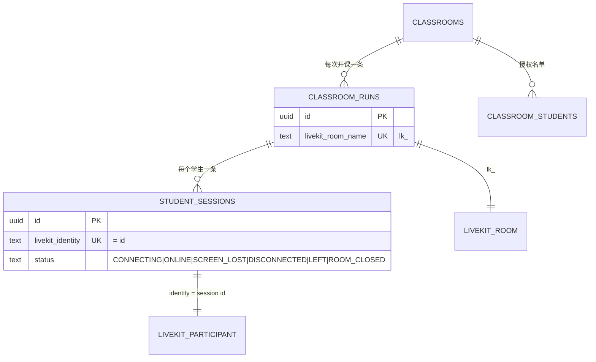
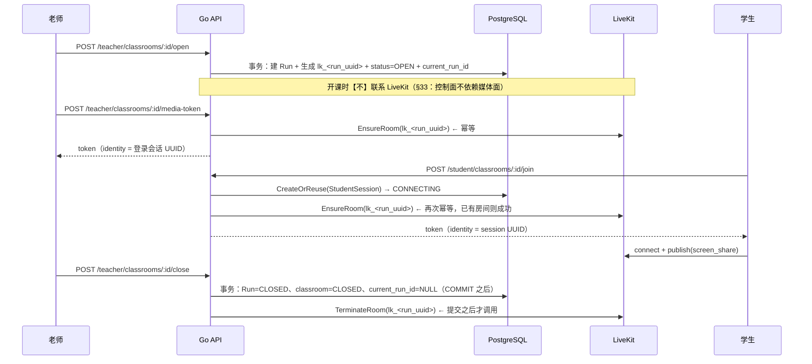
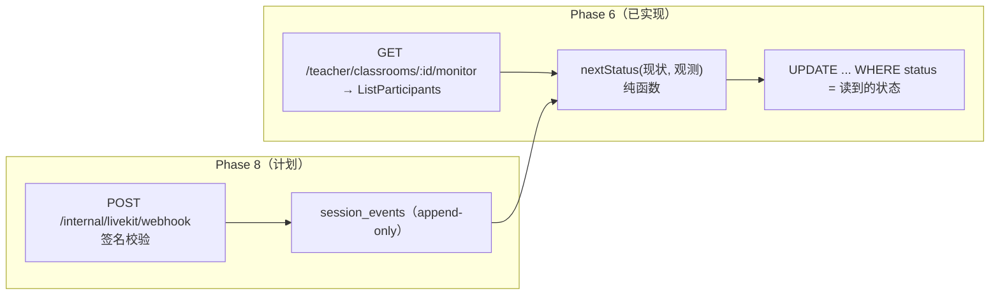

# LiveKit 架构与 ClassWatch 的接入方式

> 本文把 LiveKit 的三个核心概念（Room / Participant / Track）落到 ClassWatch 的
> 控制面模型上，逐个字段解释 Token 的权限位为什么取这些值、identity 为什么必须 opaque、
> 房间由谁创建与终止、以及 **LiveKit Cloud 与本地容器两种运行模式**怎么配。
>
> 它是 Phase 6（LiveKit 媒体接入）的产物，描述的都是**已实现**的行为。
> 提到 Phase 7/8/10/11 的地方标注为尚未实现，并写清届时在哪一层接上。
>
> 相关文档：[WebRTC 基础](webrtc-basics.md)、[SFU 取舍](sfu.md)、
> [控制面](../architecture/control-plane.md)、[状态机](../database/state-machines.md)、
> [数据库设计](../database/schema.md)、[本地环境](../development/setup.md)。

---

## 1. 三个概念，三张表



| LiveKit | ClassWatch | 谁决定 | 存哪 |
| --- | --- | --- | --- |
| Room | 一次 `ClassroomRun`（一节课） | 后端在 join / media-token 前 `EnsureRoom`；关课时 `TerminateRoom` | `classroom_runs.livekit_room_name` |
| Participant | 一个学生的 `StudentSession`，或老师的一次登录会话 | 后端签发 Token 时决定 identity | `student_sessions.livekit_identity`（学生）；老师用 `sessions.id`，不入库媒体表 |
| Track（+ Source） | 「这个学生在共享什么」 | 学生浏览器发布 | **不入库**：每次观测现取（Phase 8 才写 `session_events`） |
| Room 的存活 | **不是**任何业务事实 | LiveKit（超时）/ 后端（显式终止） | —— |

这张表最重要的一行是最后一行：**Room 存在 ≠ 课堂开着**（§33）。
`classroom_runs` 与 `classrooms` 才是事实来源，Room 只是这节课的媒体容器。

---

## 2. 房间的生命周期

### 2.1 谁创建、什么时候创建



三个决定：

1. **开课不碰 LiveKit。** §48 的事务只写数据库。若开课时创建一个 Room，那么「Room 存在」
   就会在时间上先于「课堂 OPEN」，控制面与媒体面之间多出一个必然不一致的窗口。
2. **签发 Token 之前必须 `EnsureRoom`。** Room 名由后端分配（不是客户端命名），
   而本项目**不给 Token `roomCreate` 权限**，所以「先建房」是连接成功的前提。
   把 `CreateRoom` 换成幂等的 `EnsureRoom` 是因为：一节课有 N 个学生 + 1 个老师，
   每个人都可能触发建房，第二个人的请求绝不能因为「房间已存在」而失败
   （LiveKit 会以 AlreadyExists 之类的错误表达这件事，我们把它当成功）。
3. **关课在事务提交之后终止 Room。** 顺序不能反过来，理由与取舍写在
   [控制面文档 §5](../architecture/control-plane.md) 与 `internal/classroom.Service.Close`：
   数据库已经说 CLOSED 时，媒体面落后一点是「清理问题」；反过来则是「媒体面决定控制面」。

### 2.2 为什么 Room 名是 `lk_<run_uuid>`

```text
lk_<classroom_run_uuid>
 └── 不透明：无法反推学生、老师、班级、课程
 └── 唯一：UNIQUE 约束保证两个 Run 不会合并成同一个房间
 └── 可再推导：由 Run id 决定，不需要在别处保存映射
```

Room 名会出现在：每个参与者的客户端、LiveKit 控制台、以及 LiveKit 的错误信息里。
若它写成 `class-3-math-zhangsan`，那么房间里的**每个学生**都能从房间名读出
「这个班在上什么课、谁在被监督」——这正是 §8/§26 禁止的泄漏。
`lk_` 前缀保留的唯一理由是让读 LiveKit 日志的人能认出「这是我们项目的房间」
（`internal/media.validateOpaqueRoomName` 会强制这个前缀，并拒绝「只有前缀」的名字）。

### 2.3 Room 的回收：三条路径

| 路径 | 触发者 | 语义 |
| --- | --- | --- |
| `TerminateRoom` | 后端（关课之后） | 主动结束：老师关课，房间里的人应当立刻断开 |
| `EmptyRoomTimeout`（300s） | LiveKit | 兜底：没人进的房间不会永远留着 |
| `DepartureTimeout`（20s） | LiveKit | 兜底：最后一个人离开后短暂保留，让学生刷新页面能回到同一个房间 |

第二条与第三条是「后端崩溃 / LiveKit 不可达」时的安全网，**不是**业务逻辑：
它们只保证不会留下永久房间，并不改变任何数据库状态（§33）。

一个实测得到的运维事实值得写下来：**LiveKit Cloud 的房间列表是最终一致的**。
验证时观察到刚 `CreateRoom` 的房间可能几秒后才出现在 `ListRooms` 中，
被 `DeleteRoom` 删除的房间也可能短暂地仍然列出。这不影响本项目（我们从不把
「房间在列表里」当事实），但它是「媒体面只能被观察、不能被当作状态」的又一个具体例证。

---

## 3. Token：本项目的每一个权限位

Token 是后端签发的 JWT，由 LiveKit 校验。**它是本 Phase 唯一的安全关键产物**，
所以下表逐字段写清取值与依据；代码在 `internal/media.SignToken`，
调用点在 `internal/session.Service`（join / media-token）。

### 3.1 标准声明

| JWT 字段 | 取值 | 依据 | 为什么 |
| --- | --- | --- | --- |
| `iss` | API Key | §44 | LiveKit 用它定位密钥对；Key 不是机密，Secret 才是 |
| `sub` = identity | 学生：`student_sessions.id`；老师：`sessions.id`（登录会话 UUID） | §44 | 见 §3.3 |
| `iat` / `nbf` | 签发时刻 | —— | —— |
| `exp` | 签发时刻 + `LIVEKIT_TOKEN_TTL`（默认 2h，上限 24h） | §63 | 见 §3.4 |
| 签名 | HS256，密钥 = `LIVEKIT_API_SECRET` | §44/§59 | Secret 只存在于后端进程；不写日志、不进响应、不进前端 bundle |

### 3.2 房间权限位

| 字段 | 学生 | 老师 | 依据 | 说明 |
| --- | --- | --- | --- | --- |
| `roomJoin` | `true` | `true` | §28 | 允许加入 `room` 指定的房间 |
| `room` | `lk_<run_uuid>` | 同一个 `lk_<run_uuid>` | §8/§43 | Token 的作用域就是这一节课；下发前 `EnsureRoom` 保证房间存在 |
| `roomCreate` | **不设置（false）** | **不设置（false）** | §33/§43 | 房间只能由后端创建。若 Token 能建房，参与者就能造出控制面从未听说过的媒体房间 |
| `roomAdmin` / `roomList` / `roomRecord` | 不设置 | 不设置 | §53 | 参与者不需要任何房间管理或录制能力 |
| `canPublish` | `true` | `true` | §28 | 学生要发布屏幕；老师 Phase 10 要发布私密语音 |
| `canPublishSources` | `["screen_share"]` | `["microphone"]` | §27/§28/§72 | **这是本 Phase 最窄的一条**：学生只能发屏幕，老师只能发麦克风。设了它之后 LiveKit 用它**取代** `canPublish`，所以「学生不能发摄像头」是媒体面的事实，而不是 UI 约定 |
| `canSubscribe` | `true` | `true` | §28 | 学生需要接收老师私密语音；老师需要看学生的屏幕。客户端仍然 `autoSubscribe=false`（见 [webrtc-basics](webrtc-basics.md) §3） |
| `canPublishData` | `false` | `false` | §47 | 业务消息走独立 WebSocket，不占用 WebRTC DataChannel：少一条控制面看不见的旁路 |
| `canUpdateOwnMetadata` | 不设置 | 不设置 | —— | 参与者不需要改自己的元数据 |
| `hidden` / `recorder` / `agent` | 不设置 | 不设置 | §53 | 参与者就是普通参与者 |

Phase 6 的取值汇总（也就是代码里的字面量）：

```text
学生 Token:  identity = <session uuid>   room = lk_<run uuid>
             roomJoin=true  canPublish=true  canPublishSources=[screen_share]
             canSubscribe=true  canPublishData=false
老师 Token:  identity = <login session uuid>   room = lk_<run uuid>
             roomJoin=true  canPublish=true  canPublishSources=[microphone]
             canSubscribe=true  canPublishData=false
```

变更这类取值时必须同步三处：`internal/session`（调用点）、`internal/media/token.go`（映射）、
以及本节表格。Token 权限位的单元测试（`internal/media/token_test.go`）会解码 JWT 断言
`canPublishSources`、`canSubscribe`、`canPublishData`，因此悄悄放宽一个权限会先让测试变红。

### 3.3 identity 为什么必须 opaque，以及为什么等于 session id

identity 是本项目唯一一个**会到达其他参与者与 LiveKit 控制台**的字符串：

```text
❌ zhangsan / S10086 / 13800138000 / 班级名
   → 房间里每个人都能看到；LiveKit 控制台、日志、截图里都会出现
   → 直接违反 §8/§26/§44

✅ 6c1e6a6a-4a5a-4a5a-8a5a-1a2b3c4d5e6f（student_sessions.id）
   → 无法反推姓名或账号；跨课不可关联（每节课新建一条 session）
```

三重保障，避免这条规则只靠自觉：

1. `media.SignToken` 拒绝非 UUID 形式的 identity（`isOpaqueIdentity`）；
2. 数据库 `student_sessions_identity_is_id` 约束强制 `livekit_identity = id::text`，
   任何写入路径（包括人工 SQL）都无法用姓名当 identity；
3. `livekit_identity` 唯一，避免两个会话共用一个 participant。

学生 identity 等于 `student_sessions.id` 还有一个**行为上的好处**（§50）：
LiveKit 在同一个 identity 重新加入时会踢掉旧连接，所以「学生刷新页面 = 新连接取代旧连接」
是媒体面自己完成的，后端不需要写任何踢人逻辑；而会话行被复用，监督墙上也不会出现两个「张三」。

老师 identity 用**登录会话** `sessions.id` 而不是 `users.id`：
前者每节课都不同，后者终身不变。用终身 id 会让「同一位老师的所有课」在媒体面可关联，
而这一点对产品没有任何价值（§44 明确要求 teacher identity = teacher_session UUID）。

### 3.4 TTL 为什么是 2 小时，而不是「5 分钟 + 刷新」

`LIVEKIT_TOKEN_TTL` 默认 `2h`，校验规则是 `> 0 且 ≤ 24h`（`internal/config`）。

不采用「极短 TTL + 自动续签」的理由是**课堂中途的重连**：

```text
学生 wifi 抖动 / 合上笔记本 / 浏览器刷新
        ↓
此时他【必须】能用手里已有的 Token 重新连上
        ↓
如果 Token 只有 5 分钟：
  刷新 Token 的 HTTPS 请求本身可能还没恢复（网络刚断过），
  而这个请求一旦失败，学生就被要求「重新进入课堂」——
  恰好在他最不该被打断的时刻，把监督流程从头再来一遍
```

2 小时覆盖一次晚自习（§48 的例子是 19:00–21:05），同时仍然是「短时」的：
它不会跨天、不会变成长期钥匙，而且可以由运维按部署调整。
Phase 11 会做刷新/轮换（旧 Token 撤销 + 新 Token 下发），那时 `LIVEKIT_TOKEN_TTL`
可以调到更小的值——这是路线图上的取舍，不是遗漏。

---

## 4. 观测：Phase 6 的轮询与 Phase 8 的 webhook



- **Phase 6 用轮询**，因为它是这个 Phase 能拿到的最小的服务端观测通道：
  老师在监督墙上看到的状态，与数据库里的状态，来自同一个观测函数。
- **Phase 8 换成 webhook**：`track_published` / `track_unpublished` / `participant_left`
  等事件由 LiveKit 主动推送并签名，延迟更低、且不依赖「有没有人在看监督墙」。
  `nextStatus` 与 `MonitorStudent` DTO 都不需要改——这正是把状态推进写成纯函数的原因。
- **失败语义（Phase 6 已实现）**：`ListParticipants` 失败时返回 200、
  每个学生 `connection: "UNKNOWN"`、**不推进任何状态**，并记 Warn 日志。
  把「查不到」写成「全部 DISCONNECTED」会把一次媒体面抖动永久写进课堂记录（§33）。

---

## 5. 两种运行模式：Cloud 与本地容器

`.env` 里与媒体面相关的变量一共五个：

| 变量 | 含义 | 谁读它 |
| --- | --- | --- |
| `LIVEKIT_URL` | **浏览器**连接的信令地址（`wss://` 或 `ws://`） | 后端把它放进 join / media-token 的响应 |
| `LIVEKIT_API_URL` | **后端**调用 RoomService 的地址（`https://` 或 `http://`） | `internal/media.NewClient` |
| `LIVEKIT_API_KEY` | API Key | 后端签发 Token / 调用 RoomService |
| `LIVEKIT_API_SECRET` | **机密**：签名 Token 与鉴权 | 只在后端进程；禁止进日志/响应/前端（§44/§59） |
| `LIVEKIT_TOKEN_TTL` | Token 有效期（默认 `2h`，上限 `24h`） | `internal/config` → `internal/session` |

两个 URL 分开的原因：在 Docker 里后端要访问 `http://livekit:7880`，而浏览器必须访问
`ws://localhost:7880` —— 同一个服务，两个视角。写成一个值会让其中一侧必然错误。

### 5.1 模式 A：LiveKit Cloud（当前默认）

```bash
# .env
LIVEKIT_URL=wss://<project>.livekit.cloud          # 浏览器侧
LIVEKIT_API_URL=https://<project>.livekit.cloud    # 后端侧
LIVEKIT_API_KEY=<key>
LIVEKIT_API_SECRET=<secret>                        # 不要提交、不要贴进 issue
LIVEKIT_TOKEN_TTL=2h                               # 可省略，默认即 2h
```

- `/readyz` 的 `livekit` 检查会调用 `ListRooms` 证明可达；不可达时（默认配置下）API 拒绝启动。
- Cloud 已经处理了 TURN/TLS 与固定公网地址，所以**本地开发不需要任何端口映射**，
  两个浏览器（老师端/学生端）可以在同一台机器上跑到真实的 SFU。
- Cloud 的 Key/Secret 只在项目控制台可见；轮换密钥后必须重启 API（配置在启动时读取并校验）。

### 5.2 模式 B：本地容器（`--profile local-media`）

```bash
make up                                   # postgres / redis / api（不含 livekit）
docker compose --profile local-media up -d livekit
# 然后把 .env 指到本机：
#   LIVEKIT_URL=ws://localhost:7880
#   LIVEKIT_API_URL=http://localhost:7880
#   LIVEKIT_API_KEY / LIVEKIT_API_SECRET 与容器共用同一对（make init 生成）
```

- 本地 LiveKit 的配置在 `deploy/livekit/livekit.yaml`：`room.auto_create = false`
  （房间必须由后端显式创建，§8/§33）、`empty_timeout = 300`、`departure_timeout = 20`、
  `rtc.tcp_port = 7881` 作为 UDP 被封时的兜底。
- 放进 `local-media` profile 而不是默认启动，是为了让「以为在用云、其实连的是本地容器」
  这种最难排查的错配不可能发生：要么显式起本地容器并改 `.env`，要么用云。
- 本机开发不启用 TURN；跨网络、校园网封 UDP 的场景属于 Phase 11（`turn.enabled` 与固定 `node_ip`）。
- 本地容器与 Cloud **行为一致的地方**：Token 校验、Track Source、`ListParticipants` 语义。
  **不一致的地方**：房间列表的一致性延迟、以及 Cloud 的全球节点选择——
  因此「在本地跑通」不能替代 §78 的真实网络验证。

### 5.3 手动验证的最小步骤

```bash
# 1) 后端与依赖
curl -s localhost:8090/readyz            # {"status":"ready","checks":{"livekit":"ok",...}}
# 2) 老师：登录 → 建课堂 → 加学生 → 开课
# 3) 学生：登录 → POST /student/classrooms/:id/join（带 capture 诊断）
#    期望：{"sessionId","livekitUrl","token"}，且 token 不进日志
# 4) 老师：POST /teacher/classrooms/:id/media-token
# 5) 老师：GET /teacher/classrooms/:id/monitor
#    没有真实浏览器 participant 时，sessionStatus 应当是 CONNECTING 或 DISCONNECTED，
#    screen.active=false —— 这本身就是正确行为，不是故障
# 6) 学生：POST /student/sessions/:id/leave → monitor 里该学生变为 LEFT
# 7) 老师：POST /teacher/classrooms/:id/close → LiveKit 里该 Room 消失（§49）
```

第 5 步值得强调：**不要为了「让监督墙看起来对」而伪造 participant**。
没有浏览器在房间里时显示 `CONNECTING`/`DISCONNECTED` 是服务端观测的正确结果；
真正的 `ONLINE` 只能在真实屏幕共享被观测到之后出现（§21/§45）。

---

## 6. 已实现 / 未实现一览

| 能力 | Phase 6 | 后续 |
| --- | --- | --- |
| Room 创建（幂等）、终止 | ✅ `EnsureRoom` / `TerminateRoom` | —— |
| 学生/老师 Token（最窄权限位） | ✅ | 老师 camera/screen 永不需要（§27） |
| 学生 join / leave | ✅ | —— |
| 监督墙 DTO | ✅（业务字段 + 观测字段） | Phase 7：Grid/Focus View、订阅控制 |
| 状态推进 | ✅（轮询观测 + CAS 持久化） | Phase 8：webhook 取代轮询、`session_events` |
| 摄像头 / 麦克风 | ❌（Token 里也没有） | Phase 9 / 10 |
| 私密语音订阅切换 | ❌ | Phase 10 |
| TURN / 生产网络加固 | ❌ | Phase 11 |
| 真实多人带宽压测 | ❌ | Phase 12（禁止用假 `<video>` 标签宣布通过，§78） |
| Webhook 签名校验 | ❌ | Phase 8（`/internal/livekit/webhook`） |

---

## 相关文档

- [track-permissions.md](track-permissions.md)：谁能发布什么、谁能订阅什么（三层落点与边界）
- [webrtc-basics.md](webrtc-basics.md)、[sfu.md](sfu.md)
