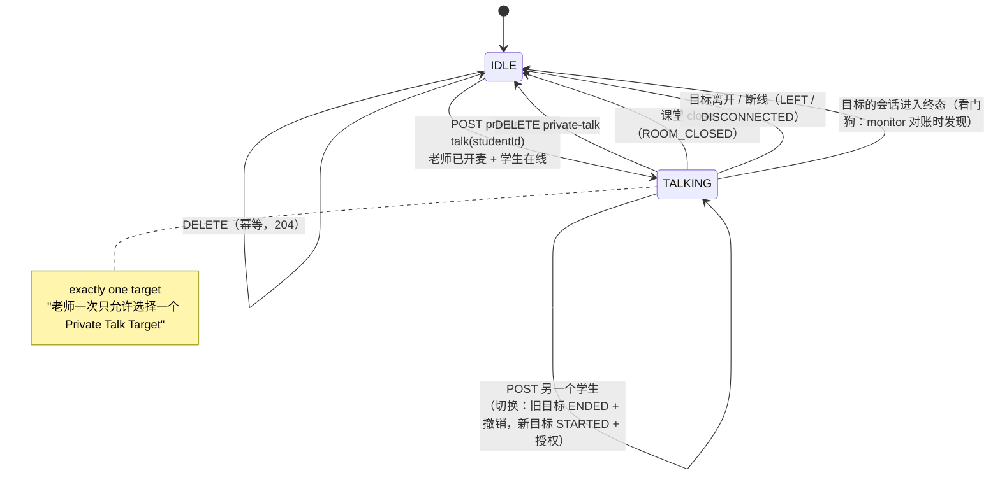
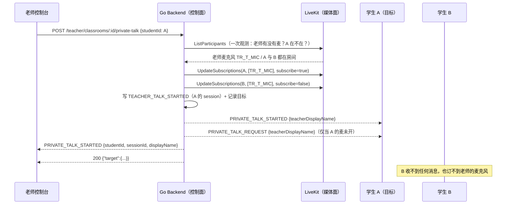
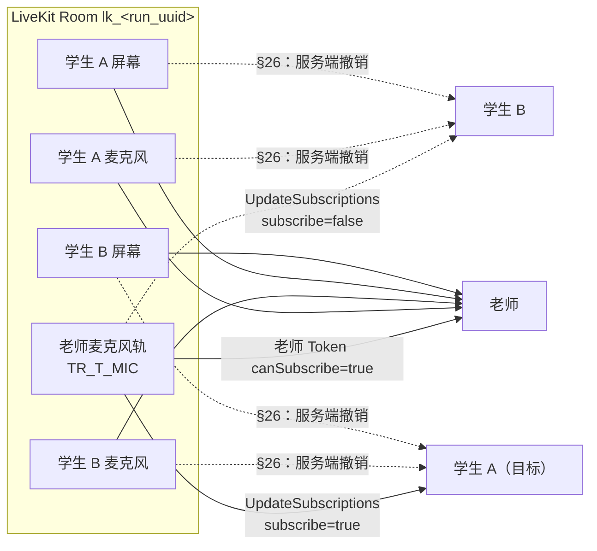
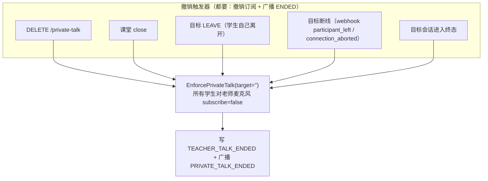

# 私密语音：老师对单个学生讲话，以及学生回话

> 本文解释 Phase 10（§76）实现的**私密语音**：老师一次只能对**一个**学生讲话，
> 这个学生能听到老师、老师能听到这个学生，**其他学生什么都收不到**（§31）。
>
> 它是**已实现**行为的说明：三个 HTTP 接口、一个进程内状态机、两处
> `RoomService.UpdateSubscriptions` 收口、四条 `session_events` 事件（`MIC_*` 与
> `TEACHER_TALK_*`）。真实 LiveKit Cloud 的端到端验证属于集成阶段的手工步骤，
> 本文区分"代码实现"与"只能真机验证"的部分（见 §9）。
>
> 相关文档：[Track 权限](track-permissions.md)、[LiveKit 架构](livekit-architecture.md)、
> [WebRTC 基础](webrtc-basics.md)、[控制面](../architecture/control-plane.md)、
> [状态机](../database/state-machines.md)、[前端契约](../frontend/teacher.md)。

---

## 1. 一句话模型

```text
老师麦克风 ──► 被选中的那一个学生        （§31，本 Phase 的核心）
其他学生   ──✗ 永远收不到老师麦克风

学生麦克风 ──► 老师                      （§32）
学生麦克风 ──✗ 其他学生（任何人）
```

三层各自负责一件事，缺一不可：

| 层 | 负责 | 位置 |
| --- | --- | --- |
| 状态 | "现在对谁讲话"（一次只有一个目标） | `internal/session/privatetalk.go`（进程内） |
| 媒体 | "谁的客户端真的能收到老师麦克风" | `media.EnforcePrivateTalk` → `UpdateSubscriptions` |
| 事件 | "这件事发生过"（审计与 lesson report） | `session_events`：`TEACHER_TALK_STARTED/ENDED`、`MIC_STARTED/STOPPED` |

**为什么必须有媒体层**：§28 要求学生 Token `canSubscribe=true`（学生要能收老师私密语音），
这个权限位是**整个房间**粒度的 LiveKit 没有"只允许订阅某一位发布者的麦克风"这种 join
grant。所以"谁能听到老师"只能是控制面在**事后**用 `UpdateSubscriptions` 决定并收口。
Token 权限 + 客户端约定（`autoSubscribe=false`）都不足以构成边界。

---

## 2. 状态机（§31）



状态本身只有两个：**没有目标**（IDLE）与**有一个目标**（TALKING(student)）。
不存在"两个目标"这种状态——注册表是 `classroomID → target` 的**一对一**映射，
第二个目标只会**替换**第一个，而不会与它并存（§31：不得出现两个学生同时听到）。



---

## 3. 谁能听到谁：媒体路径



四条规则，分别由不同机制保证：

| 规则 | 机制 | 代码 |
| --- | --- | --- |
| 老师 → 只有一个学生 | `UpdateSubscriptions`（本 Phase 新增） | `media.EnforcePrivateTalk` |
| 老师 → 目标学生（正向授权） | 同上，`subscribe=true` | 同上 |
| 学生 → 老师 | 老师 Token 的 `canSubscribe=true`，客户端订阅学生麦克风（§27/§32） | `session.TeacherToken` |
| 学生 → 学生（禁止） | 服务端撤销（§26），Token 无法表达 | `media.EnforceNoPeerSubscriptions` |
| 老师 → 其他学生（禁止） | 同上，按 (owner, source) 收窄 | `media.EnforcePrivateTalk` |

### 3.1 `UpdateSubscriptions` 怎么在 SFU 层收口

关键点：**撤销是"按 track sid + observer identity"下发的**，而
`canSubscribe=true` 是房间级权限——所以服务端能在客户端已经订阅之后把它拿掉：

```text
UpdateSubscriptionsRequest{
    Room:      "lk_<run_uuid>",
    Identity:  "<学生 session id>"   // observer = 谁
    Subscribe: true | false,          // 要还是不要
    TrackSids: ["TR_T_MIC"],          // 哪条轨（老师麦克风的 LiveKit sid）
}
```

服务端的对账逻辑（`EnforcePrivateTalk`）：

1. 从**同一次** `ListParticipants` 观测里取出老师（"不是本 run 学生的人"）的
   **MICROPHONE** 轨 sid 列表；
2. 目标学生 → `subscribe=true`；房间里**其余每个学生** → `subscribe=false`；
3. 每个学生一次 RPC（`micSids` 共用一个布尔值），失败的学生单独失败、不影响其他人；
4. 已下发过的变更按 `(连接 id, track sid, subscribe)` 记账，避免每 10s 轮询重复下发
   ——注意 **subscribe 是 key 的一部分**：同一条轨上"授权"和"撤销"是两个不同的状态，
   把它们合成一个 key 会让"切换目标"变成空操作。

为什么不是 `allowedTrackOwners`：Phase 7 的 §26 白名单是**发布者粒度**的（"老师的所有
轨道"）。§31 要求的是**发布者 + 音源**粒度（"老师的麦克风，且只给一个人"），
所以它是一条独立的对账规则，而不是把白名单收窄——收窄成"老师的麦克风"会让**所有**学生
继续合法地订阅老师的麦克风，正是 §31 禁止的。

**观测与对账共用一次查询**：`Monitor` 已经每 10s 拉一次 `ListParticipants`，§26 与 §31
两条对账都用这一份快照，没有额外的房间查询。

### 3.2 学生 → 老师：单向，且只能对老师

§32：学生麦克风上行给老师，**禁止学生 → 学生**。这条规则由两侧共同成立：

* **媒体权限**：学生 Token 没有"订阅同学"的授权可言（`canSubscribe` 是房间级），所以
  由服务端撤销（§26，`EnforceNoPeerSubscriptions`）；
* **客户端**：学生端 `autoSubscribe=false`，只订阅业务确认过的老师音轨（§26/§28）。

本 Phase **没有**新增"学生互相讲话"的任何路径：私密语音的学生麦克风上行仍然走
"学生发布 → 老师订阅"这一条既有的单向链路（§32），`PRIVATE_TALK_*` 消息里也不含
其他学生的任何信息。

---

## 4. HTTP 契约（已冻结）

```text
POST   /api/v1/teacher/classrooms/:id/private-talk    body {"studentId": uuid}
  → 200 {"target": {"studentId": uuid, "displayName": string, "sessionId": uuid}}

DELETE /api/v1/teacher/classrooms/:id/private-talk
  → 204

GET    /api/v1/teacher/classrooms/:id/private-talk
  → 200 {"target": {...} | null}
```

| 情况 | 状态 | code | 老师下一步做什么 |
| --- | --- | --- | --- |
| 老师还没开麦（观测不到老师麦克风轨） | 409 | `TEACHER_MIC_REQUIRED` | 打开自己的麦克风（"请先开启你的麦克风"） |
| 目标没有活跃会话 / 不在媒体房间 | 409 | `PRIVATE_TALK_UNAVAILABLE` | 换一个学生，或等对方上线 |
| 课堂不是 OPEN / 没有当前 Run（仅 POST） | 409 | `CLASSROOM_CLOSED` | 先开课 |
| 不是这节课的老师 | 403 | `CLASSROOM_NOT_OWNER` | 无权 |
| `studentId` 不在名单 | 404 | `STUDENT_NOT_ASSIGNED` | 先把学生加进名单 |
| 媒体面拒绝/不可达 | 502 | `MEDIA_TOKEN_FAILED` | 重试 |

三条路由都在 teacher 组：`RequireSession(TEACHER)` + `RequireRole(TEACHER)`，
两个写接口额外带 `CSRFProtection`（GET 在只读组，POST/DELETE 在写组）。

**为什么 POST 失败要 409 而不是静默成功**：老师看到"正在与张三通话"而媒体面上没有任何人
被订阅，是这一整个 Phase 最坏的失败形态——老师以为在讲，其实没人听得到（§31）。
所以开始讲话是一条**承诺**：兑现不了就报错。

**为什么 DELETE / GET 对 CLOSED 课堂返回成功而不是 409**：课堂 close 本身已经结束了
语音（见 §6），此刻"没有人在被通话"是真的；老师控制台在关课后的收尾调用不该报错。
POST 是唯一会**创建**状态的操作，所以只有它要求 OPEN。这是实现上的判断，写在这里以便复核。

---

## 5. 老师未开麦 / 学生未开麦（§25/§32）

### 5.1 老师未开麦

```text
POST private-talk → 409 TEACHER_MIC_REQUIRED
```

**不做**的事：不静默成功、不先记状态、不下发任何订阅、不写事件、不广播。
媒体面上没有可订阅的轨道，`EnforcePrivateTalk` 找不到 mic sid 时会收敛为
"所有人都未订阅"（这也是重启后的收敛形态）。

怎么判定"老师有麦"：从**同一次观测**里找该老师 participant 的 `MICROPHONE` 轨
（`media.TeacherMicrophoneTracks`）。注意它看的是**发布**而不是"是否有声音"——
麦克风被静音（muted）时仍是一条可被订阅的轨道，`ParticipantTracks.Microphone`
（"此刻有没有媒体流动"）为 false 并不影响"有麦"的判定。

### 5.2 学生未开麦（§25）

学生未开麦时：

* 老师**仍然可以单向讲话**（§25 原文："老师仍然可以向学生单向讲话"）——
  `PRIVATE_TALK_STARTED` 正常发，目标学生的订阅正常授权；
* 目标学生额外收到 `PRIVATE_TALK_REQUEST`，用于渲染：

```text
王老师希望与你进行语音沟通。

[开启麦克风]  [暂不开启]
```

* 学生**已经**在发布麦克风时**不发** `PRIVATE_TALK_REQUEST`：请求对方去做一件已经
  做完的事，只会让 UI 闪一个没有意义的对话框。判定来自同一次观测的
  `Microphone` 布尔值（未静音且已发布的麦克风才算"已开启"）。

**老师不能远程打开学生麦克风**：麦克风必须由学生在浏览器里授权（§25/§32），
服务端只能"请求"（发消息）和"订阅/取消订阅"，没有 `getUserMedia` 的远程入口。

学生开麦之后：`track_published(MICROPHONE)` → `MIC_STARTED` + `MIC_CHANGED{active:true}`
给老师；关麦 → `MIC_STOPPED` + `MIC_CHANGED{active:false}`。
**麦克风绝不改变 `student_sessions.status`**——只有屏幕才决定状态（§21/§24/§25）。

---

## 6. 切换与撤销时机



| 触发 | 谁在跑 | 结果 | 幂等性 |
| --- | --- | --- | --- |
| `DELETE` | HTTP → `Service.StopPrivateTalk` | 撤销 + `TEACHER_TALK_ENDED(reason=STOPPED)` + ENDED 广播 | 没有目标 → 204，不写不广播 |
| **切换**（POST 另一个学生） | HTTP → `StartPrivateTalk` | **同一次**对账里：新目标授权、旧目标撤销；旧目标 `ENDED(reason=SWITCHED)`，新目标 `STARTED` | 同一目标重复 POST → 不写事件、不重复广播 |
| 课堂 close | `Processor.closeRun`（close 事务提交后） | `EndPrivateTalkForRun` → 撤销 + `ENDED(reason=ROOM_CLOSED)` + 广播 | 已经结束 → 静默成功 |
| 目标 LEAVE | `Processor.SessionLeft` | `EndPrivateTalkForSession` → 撤销 + `ENDED(reason=LEFT)` | 事件行是幂等键，重试不再写 |
| 目标断线 | `Processor.participantGone`（webhook） | 同上，`reason=DISCONNECTED` | 重复 webhook 已 DISCONNECTED → 不重复结束 |
| 看门狗 | `Service.enforcePrivateTalk`（monitor 轮询发现目标会话不再是活跃会话） | 清掉目标 + 收敛为"所有人未订阅" | 每次都收敛到同一形态 |

**切换为什么是"一次对账"而不是"先结束再开始"两次**：媒体面只有一次
`EnforcePrivateTalk(..., target=B)`，旧目标出现在"撤销"一侧——并且这一次对账内部
**先下发所有撤销，再下发目标的授权**（`UpdateSubscriptions` 是按 observer 逐条调用的，
不存在"一次原子切换"，所以顺序就是保证）：任何瞬间都不会有两个学生同时订阅老师麦克风。
两次独立调用（先 ENDED 再 STARTED 两个 pass）之间则会有一个窗口。

**结束为什么可以是"尽力而为"，而开始不行**：开始是承诺（老师会以为对方听得到），
结束是安全动作——期望的终态是"没有人订阅老师麦克风"，即使这一刻媒体面拒绝了撤销，
下一次 monitor 对账（没有目标 → 全部撤销）也会到达同一终态。所以 DELETE 永远不因为
媒体面失败而报错。

---

## 7. 事件与广播

### 7.1 `session_events`（§13）

| 事件 | 写在哪 | 触发 |
| --- | --- | --- |
| `MIC_STARTED` / `MIC_STOPPED` | 学生自己的 session | `track_published/unpublished(source=MICROPHONE)` |
| `TEACHER_TALK_STARTED` | **目标学生**的 session | 开始 / 切换的新目标 |
| `TEACHER_TALK_ENDED` | **目标学生**的 session | 停止 / 切换的旧目标 / close / 离开 / 断线 |

payload 只有**标识符**：`room`、`livekitEvent`、`webhookEventId`、
`trackSid`、`trackSource`、`participantSid`、`runId`、`studentId`，以及结束原因
（`STOPPED | SWITCHED | LEFT | DISCONNECTED | ROOM_CLOSED`）。
**绝不含**音频、转写、时长、姓名、账号、token（§13/§53/§59）——V1 不录音（§53）。

`TEACHER_TALK_*` 用**无条件追加**（`Postgres.AppendEvent`）而不是
`RecordEventOnce`：一节课里可以对同一个学生讲两次、三次，每一次都是真实事件；
"每个 (session, type) 只允许一条"的守卫会静默吃掉第二次。

### 7.2 实时消息（§47）

| 消息 | 受众 | data |
| --- | --- | --- |
| `PRIVATE_TALK_STARTED` | 目标学生 | `{teacherDisplayName}` |
| | 老师（owner，所有标签页） | `{studentId, sessionId, displayName}` |
| `PRIVATE_TALK_REQUEST` | 目标学生，**仅当学生麦克风未开** | `{teacherDisplayName}` |
| `PRIVATE_TALK_ENDED` | 目标学生 + 老师 | `{studentId, sessionId}` |
| `MIC_CHANGED` | 老师（owner） | `{studentId, sessionId, active}` |

**其他学生收不到任何 `PRIVATE_TALK_*` / `MIC_CHANGED`**（§31："其他人不接收任何东西"）。
这不是"记得过滤"，而是结构决定的：`PrivateTalkEvents` 的每个方法只接受一个
**session 引用**，没有参数可以传教室或收件人列表；受众由 `internal/realtime`
从引用解析（run → classroom → owner / 该学生自己的连接）。

`PRIVATE_TALK_ENDED` 不带原因：告诉学生"老师去跟别的同学讲话了"是关于同学的泄露（§26）。

---

## 8. 状态存放：为什么是进程内，代价是什么

Phase 10 的选择：**进程内注册表**（`classroomID → target`，`sync.Mutex` 保护），
与 Phase 8 的 WebSocket hub 相同的单实例假设（§52）。

**为什么不用数据库表**：

* 目标是一份**媒体面事实的缓存**，而媒体面不参与事务。写一张表就得回答"表里的目标和
  媒体面上的订阅关系不一致时谁赢"——答案只能是"以媒体面为准，定期对账"，那这张表
  就退化成一个带 TTL 的缓存，而 TTL 没人能给出；
* 真正必须成立的性质不是"选择能跨重启存活"，而是"**重启不能留下幽灵订阅**"。
  这一点从另一侧保证：monitor 对账每次把媒体面收敛到"当前目标"，**没有目标时所有学生
  都必须未订阅**。重启丢失的是老师的选择（老师再点一次按钮），而不是隔离性。

**已知代价（明确写下来）**：

1. **多实例不成立**：两个 API 副本各有自己的注册表。`Monitor` 在 A 副本、`POST` 在 B 副本
   时，A 的收敛会认为"没有目标"并把所有人的订阅撤销掉。当前部署假设单实例（§52）。
2. **重启丢状态**：老师需要重新点一次"语音沟通"。期间不会有人还在听老师讲话（见上）。
3. **消息只到本进程的连接**：与 Phase 8 的 hub 同一个限制。

### Phase 11/12 的演进

```text
Phase 10（现在）         Phase 11/12
进程内 map         →     Redis（一个 classroom 一把锁 / 一个 key）
单实例 hub         →     Redis pub/sub（或 NATS）广播
monitor 对账       →     不变（仍然由"观测 → 收敛"驱动）
```

接缝就是 `privateTalkRegistry` 这一个类型，以及 `realtime.Service` 的 hub；
媒体面收敛逻辑（`EnforcePrivateTalk`）与事件、HTTP 契约都不需要改。跨实例时还要注意：
**只有持有该课堂锁的实例执行媒体对账**，否则两个实例会互相撤销对方的授权。

---

## 9. 威胁模型边界（§26 已声明的事）

**这一层不是协议级隔离，也不能被描述成协议级隔离。**

* **改了代码的客户端仍可重订**：学生 Token 带着 `canSubscribe=true`（§28 的要求，
  因为要收老师私密语音），所以一个自己改了前端的客户端可以在服务端撤销之后的**下一秒**
  重新订阅老师的麦克风（或者任何一个它知道 sid 的轨道）。
* **服务端无法读取订阅关系**：LiveKit 的 `RoomService` **没有**任何 API 能读出"谁订阅了
  什么"（对照 protocol v1.49：`ParticipantInfo` 只带**发布**的轨道）。所以控制面无法
  *观测*违规，只能按**发布**对账，并在每次撤销时留下一条日志。
* 因此这一层买到的是：
  1. 正常但配置错误的客户端会被**纠正**，而不是继续泄露同学的画面/声音；
  2. 每次纠正都有一条 `Warn`/`Info` 日志，所以"持续这么干的客户端"在运维上是**可见**的；
  3. "老师一次只对一个学生讲话"在**产品语义**上成立，并且在**媒体面**上被主动收口
     （而不是只靠客户端自愿）。

已经被文档接受、不在本 Phase 解决的风险：

* 恶意学生可以通过 MediaStream 二次转发它**有权**收到的媒体（例如把老师的语音录下来
  再转发）——这是端侧可信问题，不在 SFU 能表达的范围内；
* 恶意学生可以订阅**同学**的轨道（§26 的同一类边界），服务端只能撤销 + 记录；
* 单实例假设下的多副本部署会互相撤销（见 §8）。

---

## 10. 能自动验证的 与 只能真机验证的

**自动验证（`go test`，见 `services/api/internal/{media,session,realtime,httpapi}`）**

* 学生 Token 的三类发布权限，顺序为 `[SCREEN_SHARE, CAMERA, MICROPHONE]`；老师仍只有
  `[MICROPHONE]`；
* `MIC_STARTED/MIC_STOPPED` 落库、payload 形状（无音频）、幂等、乱序、终态会话忽略，
  以及 `student_sessions.status` **逐字段不变**；
* `PRIVATE_TALK_*` 的受众裁决（其他学生收不到任何消息）；
* 私密语音状态机：开始、重复、切换（断言旧目标被撤销）、停止、409/403/404/502 映射、
  媒体面拒绝时不产生状态、monitor 收敛（无目标 → 所有人未订阅）、close/离开/断线触发撤销；
* 真实 PostgreSQL 下的事件行与 payload、close 触发撤销、失效订阅对账。

**只能真机验证（集成阶段手工步骤）**

* 真实 LiveKit Cloud 上"**只有目标学生的浏览器真的听得到**老师"——需要真实探针发布麦克风、
  真实浏览器两个，听感与 `RoomService` 的 `UpdateSubscriptions` 语义（尤其"客户端已订阅后
  再撤销"的时序）；
* 真实 `track_published(MICROPHONE)` webhook（LiveKit Cloud 的自签 webhook）是否与本仓库
  假设的字段一致；
* 浏览器麦克风权限被拒 (`MIC_PERMISSION_DENIED`，前端本地错误码) 时的 UI 行为；
* 老师多标签页下 `PRIVATE_TALK_STARTED` 的一致性（代码按 owner 的所有连接投递，
  但真实双开浏览器属于手工场景）；
* 断线/重连的时间窗（例如目标在学生重载页面的 2 秒内，旧连接尚未回收）。

---

## 11. 代码索引

| 关注点 | 文件 |
| --- | --- |
| 学生/老师 Token 权限 | `internal/session/service.go`（`Join` / `TeacherToken`） |
| 麦克风轨道事件路径 | `internal/session/processor.go`（`micObserved`） |
| 事件幂等（最近一条 MIC_* = 当前状态 + advisory lock） | `internal/session/events_postgres.go`（`ApplyTrackState`） |
| 私密语音状态机 / 注册表 / 对账 | `internal/session/privatetalk.go` |
| 媒体面收口（§31） | `internal/media/privatetalk.go`（`EnforcePrivateTalk`） |
| §26 同学隔离 | `internal/media/subscriptions.go` |
| 受众裁决（§47） | `internal/realtime/service.go`（`PrivateTalk*`、`MicChanged`） |
| 错误码 | `internal/apperr/codes.go`、`internal/httpapi/student_sessions.go`（`sessionError`） |
| HTTP 契约 | `internal/httpapi/teacher_private_talk.go` |
| 路由与中间件链 | `internal/httpapi/router.go`（`registerTeacherRoutes`） |
| 装配（含 Processor ↔ Service 的环形接线） | `cmd/api/main.go` |
