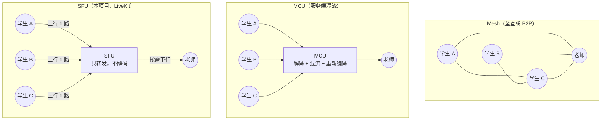

# SFU 与拓扑取舍：为什么是 SFU，而不是 Mesh / MCU

> 本文回答三个问题：三种实时音视频拓扑各自付出什么代价、
> ClassWatch 的规模假设（1 老师 + 20–30 学生）在带宽上是什么量级、
> 以及为什么**不能用「本地 30 个假 `<video>` 标签」宣称通过了压力测试**（§78）。
>
> 它是 Phase 6（LiveKit 媒体接入）的产物。文中带宽数字是**量级估算**，
> 用于做架构判断与容量规划，不是实测结果；真正的压测属于 Phase 12。
>
> 相关文档：[WebRTC 基础](webrtc-basics.md)、[LiveKit 架构](livekit-architecture.md)、
> [架构总览](../architecture/overview.md)、[数据库与索引](../database/schema.md)。

---

## 1. 三种拓扑



| | Mesh | MCU | SFU |
| --- | --- | --- | --- |
| 每个学生的上行 | **N−1 路**（自己的媒体发给每个同伴） | 1 路 | 1 路 |
| 服务端 CPU | 无 | **最高**（每路解码 + 混流 + 重编码） | 低（转发，不解码） |
| 服务端带宽 | 无 | 中等（每房间 1 路上行/下行） | 中高（每人 1 上行、按订阅数下行） |
| 端到端延迟 | 最低 | **最高**（编解码 + 合成） | 低（无转码，仅转发） |
| 订阅控制 | 无（收到什么就是什么） | 服务端决定（合流后无法逐人开关） | **逐 track 可控** |
| 服务端可观测性 | 无 | 有 | **有**（ListParticipants / webhook） |
| 规模上限 | ~4 人 | 依赖服务端算力 | 数十人/房间（取决于带宽） |

### 1.1 为什么 Mesh 在课堂里立刻出局

Mesh 的成本记在**学生**身上，而且随班级人数平方增长。以 30 人的班为例：

```text
Mesh：每个学生上行 29 路屏幕共享
      屏幕共享按 1.5 Mbps 估算 → 单学生上行 44 Mbps
      → 校园网 / 家庭宽带的上行通常只有 10–50 Mbps，一节课人数刚过 10 就崩
      → 而且崩溃发生在学生侧：老师无法通过扩容服务端来解决

SFU：每个学生上行 1 路 = 1.5 Mbps（与人数无关）
     下行 0 路（学生端 autoSubscribe=false，见 webrtc-basics §3）
```

Mesh 唯一适合的场景是「2–4 人、没有服务端」的临时通话，与「一个老师同时监督几十个屏幕」
正好相反。

### 1.2 为什么 MCU 不符合本项目的产品语义

MCU 把多路媒体**合成一路**再下发，看起来省带宽，但它毁掉了本项目最需要的两件事：

1. **逐学生的画面与状态。** 监督墙要显示的是「张三的屏幕」「李四的屏幕」，
   每块 tile 必须能单独订阅、单独开始/停止（Phase 7 的 Focus View）。
   混流之后画面是一张拼图，产品上无法聚焦某一个人，也无法把「这个人停播了」表达清楚。
2. **不需要转码的清晰度。** 混流意味着服务端解码每个人的 1080p 再重新编码，
   CPU 成本与画质损失都记在服务端；SFU 只转发，学生的原始码流直接到达老师。

代价是 SFU 把「下行总带宽」留给老师（N 路），这正是 §52 要求 v1 限制同时订阅数量、
Phase 7 用 Focus View 解决的问题。

---

## 2. 本项目的规模假设与带宽量级

### 2.1 假设（§78）

```text
近期目标：1 老师 + 20 学生
验收目标：1 老师 + 30 学生
媒体内容：每个学生 1 路屏幕共享（1080p，内容以代码/文档为主）
          老师 0–1 路上行（Phase 10 私密语音，约 32 kbps）
不包含：录制、转码、跨区域转发
```

### 2.2 学生侧（与人数无关）

| 方向 | 量级 | 说明 |
| --- | --- | --- |
| 上行 | 1.5–3 Mbps | 1080p 屏幕共享，静止内容可被编码器压得很低；大量文字滚动时接近上限 |
| 下行 | 0 或 ~32 kbps | 默认不订阅；Phase 10 只在被私密讲话时收 1 路音频 |
| CPU | 1 个编码器 | 屏幕共享编码远轻于摄像头（无运动、无噪声） |

结论：**学生侧不是瓶颈**，而且它与班级人数无关——这是 SFU 拓扑的核心收益。

### 2.3 老师侧（与人数线性相关）

```text
老师下行 ≈ 同时订阅的屏幕数 × 每路码率

Phase 6（1 个学生）      ：1 × 1.5 Mbps  ≈ 1.5 Mbps
Phase 7 全部订阅 20 人   ：20 × 1.5 Mbps ≈ 30 Mbps     ← 需要 simulcast 分层 + 只渲染可见 tile
Phase 7 全部订阅 30 人   ：30 × 1.5 Mbps ≈ 45 Mbps     ← 家用/办公上行通常吃不住
Phase 7+（Focus View）   ：1–4 路 ≈ 1.5–6 Mbps         ← 目标形态
```

上表解释了 §52 的规则：「第一版不要让老师同时下载所有学生的画面」。
Phase 7 的三件武器是：**simulcast**（每个学生同时发低/中/高三层，
老师按 tile 尺寸订阅对应层，小 tile 只要约 150–300 kbps）、
**Focus View**（只全码率订阅被点开的那一个）、
以及**只订阅可见 tile**（滚动出视口的画面停止订阅）。

服务端（SFU）带宽量级：`上行总和 + 下行总和`。
Phase 7 的 30 人目标下，最坏情况约 `30 × 1.5 Mbps（收） + 30 × 0.3 Mbps（发低层） ≈ 54 Mbps`，
这是一个单节点 SFU 轻松承担的量级；真正的风险在老师那一条下行链路，而不是 SFU。

### 2.4 这些数字该怎么用

它们是**容量规划的起点**，不是承诺：

- 屏幕共享的实际码率取决于内容变化率、分辨率、以及编码器的拥塞控制；
  静态 PPT 可能只有 200 kbps，满屏滚动的代码可能到 3 Mbps。
- 网络抖动、丢包重传、NAT 中继（TURN）都会改变实际吞吐。
- 因此 Phase 12 必须**实测**（老师入带宽、学生出带宽、CPU、内存、SFU CPU/带宽、
  延迟、重连），而不是拿本节表格当作结论。

---

## 3. 为什么不能用「本地 30 个假 video 标签」压测（§78）

一个常见的错误做法是：写一个本地页面，`for (i=0;i<30;i++)` 生成 30 个 `<video>` 标签，
或者用同一个摄像头/屏幕流复制 30 份，然后宣布「30 人压力测试通过」。它测不到任何东西：

| 假压测提供的 | 真实课堂需要验证的 |
| --- | --- |
| 同一台机器上的 DOM 渲染 | 30 台设备各自的编码器负载与上行带宽 |
| 一条流的 30 个副本（同一编码器输出） | 30 个**独立**编码器，码率随各自屏幕内容波动 |
| localhost：无丢包、无抖动、无 NAT | 校园网 / 家庭宽带的丢包、抖动、UDP 被封时回退 TCP |
| 无 SFU 转发路径或只有一条 | SFU 的转发容量、节点选择、跨区域链路 |
| 假轨道（canvas/`MediaStreamTrackGenerator`） | 真实 `getDisplayMedia` 授权、浏览器编码参数、硬件加速差异 |
| 无法观察到「老师端解码 N 路」 | 老师端解码 + 渲染 N 路 tile 的 CPU 与内存 |

§78 因此要求：Phase 12 的压测必须用**真实浏览器、真实屏幕共享、真实网络**，
按 20 人 → 30 人两档逐步加压，并记录上表右列的所有指标。
在那之前，任何「性能已达标」的说法都不成立——本项目的文档与提交信息也不应出现这种表述。

（可以做的替代验证：用 2–3 台真实机器先验证**功能**正确性——这节课的重点——
再用 Phase 12 的方式扩容到 20/30 人。Phase 6 只做 1 老师 + 1 学生，正是这个顺序的第一步。）

---

## 4. SFU 的订阅控制就是产品隔离

在 SFU 拓扑里，「谁能看到谁」由**订阅关系**决定，而订阅关系由服务端的权限控制。
本项目对它的使用分两步：

```text
Phase 6（1 个学生）
  学生端 autoSubscribe=false → 不订阅任何轨道
  老师端手动订阅这个学生的屏幕 → 老师能看到学生
  学生看不到老师、也看不到任何其他人

Phase 7（N 个学生）
  服务端下发 Subscription Permission：学生媒体 → 只有老师可订阅
  学生端仍然 autoSubscribe=false，且 UI 不展示其他学生（§26）
```

§26 的要求在这里有一个必须写明的边界：同一个 SFU Room 内，
「学生之间互不感知」是**产品和媒体权限层**的隔离，
不能定义成对恶意自定义客户端的协议级匿名性。
因此本项目的隔离由三层共同保证：

1. **客户端**：`autoSubscribe=false`，学生端界面不展示其他人；
2. **服务端**：Phase 7 的订阅权限 + 每个学生独立的 identity（opaque UUID）；
3. **控制面**：学生端 API 从不返回其他学生的任何信息（`StudentClassroom` DTO 里连人数都没有）。

---

## 5. 运维边界（Phase 11 的输入）

SFU 把复杂度从客户端搬到了服务端。本项目需要为它准备的运维动作：

| 关注点 | 现状（Phase 6） | Phase 11 计划 |
| --- | --- | --- |
| 节点与区域 | 单一 Cloud 项目 / 本地单节点 | 就近接入、必要时多节点 |
| 网络 | Cloud 自带 TURN/TLS；本地 `rtc.tcp_port=7881` 兜底 | 自建 TURN/TLS、固定 `node_ip` |
| 容量 | 未测 | 按 §2 的量级设监控阈值（SFU 带宽、CPU、参与者数） |
| 房间回收 | `empty_timeout` / `departure_timeout` + 关课终止 | 告警「关课后房间仍存在」 |
| 可观测性 | `/readyz` 的 `livekit` 探测、结构化日志 | 指标与告警、webhook 事件审计 |
| 密钥轮换 | 启动时读取、校验 | 轮换流程（重启 / 双密钥窗口） |

---

## 6. 已知限制

1. **没有真实多人压测数据。** 本文的带宽数字是估算；Phase 12 之前不得宣称任何性能结论（§78）。
2. **没有订阅权限控制。** Phase 6 只有 1 个学生，隔离依赖客户端不订阅；Phase 7 补服务端控制。
3. **没有 simulcast 调优。** 学生端只发一层，老师端全码率订阅；两层/三层与
   `degradationPreference` 属于 Phase 7。
4. **没有录制与转码。** V1 不录像（§53），也不引入 MCU 式混流。
5. **没有跨区域部署经验。** 全局节点的选择与就近接入属于 Phase 11。
