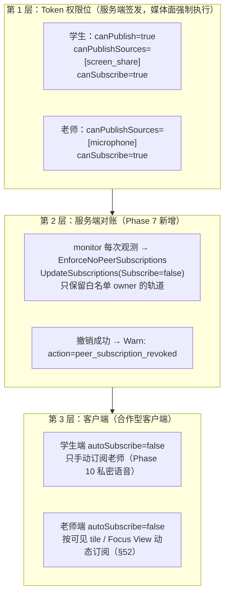
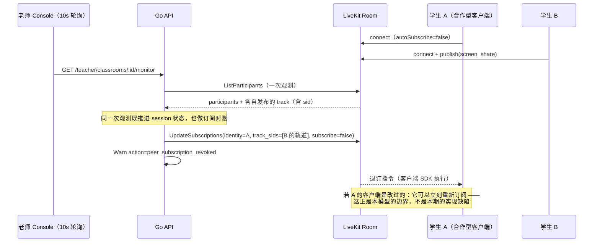

# Track 权限：谁能发布什么、谁能订阅什么

> 本文回答一个具体问题：**在一个共享的 LiveKit Room 里，每个角色到底能发布什么、能收到谁的媒体，
> 以及这条规则落在哪一层。**
>
> 它是 Phase 7（多学生监督墙）的产物。Phase 7 之前，"学生之间互不感知"只靠两件事：学生客户端
> `autoSubscribe=false`，以及 Monitor DTO 不含他人信息。这两件都只约束**合作型客户端**，
> SFU 层没有任何强制。Phase 7 把服务端的强制补上了，并同时把它的**边界**写清楚 ——
> 因为这条边界比实现本身更容易被误读成"协议级隔离"。
>
> 相关文档：[LiveKit 架构与接入](livekit-architecture.md)、[WebRTC 基础](webrtc-basics.md)、
> [SFU 取舍](sfu.md)、[控制面](../architecture/control-plane.md)、[状态机](../database/state-machines.md)。

---

## 1. 三层防线，一次说清

"学生看不到同学"不是一条规则，而是三层各自的规则叠起来的结果。任何一层单独拿出来都不成立：



| 层 | 能强制什么 | 强制不了什么 |
| --- | --- | --- |
| Token 权限位 | 谁能进房间、能**发布**哪几种 source | 房间级的 `canSubscribe` 无法表达"只能订阅老师"（§28 要求它为 true） |
| 服务端 `UpdateSubscriptions` | 把**已经存在的**订阅关系撤掉（合作型客户端 + 配置被改坏的情况） | 撤销是一次指令：客户端可以在下一毫秒重新订阅 |
| 客户端 `autoSubscribe=false` | 正常路径下根本不会产生越界订阅 | 一个改过的客户端可以直接无视它 |

**一句话结论：这是一个"合作型客户端可强制、恶意自定义客户端不可强制"的模型（§26 末段、§19）。
本文不宣称、代码注释也不宣称协议级隔离。**

---

## 2. 角色 × 场景：谁能发布什么、谁能订阅什么

### 2.1 发布矩阵

| 发布者 | 允许发布的 source | 谁签发的权限 | 现状 |
| --- | --- | --- | --- |
| 学生 | `screen_share` | join 时后端签发学生 Token（§28） | Phase 6/7 生效 |
| 学生 | `camera` / `microphone` | 同一 Token 的 `canPublishSources` 收窄为只有 screen | Phase 9 / Phase 10 才加入 |
| 老师 | `microphone` | media-token 接口签发（§27） | 权限位已有，Phase 7 客户端**不发布**；Phase 10 用于私密语音 |
| 老师 | `camera` / `screen_share` | —— | **V1 永不**（§27）。老师发布屏幕会让监督墙把课堂展示给自己 |
| 任何人 | data channel | `canPublishData=false` | 业务消息走 WebSocket（§47），数据通道是控制面观测不到的旁路 |

### 2.2 订阅矩阵（Phase 7 的实际行为）

| 订阅者 ↓ / 发布者 → | 学生 B | 老师 |
| --- | --- | --- |
| 学生 A | ✗ **本期由服务端撤销** | ✓ 允许（Phase 10 只有被选中的学生实际收到） |
| 老师 | ✓ 老师要看到所有学生的屏幕 | —— |



---

## 3. 第 1 层：Token 权限位

Token 是三层里唯一**媒体面自己执行**的一层：LiveKit 收到 Token 后按其中的 grant 拒绝越权操作，
不依赖客户端配合。两个角色的 grant 都写在 `internal/media/token.go` 的 `SignToken` 里，
单元测试解码 JWT 逐字段断言（`internal/media/token_test.go`）。

### 3.1 学生 Token（§28）

```text
roomJoin        = true            房间由后端 EnsureRoom 创建（§43），Token 不能自建房间
room            = lk_<run_uuid>   一个 Token 只对一个 Run 的 Room 有效
canPublish      = true
canPublishSources = ["screen_share"]   Phase 6/7 只允许共享屏幕
canSubscribe    = true            ← §28 的明确要求：学生要能收到老师的私密语音
canPublishData  = false
identity        = student_sessions.id（= livekit_identity，§44，永远是不透明 UUID）
```

`canSubscribe=true` 是本文所有"限制"的来源：**订阅权限是房间级的，没法写成"只订阅老师"。**
把它改成 `false` 会让 §28/§31（老师私密讲话）在 Phase 10 无法实现，把一个本期能解决的问题
换成下一期无法解决的问题。所以第 2 层必须存在。

### 3.2 老师 Token（§27）

```text
canSubscribe      = true          老师要订阅所有学生的屏幕
canPublish        = true
canPublishSources = ["microphone"]  §27：老师不需要 camera / screen_share
canPublishData    = false
identity          = sessions.id（登录会话 UUID，§44；不落 media 表）
```

### 3.3 为什么 identity 必须 opaque

Room 里的 identity 是**每个参与者都看得到**的字符串（客户端 SDK、LiveKit 控制台、
以及任何抓包）。如果它是 `zhangsan`、`student001` 或手机号，那么"学生之间互不感知"在
第一秒就破产了：学生 A 只要枚举房间里其他 participant 的 identity，就拿到了全班名单。
因此 identity 一律是 UUID（学生 = session id，老师 = 登录会话 id），数据库里还有
`student_sessions_identity_is_id` 这个 CHECK 兜底（§8/§26/§44）。

---

## 4. 第 2 层：服务端 `UpdateSubscriptions` 撤销（Phase 7 新增）

### 4.1 它做什么

`internal/media.EnforceNoPeerSubscriptions`（`internal/media/subscriptions.go`）：

- 输入是**调用方刚刚做完的那次观测**（`ObserveRoom` 的返回值）+ 该 Run 的学生 identity 列表
  + 一个**显式白名单** `allowedTrackOwners`。调用点在 `internal/session` 的 monitor 观测流程里，
  与状态推进复用同一次 `ListParticipants`，**不额外多查一次房间**。
- 对每个"在房间里"的学生，把它**没有白名单的**同学的已发布轨道收集起来，
  发一次 `RoomService.UpdateSubscriptions{Identity: 学生, TrackSids: [...], Subscribe: false}`。
  一个学生一次调用，**按 sid 退订**（不用 `ParticipantTracks`：那种形式按发布者的
  participant sid 分组，而 participant sid 会在发布者刷新页面时变化，与撤销本身无关）。
- 返回**本次真正撤销掉的** `(observer, owner, track_sid)` 列表；由 `internal/session` 逐条打
  Warn 日志（媒体包不认识 classroom/request id，也不该认识）。

### 4.2 白名单是什么（Phase 10 的接缝就在这里）

Phase 7 的白名单 = **房间里"不是本 Run 学生"的参与者**，也就是老师：

```text
allowedTrackOwners = { observed 中的 identity } − { 本 Run 所有 session 的 identity }
```

这里有两个刻意的选择：

1. **白名单是显式参数，不是硬编码的 `if identity == teacher`。** monitor 路径上后端并不知道
   老师的媒体 identity（老师用登录会话 id 当 identity，它不落 `student_sessions` 表），
   所以把"谁不是学生"算出来传进去，比去猜老师是谁更诚实。
   一个 LEFT 但仍滞留在房间里的学生，仍然算"学生"，因此同学仍会被从他那里退订。
2. **Phase 10 收窄的是同一处**：`ObservedTrack.Source` 已经带上了每条轨道的 source，
   所以"保留老师的麦克风"只需要把白名单从"这个 owner"收窄成"(这个 owner, MICROPHONE)"，
   观测层不用改。真正需要新设计的只有 §31 的**按人**授权（只有被选中的学生能收老师麦克风），
   它同时会用到 `Subscribe=true` 的手动订阅与对其他学生的退订 —— 那是 Phase 10 的决策，
   本期不预判。

### 4.3 幂等：为什么不会每 10 秒刷一遍 RPC

老师端每 10 秒轮询一次 monitor，如果每次都对全班重发一遍退订指令，就是纯粹的 RPC 噪音
（LiveKit Cloud 是按量计费的）。所以媒体客户端记住"**已经生效的撤销**"：

```text
key = (room, 学生的 participant_sid, track_sid)
```

- `participant_sid` 是 LiveKit 给**这条连接**的 id：学生刷新页面后 identity（session id）不变、
  连接变了 —— 一个"连接时自动订阅全班"的客户端因此会在**新连接上**被再撤销一次。
- 每次对账后用**当前观测**修剪这张表：轨道消失（不会再用同一个 sid 出现）就删掉 key，
  内存有界；撤销失败**不**记入（下一次轮询会重试）。
- 这张表是进程内、尽力而为的，**不持久化**：重启或多实例只会让每条轨道多撤销一次，
  这是无害的，而且在重新部署之后恰好是想要的（客户端可能刚重连过）。

### 4.4 观测到的异常 → Warn 日志

```text
action                  = peer_subscription_revoked
room                    = lk_<run_uuid>
observer_identity       = 发出订阅的学生（= 其 session id）
subscribed_track_owner  = 轨道发布者（本 Phase 恒为另一个学生）
track_sid               = 被撤销的轨道
reason                  = students must not receive each other's media (§26)
```

一条 Warn = 一次"服务端不得不替客户端纠正"的事实。它的用途是发现**客户端配置被改坏或被绕过**：
正常路径（`autoSubscribe=false`）下这条日志根本不会出现。
媒体面调用失败另记 `action=peer_subscription_revocation_failed`，**不影响 monitor 的 200 响应**，
也不推进任何业务状态（§33）。

### 4.5 一个必须写下来的实现事实：**订阅状态读不到**

本仓库使用的 `livekit/protocol v1.49.0`（以及更新版本）里：

- `ParticipantInfo` 只包含该参与者**发布**的 track，没有它**订阅**的 track；
- `RoomService` 里与订阅相关的 RPC 只有 `UpdateSubscriptions`（写），没有读；
- LiveKit webhook 的事件集是 `room_*` / `participant_*` / `track_published` / `track_unpublished` /
  `egress_*` / `ingress_*`，**没有 `track_subscribed`**（§45 列出的正是这个集合）。

也就是说：**服务端无法直接观测"学生 A 是否订阅了学生 B 的轨道"。** 这正是本期实现的形状
由来的原因 —— 它不是"检测到越界再撤销"，而是**对已发布轨道做对账**：
"只要 B 发布了轨道而 A 没有被撤销过，就发一次退订并记一条日志"。

这个区别在运维上很重要，本文与代码注释都不把它说成"我们检测到了越界订阅"：

- 对**合作型客户端**：撤销是多余但无害的（它本来就没订阅）；
- 对**被改坏的客户端**：撤销真正生效，日志留下痕迹；
- 对**恶意客户端**：它可以在撤销之后立刻重新订阅，而服务端下一次轮询才会再撤销一次
  （最多晚一个轮询周期）。这就是 §26 末段所说的"不定义为协议级匿名性"。

> 如果将来需要更接近"检测"的能力，正确的位置是 Phase 8 的 webhook 管道 + 客户端上报的
> 订阅状态（只能作为**弱信号**：客户端上报本身不可信，§19 的威胁模型同样适用于它），
> 或者 LiveKit 未来提供的订阅读取 API。本期不做，也不假装做了。

---

## 5. 第 3 层：客户端

| 客户端 | 配置 | 说明 |
| --- | --- | --- |
| 学生端 | `autoSubscribe=false` | 连上后不自动订阅任何轨道；Phase 6/7 只发布屏幕，不订阅任何东西 |
| 学生端（Phase 10） | 只手动订阅老师 | 收到"老师正在对你说话"的业务消息后才 `setSubscribed(true)`；结束/切换目标时退订 |
| 老师端 | `autoSubscribe=false` | §52：按可见 tile / Focus View / 滚动位置动态订阅，避免 30 路 1080p |

`autoSubscribe=false` 不是安全边界（改代码即可绕过），它的价值在于**让正常路径根本不产生越界订阅**，
从而让第 2 层的 Warn 日志具备信号意义：它一响，就说明有人没走正常路径。

服务端**不相信**客户端的任何自述（§45）：不订阅就不会有画面，而"我订阅成功了"从不作为业务状态。

---

## 6. 替代方案，以及为什么没选

| 方案 | 为什么没选 |
| --- | --- |
| 每个学生一个 Room，老师加入所有 Room | 老师端要维护 N 条 PeerConnection，正是 §52 要避免的；而且老师私密语音、监督墙的"一次观测"都要跨房间拼装，控制面复杂度远超收益。§26 明确接受"共享同一个 SFU Room"这个前提 |
| 学生 Token `canSubscribe=false` | §28 要求学生能收老师私密语音。这会用"本期更严格"换"下一期做不出来" |
| 只依赖客户端 `autoSubscribe=false` | 这正是 Phase 7 之前的现状：一个学生客户端只要把配置改成 `true`，就能收到全班的屏幕，而服务端毫无痕迹 |
| 让老师端做隔离 | 老师端是浏览器，不是权限点。任何"由观察者执行"的隔离都不构成隔离 |
| 拒绝学生发布、由老师拉流时才订阅 | 不解决问题：越界订阅是**学生**客户端的行为，与老师是否在拉流无关 |

---

## 7. 失败语义与运维

| 情况 | 行为 | 为什么 |
| --- | --- | --- |
| `ListParticipants` 失败 | monitor 返回 200；`connection=UNKNOWN`；状态**不推进**；**不做**订阅对账 | 没有观测就没有可对账的事实；把媒体面抖动写成业务事实是不可逆的（§33） |
| `UpdateSubscriptions` 失败 | Warn 日志；monitor 仍 200；状态照常推进；**不**记入"已撤销"→ 下次轮询重试 | 撤销是尽力而为的收敛过程，不是事务 |
| 某个学生撤销失败 | 其余学生照常撤销（每个学生一次独立 RPC） | 一个客户端的失败不该让另一个学生继续收到同学的屏幕 |
| API 进程重启 | 记住的撤销丢失，下一轮对每个活跃轨道各多发一次 | 无害，且重新部署后客户端可能刚重连 |
| 多实例部署 | 每个实例各自对账，最坏情况同一条轨道被撤销多次 | 幂等操作；不引入分布式锁 |

---

## 8. 一张表收尾：本期做了 / 没做

| 能力 | Phase 7 状态 |
| --- | --- |
| 学生 Token 只发布 `screen_share` | ✅（Phase 6 起） |
| 学生 `canSubscribe=true` | ✅（§28 要求，Phase 10 用） |
| 服务端撤销学生的同学订阅 | ✅ `EnforceNoPeerSubscriptions`，随 monitor 观测触发 |
| 撤销的日志证据 | ✅ `action=peer_subscription_revoked` |
| 幂等 / 最小调用 | ✅ 按 (room, connection, track) 记账并修剪 |
| 老师端按需订阅（Grid / Focus） | ⬜ 前端 Phase 7 范围；服务端 DTO 已提供 `sessionId` 作为 identity |
| 摄像头 / 麦克风发布 | ⬜ Phase 9 / Phase 10 |
| 私密语音的按人授权（只有被选中的学生能收） | ⬜ Phase 10 |
| 读取订阅状态（真正的"检测"） | ⬜ LiveKit 当前无此 API；见 §4.5 |
| 协议级恶意客户端隔离 | ❌ 不在 V1 的威胁模型内（§26 末段） |
