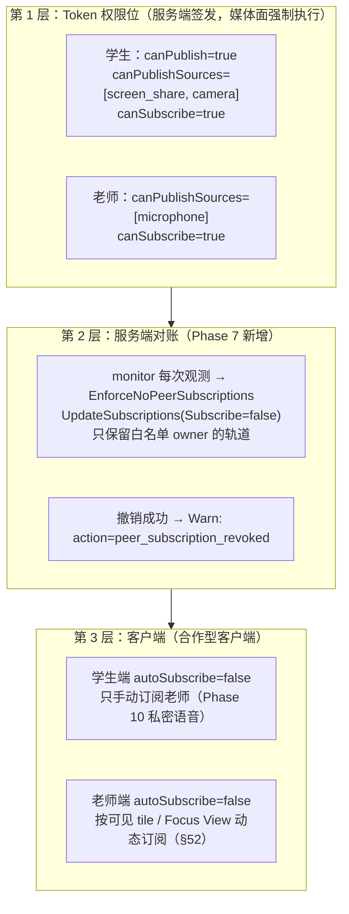
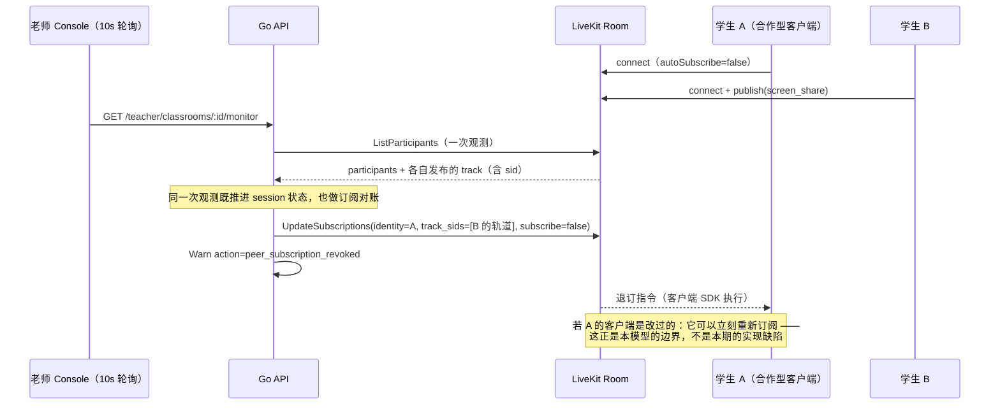
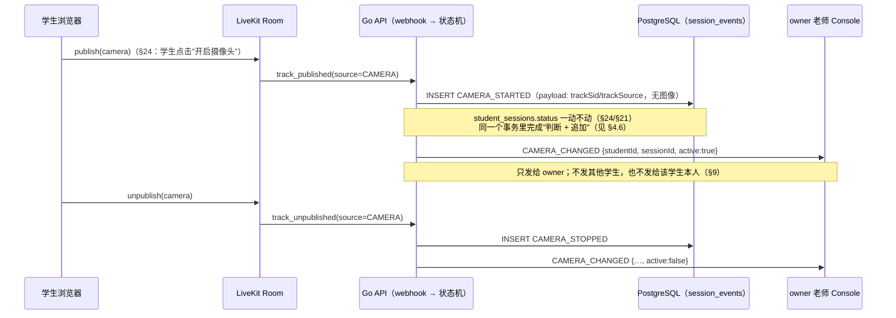

# Track 权限：谁能发布什么、谁能订阅什么

> 本文回答一个具体问题：**在一个共享的 LiveKit Room 里，每个角色到底能发布什么、能收到谁的媒体，
> 以及这条规则落在哪一层。**
>
> 它是 Phase 7（多学生监督墙）的产物。Phase 7 之前，"学生之间互不感知"只靠两件事：学生客户端
> `autoSubscribe=false`，以及 Monitor DTO 不含他人信息。这两件都只约束**合作型客户端**，
> SFU 层没有任何强制。Phase 7 把服务端的强制补上了，并同时把它的**边界**写清楚 ——
> 因为这条边界比实现本身更容易被误读成"协议级隔离"。
>
> Phase 9（摄像头）在这套模型上加了**第三种 source**，于是本文多了 §2.3、§4.6 与 §9：
> 摄像头为什么进权限位、为什么**不进**会话状态机、以及为什么它的业务消息只发给 owner 老师。
>
> 相关文档：[LiveKit 架构与接入](livekit-architecture.md)、[WebRTC 基础](webrtc-basics.md)、
> [SFU 取舍](sfu.md)、[控制面](../architecture/control-plane.md)、[状态机](../database/state-machines.md)。

---

## 1. 三层防线，一次说清

"学生看不到同学"不是一条规则，而是三层各自的规则叠起来的结果。任何一层单独拿出来都不成立：



| 层 | 能强制什么 | 强制不了什么 |
| --- | --- | --- |
| Token 权限位 | 谁能进房间、能**发布**哪几种 source | 房间级的 `canSubscribe` 无法表达"只能订阅老师"（§28 要求它为 true） |
| 服务端 `UpdateSubscriptions` | 把**已经存在的**订阅关系撤掉（合作型客户端 + 配置被改坏的情况） | 撤销是一次指令：客户端可以在下一毫秒重新订阅 |
| 客户端 `autoSubscribe=false` | 正常路径下根本不会产生越界订阅 | 一个改过的客户端可以直接无视它 |

**一句话结论：这是一个"合作型客户端可强制、恶意自定义客户端不可强制"的模型（§26 末段、§19）。
本文不宣称、代码注释也不宣称协议级隔离。**

---

## 2. 角色 × 场景：谁能发布什么、谁能订阅什么

### 2.1 发布矩阵

| 发布者 | 允许发布的 source | 谁签发的权限 | 现状 |
| --- | --- | --- | --- |
| 学生 | `screen_share` | join 时后端签发学生 Token（§28） | Phase 6/7 生效 |
| 学生 | `camera` | 同一个学生 Token 的 `canPublishSources`（§75） | ✅ Phase 9 |
| 学生 | `microphone` | 同一个学生 Token | ✅ Phase 10（§76）已加入，与它的事件路径同时落地 |
| 老师 | `microphone` | media-token 接口签发（§27） | 权限位自 Phase 6 就有；Phase 10 起客户端**会**发布，用于私密语音 |
| 老师 | `camera` / `screen_share` | —— | **V1 永不**（§27）。老师发布屏幕会让监督墙把课堂展示给自己 |
| 任何人 | data channel | `canPublishData=false` | 业务消息走 WebSocket（§47），数据通道是控制面观测不到的旁路 |

### 2.2 订阅矩阵（Phase 7 的规则，Phase 9 未改）

| 订阅者 ↓ / 发布者 → | 学生 B（屏幕） | 学生 B（摄像头） | 老师 |
| --- | --- | --- | --- |
| 学生 A | ✗ **由服务端撤销** | ✗ **同样由服务端撤销** | ✓ 允许（Phase 10 已实现：只有被选中的学生实际收到） |
| 老师 | ✓ 老师要看到所有学生的屏幕 | ✓ 画中画（§30/§75） | —— |

摄像头没有引入新的订阅规则：第 2 层的对账按**已发布轨道**工作，而 `ObservedTrack.Source`
从 Phase 7 起就带着每条轨道的 source。所以"学生 B 的摄像头"和"学生 B 的屏幕"在撤销逻辑里
是同一种东西 —— 一条同学发布的轨道。



### 2.3 摄像头的完整事件路径（Phase 9 新增）



同时，老师端每 10 秒轮询的 `GET /teacher/classrooms/:id/monitor` 里的 `camera.active`
来自**服务端观测**：`ObserveRoom`（`ListParticipants`）看到该 participant 有一条
**未静音**的 `CAMERA` 轨道时为 true，否则 false。§51 的 DTO 形状没有变（Phase 7 已冻结），
变的是这个布尔值第一次可能为 true。

---

## 3. 第 1 层：Token 权限位

Token 是三层里唯一**媒体面自己执行**的一层：LiveKit 收到 Token 后按其中的 grant 拒绝越权操作，
不依赖客户端配合。两个角色的 grant 都写在 `internal/media/token.go` 的 `SignToken` 里，
单元测试解码 JWT 逐字段断言（`internal/media/token_test.go`）；
**每个角色到底要哪几个 source** 由 `internal/session` 决定（join 与 media-token 两条路径），
那里也各有断言。

### 3.1 学生 Token（§28 + §75）

```text
roomJoin        = true            房间由后端 EnsureRoom 创建（§43），Token 不能自建房间
room            = lk_<run_uuid>   一个 Token 只对一个 Run 的 Room 有效
canPublish      = true
canPublishSources = ["screen_share", "camera"]   Phase 9：屏幕（必需，§21）+ 摄像头（可选，§24）
canSubscribe    = true            ← §28 的明确要求：学生要能收到老师的私密语音
canPublishData  = false
identity        = student_sessions.id（= livekit_identity，§44，永远是不透明 UUID）
```

`canSubscribe=true` 是本文所有"限制"的来源：**订阅权限是房间级的，没法写成"只订阅老师"。**
把它改成 `false` 会让 §28/§31（老师私密讲话）实现不了，把一个本期能解决的问题
换成下一期无法解决的问题。所以第 2 层必须存在。

**为什么学生麦克风在 Phase 10 才加：** 摄像头与它的**事件路径**是同一期落地的
（`CAMERA_STARTED` / `CAMERA_STOPPED` / `CAMERA_CHANGED` / `camera.active`），所以"允许发布"
和"有人观测"同时成立。麦克风不是：grant 一旦放开，学生就能发布一路**控制面完全不观测**的音频 ——
没有 `MIC_STARTED`、没有 `MIC_CHANGED`，也没有 §31"老师可以对谁说话"的授权模型。
§33 要求"数据库先决定什么是真的、媒体面跟上"，所以麦克风的权限位必须与它的事件路径一起在
Phase 10 落地，而不是提前放行。

顺序也不是随手写的：`screen_share` 在前是因为 §21 让它成为**必需**轨道，`camera` 在后是因为
§24 让它**可选**。这个列表是被签名的值，测试按顺序断言，diff 时一眼能看出多了什么。

### 3.2 老师 Token（§27）

```text
canSubscribe      = true          老师要订阅所有学生的屏幕（Phase 9 起还有摄像头）
canPublish        = true
canPublishSources = ["microphone"]  §27：老师不需要 camera / screen_share
canPublishData    = false
identity          = sessions.id（登录会话 UUID，§44；不落 media 表）
```

Phase 9 **没有**改动老师这一行：摄像头是学生的轨道，老师发布摄像头只会把老师自己变成监督墙上
一块谁也解释不了的 tile。

### 3.3 为什么 identity 必须 opaque

Room 里的 identity 是**每个参与者都看得到**的字符串（客户端 SDK、LiveKit 控制台、
以及任何抓包）。如果它是 `zhangsan`、`student001` 或手机号，那么"学生之间互不感知"在
第一秒就破产了：学生 A 只要枚举房间里其他 participant 的 identity，就拿到了全班名单。
因此 identity 一律是 UUID（学生 = session id，老师 = 登录会话 id），数据库里还有
`student_sessions_identity_is_id` 这个 CHECK 兜底（§8/§26/§44）。

---

## 4. 第 2 层：服务端 `UpdateSubscriptions` 撤销（Phase 7 新增）

### 4.1 它做什么

`internal/media.EnforceNoPeerSubscriptions`（`internal/media/subscriptions.go`）：

- 输入是**调用方刚刚做完的那次观测**（`ObserveRoom` 的返回值）+ 该 Run 的学生 identity 列表
  + 一个**显式白名单** `allowedTrackOwners`。调用点在 `internal/session` 的 monitor 观测流程里，
  与状态推进复用同一次 `ListParticipants`，**不额外多查一次房间**。
- 对每个"在房间里"的学生，把它**没有白名单的**同学的已发布轨道收集起来，
  发一次 `RoomService.UpdateSubscriptions{Identity: 学生, TrackSids: [...], Subscribe: false}`。
  一个学生一次调用，**按 sid 退订**（不用 `ParticipantTracks`：那种形式按发布者的
  participant sid 分组，而 participant sid 会在发布者刷新页面时变化，与撤销本身无关）。
- 返回**本次真正撤销掉的** `(observer, owner, track_sid)` 列表；由 `internal/session` 逐条打
  Warn 日志（媒体包不认识 classroom/request id，也不该认识）。

### 4.2 白名单是什么（Phase 10 的接缝就在这里）

Phase 7 的白名单 = **房间里"不是本 Run 学生"的参与者**，也就是老师：

```text
allowedTrackOwners = { observed 中的 identity } − { 本 Run 所有 session 的 identity }
```

这里有两个刻意的选择：

1. **白名单是显式参数，不是硬编码的 `if identity == teacher`。** monitor 路径上后端并不知道
   老师的媒体 identity（老师用登录会话 id 当 identity，它不落 `student_sessions` 表），
   所以把"谁不是学生"算出来传进去，比去猜老师是谁更诚实。
   一个 LEFT 但仍滞留在房间里的学生，仍然算"学生"，因此同学仍会被从他那里退订。
2. **Phase 10 收窄的是同一处**：`ObservedTrack.Source` 已经带上了每条轨道的 source，
   所以"保留老师的麦克风"只需要把白名单从"这个 owner"收窄成"(这个 owner, MICROPHONE)"，
   观测层不用改。真正需要新设计的只有 §31 的**按人**授权（只有被选中的学生能收老师麦克风），
   它同时会用到 `Subscribe=true` 的手动订阅与对其他学生的退订 —— 那是 Phase 10 的决策，
   本期不预判。

### 4.3 幂等：为什么不会每 10 秒刷一遍 RPC

老师端每 10 秒轮询一次 monitor，如果每次都对全班重发一遍退订指令，就是纯粹的 RPC 噪音
（LiveKit Cloud 是按量计费的）。所以媒体客户端记住"**已经生效的撤销**"：

```text
key = (room, 学生的 participant_sid, track_sid)
```

- `participant_sid` 是 LiveKit 给**这条连接**的 id：学生刷新页面后 identity（session id）不变、
  连接变了 —— 一个"连接时自动订阅全班"的客户端因此会在**新连接上**被再撤销一次。
- 每次对账后用**当前观测**修剪这张表：轨道消失（不会再用同一个 sid 出现）就删掉 key，
  内存有界；撤销失败**不**记入（下一次轮询会重试）。
- 这张表是进程内、尽力而为的，**不持久化**：重启或多实例只会让每条轨道多撤销一次，
  这是无害的，而且在重新部署之后恰好是想要的（客户端可能刚重连过）。

### 4.4 观测到的异常 → Warn 日志

```text
action                  = peer_subscription_revoked
room                    = lk_<run_uuid>
observer_identity       = 发出订阅的学生（= 其 session id）
subscribed_track_owner  = 轨道发布者（本 Phase 恒为另一个学生）
track_sid               = 被撤销的轨道
reason                  = students must not receive each other's media (§26)
```

一条 Warn = 一次"服务端不得不替客户端纠正"的事实。它的用途是发现**客户端配置被改坏或被绕过**：
正常路径（`autoSubscribe=false`）下这条日志根本不会出现。
媒体面调用失败另记 `action=peer_subscription_revocation_failed`，**不影响 monitor 的 200 响应**，
也不推进任何业务状态（§33）。

### 4.5 一个必须写下来的实现事实：**订阅状态读不到**

本仓库使用的 `livekit/protocol v1.49.0`（以及更新版本）里：

- `ParticipantInfo` 只包含该参与者**发布**的 track，没有它**订阅**的 track；
- `RoomService` 里与订阅相关的 RPC 只有 `UpdateSubscriptions`（写），没有读；
- LiveKit webhook 的事件集是 `room_*` / `participant_*` / `track_published` / `track_unpublished` /
  `egress_*` / `ingress_*`，**没有 `track_subscribed`**（§45 列出的正是这个集合）。

也就是说：**服务端无法直接观测"学生 A 是否订阅了学生 B 的轨道"。** 这正是本期实现的形状
由来的原因 —— 它不是"检测到越界再撤销"，而是**对已发布轨道做对账**：
"只要 B 发布了轨道而 A 没有被撤销过，就发一次退订并记一条日志"。

这个区别在运维上很重要，本文与代码注释都不把它说成"我们检测到了越界订阅"：

- 对**合作型客户端**：撤销是多余但无害的（它本来就没订阅）；
- 对**被改坏的客户端**：撤销真正生效，日志留下痕迹；
- 对**恶意客户端**：它可以在撤销之后立刻重新订阅，而服务端下一次轮询才会再撤销一次
  （最多晚一个轮询周期）。这就是 §26 末段所说的"不定义为协议级匿名性"。

> 如果将来需要更接近"检测"的能力，正确的位置是 Phase 8 的 webhook 管道 + 客户端上报的
> 订阅状态（只能作为**弱信号**：客户端上报本身不可信，§19 的威胁模型同样适用于它），
> 或者 LiveKit 未来提供的订阅读取 API。本期不做，也不假装做了。

### 4.6 摄像头：幂等判断从状态列换成事件日志（Phase 9）

摄像头与屏幕最大的结构差别是：`student_sessions` **没有摄像头列**，而且不能有。
§24 说摄像头不影响 `ONLINE`，§21 说只有屏幕是 mandatory —— 一个紧挨着 `status` 的
`camera_active` 列，就是把这句话作废的第一步（下一个人会忍不住用它做状态判断）。

所以"现在是不是已经开着"这个问题由**事件日志**回答（`internal/session/event.go` 的
`TrackStateChange` + `events_postgres.go` 的 `ApplyTrackState`）：

```text
当前状态 = 该 session 最近一条 CAMERA_* 事件的类型
           CAMERA_STARTED = 开，CAMERA_STOPPED = 关
           一条都没有 = 关（§24：摄像头是学生点出来的，默认就是关）
```

要写新的一行，必须同时满足两个条件 —— 它们是**两种不同的重复投递**：

| 判断 | 挡住的投递 | 为什么需要 |
| --- | --- | --- |
| 该 `(session, 事件类型, trackSid)` 还不存在 | **重试**：`publish(A) → unpublish(A) → publish(A)` 的第三条 | 只看"最近一条"的话，这一条会把已经关掉的摄像头重新点亮 |
| 最近一条 CAMERA_* 不是目标状态 | **乱序**：`unpublish` 先到（摄像头本来就没开） | 与 §22 的屏幕乱序同一条纪律：描述"日志已经隐含的状态"的投递不产生历史 |

两个判断和 INSERT 在**同一个事务**里，并且这个事务先取一把**按 session 的
advisory lock**：webhook 是并发到达的（学生快速开关摄像头），两个 goroutine 都可能读到
"关"然后各写一行 `CAMERA_STARTED`。锁是事务级的，粒度是 session，对其他学生零成本。

写入成功才广播：`CAMERA_CHANGED` 因此**每个真实变化恰好一条**，重复投递既不写事件也不发消息。

---

## 5. 第 3 层：客户端

| 客户端 | 配置 | 说明 |
| --- | --- | --- |
| 学生端 | `autoSubscribe=false` | 连上后不自动订阅任何轨道；Phase 6/7 只发布屏幕，Phase 9 起可再发布摄像头，不订阅任何东西 |
| 学生端（Phase 10） | 只手动订阅老师 | 收到"老师正在对你说话"的业务消息后才 `setSubscribed(true)`；结束/切换目标时退订 |
| 老师端 | `autoSubscribe=false` | §52：按可见 tile / Focus View / 滚动位置动态订阅，避免 30 路 1080p |

`autoSubscribe=false` 不是安全边界（改代码即可绕过），它的价值在于**让正常路径根本不产生越界订阅**，
从而让第 2 层的 Warn 日志具备信号意义：它一响，就说明有人没走正常路径。

服务端**不相信**客户端的任何自述（§45）：不订阅就不会有画面，而"我订阅成功了"从不作为业务状态。
摄像头也一样：前端点开摄像头后**不**上报"我开了"，`camera.active` 由服务端的观测与 webhook 决定。

---

## 6. 替代方案，以及为什么没选

| 方案 | 为什么没选 |
| --- | --- |
| 每个学生一个 Room，老师加入所有 Room | 老师端要维护 N 条 PeerConnection，正是 §52 要避免的；而且老师私密语音、监督墙的"一次观测"都要跨房间拼装，控制面复杂度远超收益。§26 明确接受"共享同一个 SFU Room"这个前提 |
| 学生 Token `canSubscribe=false` | §28 要求学生能收老师私密语音。这会用"本期更严格"换"下一期做不出来" |
| 只依赖客户端 `autoSubscribe=false` | 这正是 Phase 7 之前的现状：一个学生客户端只要把配置改成 `true`，就能收到全班的屏幕，而服务端毫无痕迹 |
| 让老师端做隔离 | 老师端是浏览器，不是权限点。任何"由观察者执行"的隔离都不构成隔离 |
| 拒绝学生发布、由老师拉流时才订阅 | 不解决问题：越界订阅是**学生**客户端的行为，与老师是否在拉流无关 |
| 一次给学生的 `canPublishSources` 加上 camera **和** microphone | 麦克风的事件路径不存在，"允许发布"会先于"有人观测"到达 —— 正是 §33 禁止的媒体面跑到控制面前面（§3.1/§76） |
| 给 `student_sessions` 加一个 `camera_active` 列来做 CAS | 列一旦紧挨 `status`，下一个人就会用它做状态判断，§24/§21 随之作废；摄像头的完整历史本来就在 `session_events` 里，判断从"最近一条 CAMERA_*"来即可（§4.6） |
| 把 `CAMERA_CHANGED` 广播给全班（"大家都开摄像头更有课堂感"） | §26：这等于向每个学生广播"此刻谁开着摄像头"，而学生本人并不需要这条回执（§9） |

---

## 7. 失败语义与运维

| 情况 | 行为 | 为什么 |
| --- | --- | --- |
| `ListParticipants` 失败 | monitor 返回 200；`connection=UNKNOWN`；状态**不推进**；**不做**订阅对账；`camera.active=false` | 没有观测就没有可对账的事实；把媒体面抖动写成业务事实是不可逆的（§33）。摄像头同理：宁可显示"没看到摄像头"，也不猜 |
| `UpdateSubscriptions` 失败 | Warn 日志；monitor 仍 200；状态照常推进；**不**记入"已撤销"→ 下次轮询重试 | 撤销是尽力而为的收敛过程，不是事务 |
| 某个学生撤销失败 | 其余学生照常撤销（每个学生一次独立 RPC） | 一个客户端的失败不该让另一个学生继续收到同学的屏幕 |
| API 进程重启 | 记住的撤销丢失，下一轮对每个活跃轨道各多发一次 | 无害，且重新部署后客户端可能刚重连 |
| 多实例部署 | 每个实例各自对账，最坏情况同一条轨道被撤销多次 | 幂等操作；不引入分布式锁 |
| 摄像头 webhook 处理失败（数据库不可达） | 返回 500，LiveKit 重试；**不**广播 `CAMERA_CHANGED` | 事件行是幂等键：没写进去就没有"已经发生过"的记录，广播一条没有历史的消息会让墙与日志不一致（§33/§74） |
| 重复 / 乱序 / 重试的摄像头 webhook | 200；不写事件、不广播 | 见 §4.6；这是 at-least-once 投递的正常结果，4xx 会让 LiveKit 重试一个永远不可能成功的事件 |
| 学生客户端用 `track.mute()` 而不是 unpublish | `camera.active` 在下一个轮询周期变 false；事件日志里**没有** `CAMERA_STOPPED` | LiveKit 的事件集里没有 `track_muted`（§45），静音这个瞬间服务端观测不到。所以两条路径各自回答一个问题：**轮询观测**回答"现在有没有画面在传"（`camera.active`，静音的轨道不算），**事件日志**回答"这条发布的生命周期"。§24 的前端契约是"关摄像头 = unpublish"，本期以该契约为准，二者因此一致 |

---

## 8. 摄像头为什么不参与会话状态机（§21/§24）

这是 Phase 9 最容易写错的一处，所以单独写一节。

```text
ONLINE  ⇔  有一路未静音的 screen_share 轨道          （§21，Phase 6 起）
CAMERA  ⇒  不改变 student_sessions.status            （§24，Phase 9）
```

三件事把这句话钉住：

1. **代码分叉。** `track_published` 按 source 分流：`SCREEN_SHARE` 走 `screenPublished`
   （唯一能把 session 变成 ONLINE 的地方），`CAMERA` 走 `cameraObserved`
   （只写事件 + 广播，完全不碰状态列）。摄像头那条路径的单元测试直接断言整行
   `student_sessions`（状态 + 四个时间戳）**逐字段不变**，所以"摄像头顺手推进了状态"
   这种回归会在 CI 里失败，而不是在老师的墙上失败。
2. **数据模型不提供工具。** 没有 `camera_active` 列（§4.6）。没有列，就没有"顺手把摄像头
   也写进状态判断"的诱惑；摄像头的"当前状态"只存在于事件日志里。
3. **老师看到的是两件事，不是一个。** §51 的 tile 同时有 `sessionStatus` 和 `camera.active`：
   `SCREEN_LOST` + `camera.active=true` 是**完全正常**的一张卡 —— 学生的屏幕掉了，但人还在镜头前。
   如果摄像头能把状态推回 ONLINE，这张卡就再也表达不出来了，而"学生没在共享屏幕"正是
   老师最需要看到的事实。

> 一个自然的反问："那摄像头开着、屏幕关着，算不算被监督？" 不算。§21 的 `ONLINE` 是
> **共享屏幕**这个动作的名字，不是"这个人在线"的名字。摄像头是 §30 Focus View 的补充画面，
> 不是监督的替代品。

---

## 9. 摄像头事件为什么只发给 owner 老师（§26）

`CAMERA_CHANGED {studentId, sessionId, active}` 的受众在 `internal/realtime.Service.CameraChanged`
里被**唯一地**决定，`session.SessionEvents` 接口只收 `SessionRef`、收不到收件人列表 ——
也就是说 session 领域**没有能力**扩大受众。三个候选受众，两个被排除：

| 候选 | 结论 | 理由 |
| --- | --- | --- |
| owner 老师 | ✅ 唯一的接收者 | 监督墙看不到学生浏览器上的按钮，这是它唯一的信息来源 |
| 其他学生 | ❌ 绝不 | §26：教室级广播等于告诉每个学生"此刻谁开着摄像头"。这正是本产品要隐藏的事实 |
| 学生本人 | ❌ 本期不发 | 见下 |

**为什么不给学生本人回执：** 摄像头是学生**自己**按下的按钮，本地轨道已经在他们自己的页面上
渲染出来了；服务端的回执只可能**更晚**到达，于是它不能提供信息，只能制造一个第二事实源 ——
一条被重试延迟的回执甚至在客户端切换按钮之后才到，会把它翻回错误的状态。学生真正需要服务端
确认的是**屏幕**（§22/§46 的 `SCREEN_LOST` / `SCREEN_RESTORED`，那条消息确实也发给学生本人），
因为屏幕的"是否还在共享"无法由页面单独判定。摄像头不需要，所以 Frontend 的"摄像头开着"
只看本地 track 状态；服务端的 `camera.active` 是给**老师**看的。

---

## 10. 一张表收尾：做了 / 没做

| 能力 | 状态 |
| --- | --- |
| 学生 Token 只发布 `screen_share` | ✅（Phase 6 起） |
| 学生 Token 追加 `camera`（老师仍是 `[microphone]`） | ✅ Phase 9（§75） |
| 学生 `canSubscribe=true` | ✅（§28 要求，Phase 10 用） |
| 服务端撤销学生的同学订阅 | ✅ `EnforceNoPeerSubscriptions`，随 monitor 观测触发（摄像头轨道同样覆盖） |
| 撤销的日志证据 | ✅ `action=peer_subscription_revoked` |
| 幂等 / 最小调用 | ✅ 按 (room, connection, track) 记账并修剪 |
| `track_published/unpublished(CAMERA)` → `CAMERA_STARTED` / `CAMERA_STOPPED` | ✅ Phase 9，含重试与乱序的幂等（§4.6） |
| `CAMERA_CHANGED` → owner 老师 | ✅ Phase 9（§9）；其他学生与该学生本人都收不到 |
| Monitor DTO 的 `camera.active` 来自观测（未静音才算） | ✅ Phase 9，DTO 形状未变（§51） |
| 老师端按需订阅（Grid / Focus） | ⬜ 前端 Phase 7/9 范围；服务端 DTO 已提供 `sessionId` 作为 identity |
| 摄像头画面本身（画中画、Focus View） | ⬜ 前端 Phase 9；服务端只提供事实 |
| 麦克风发布 / `MIC_CHANGED` / `TEACHER_TALK_*` | ⬜ Phase 10（§76） |
| 私密语音的按人授权（只有被选中的学生能收） | ⬜ Phase 10 |
| 读取订阅状态（真正的"检测"） | ⬜ LiveKit 当前无此 API；见 §4.5 |
| 协议级恶意客户端隔离 | ❌ 不在 V1 的威胁模型内（§26 末段） |
| 在真实 LiveKit Cloud 上同时发布 screen + camera 并肉眼确认 | ⬜ 只能真机验证，见 Phase 9 报告 |

---

## 相关文档

- [private-audio.md](private-audio.md)：私密语音的完整设计（状态机、订阅收口、老师未开麦/学生未开麦的行为）
