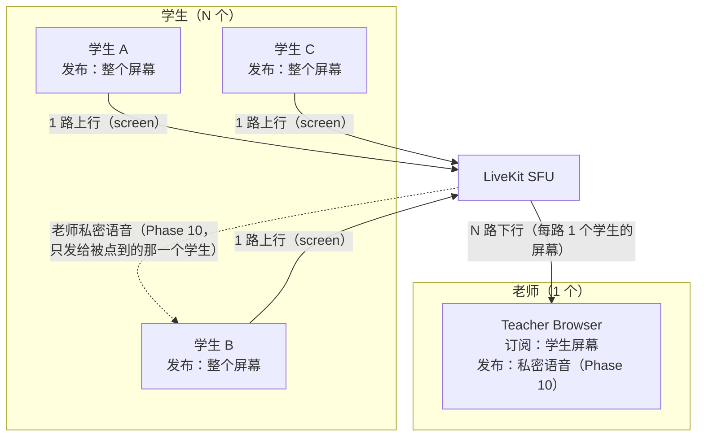
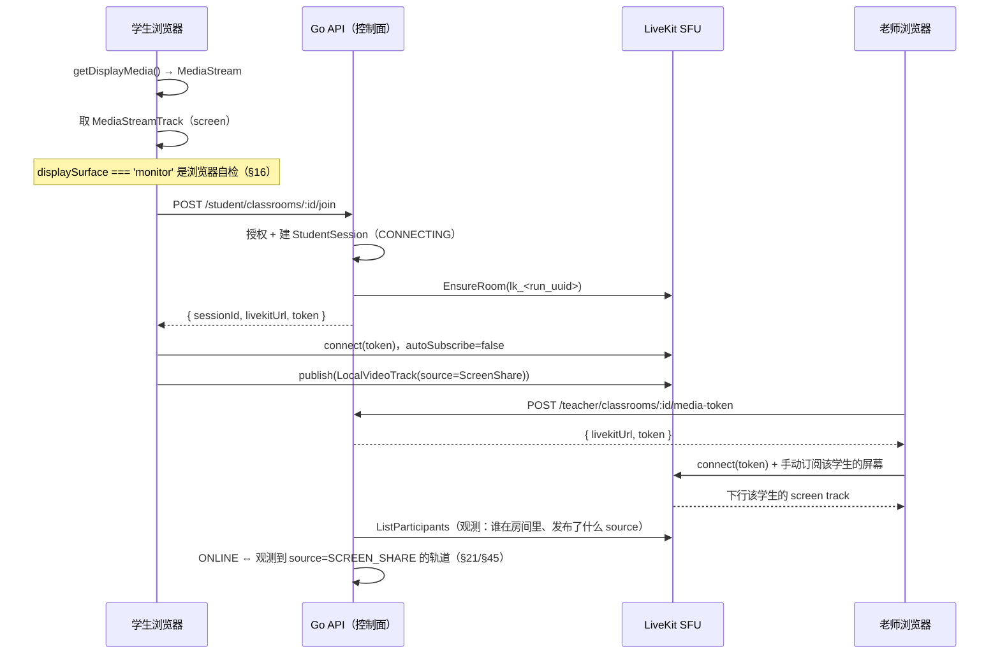

# WebRTC 基础与课堂媒体形态

> 本文回答四个问题：为什么 ClassWatch 的课堂天然是「1 上行 N 下行」、
> Track 与 Source 到底是什么、为什么学生端必须 `autoSubscribe = false`、
> 以及**客户端与服务端各自能证明什么**（任务书 §19 的威胁模型）。
>
> 它是 Phase 6（LiveKit 媒体接入）的产物。文中标注 Phase 7/8 的地方表示**尚未实现**，
> 并说明届时会在哪一层接上。
>
> 相关文档：[LiveKit 架构](livekit-architecture.md)、[SFU 取舍](sfu.md)、
> [控制面](../architecture/control-plane.md)、[架构总览](../architecture/overview.md)、
> [学生端页面](../frontend/student.md)。

---

## 1. 课堂里的媒体方向不是对称的

ClassWatch 的一节课在媒体面上只有一个**广播源**和很多**观察者**：



关键在于**每个参与者只上行自己那一份，下行由别人决定**：

| 角色 | 上行 | 下行 |
| --- | --- | --- |
| 学生 | 1 路（自己的整屏；Phase 9/10 再加摄像头/麦克风） | 0 路（默认）或 1 路（老师私密语音） |
| 老师 | 0 路（Phase 10 起 1 路私密语音） | N 路（每个学生的屏幕） |

这个形状对产品有三个直接后果，也是本项目很多设计决定的原因：

1. **老师端是带宽瓶颈，不是学生端。** 学生的上行与班级人数无关（永远 1 路），
   而老师的下行随人数线性增长。§52 因此要求 v1 不让老师同时下载所有人的画面，
   Phase 7 用 Focus View / 手动订阅把「N 路」压成「少量几路」。量级估算见 [sfu.md](sfu.md)。
2. **学生之间不应该有任何媒体关系。** 他们没有理由互相上行或下行，§26 把这一点写成产品规则：
   学生端不显示其他人、不订阅其他人的轨道。技术上是「不订阅」，产品上是「不感知」。
3. **媒体面永远是星形，而不是网状。** 这也是选 SFU 而不是 Mesh 的根本原因（见 [sfu.md](sfu.md)）。

---

## 2. Track 与 Source

### 2.1 一条轨道从浏览器走到老师屏幕的全过程



### 2.2 Source 是「这条轨道是什么」的声明

WebRTC 本身只知道「这是一条视频轨道」。`Source` 是 LiveKit 在**发布时**附加的语义标签：

| Source | 谁发布 | ClassWatch 里的用途 |
| --- | --- | --- |
| `screen_share` | 学生（§21 强制） | 判断 `ONLINE`、监督墙的 `screen.active`、§22 的「屏幕共享已停止」 |
| `screen_share_audio` | 学生（本项目不用） | 整屏共享时的系统声音；V1 不采集，避免把课堂外的声音带进房间 |
| `camera` | 学生（Phase 9） | `camera.active`；Phase 6 恒为 false |
| `microphone` | 老师私密语音 / 学生（Phase 10） | `microphone.active`；Phase 6 恒为 false |

**Source 是服务端唯一能据以判断「学生在共享什么」的东西**，因为：

- 轨道本身没有「内容」可供检查（服务端不解码、V1 不录像，§53）；
- 客户端上报的 `displaySurface` 是自报字段（见 §4）。

因此 Phase 6 的观测逻辑（`internal/media.ObserveRoom`）只做一件事：
把 `ListParticipants` 里每个 participant 的轨道收敛成三个布尔值
（`ScreenShare` / `Camera` / `Microphone`），并且**只认未静音的轨道**——
一条 muted 的屏幕轨道没有在传输任何东西，把它算作「正在共享」会让监督墙说谎。

### 2.3 一个必须承认的边界

`source = screen_share` 只说明「发布者声称这是一条屏幕共享轨道」。
它**不能**证明这条轨道来自一整块物理显示器（§19）。所以：

```text
服务端可以证明：这个学生在房间里，并且发布了一条自称是屏幕共享的轨道
服务端不能证明：这条轨道的内容是完整物理屏幕，而不是某个窗口
```

这不是实现缺陷，而是浏览器安全模型的边界；§19 要求我们**把它写进文档**，
而不是用一句「已验证屏幕共享」掩盖过去。

---

## 3. 为什么学生端必须 `autoSubscribe = false`

LiveKit 客户端默认 `autoSubscribe = true`：连上房间后自动订阅**所有能订阅的轨道**。
在 ClassWatch 里这个默认值会造成三个后果，每一个都足以否决它：

1. **学生之间互相看得见。** 学生 A 会自动订阅学生 B 的屏幕 —— 这直接违反 §26
   （不展示、不订阅其他学生），而且是在媒体层发生的，UI 层想藏也藏不住。
2. **学生端下行爆炸。** 一个 30 人的班里，每个学生会自动下载 29 路屏幕共享，
   等于把老师的带宽问题复制 30 份到学生端。
3. **产品意图被静默改变。** 「学生只需要看见自己、听见老师」是一个可以写进文档的承诺，
   而一个默认参数会让它在没有任何人改代码的情况下失效。

因此本项目固定：**学生端 `autoSubscribe = false`，由业务逻辑在需要时显式订阅**
（Phase 6 学生不需要订阅任何轨道；Phase 10 的私密语音才显式订阅老师那一路）。

### 3.1 那为什么 Token 里仍然 `canSubscribe = true`

「能不能订阅」和「要不要订阅」是两道不同的闸门：

| 闸门 | 位置 | 决定什么 |
| --- | --- | --- |
| `canSubscribe`（Token 权限位） | 服务端签发，媒体面执行 | 这个参与者**被允许**订阅房间里的轨道吗 |
| `autoSubscribe` / `subscribe()` | 客户端 | 这个参与者**此刻**订阅了哪些轨道 |

学生需要 `canSubscribe = true`，因为 §28/Phase 10 要求他能接收老师的私密语音——
一条只有被老师选中的学生才会收到的轨道。若把权限位关掉，Phase 10 就必须重新签发
一个更宽的 Token（等于中途换钥匙），而 §63 要求 Token 尽可能窄且短时、可预测。

所以本项目采取的组合是：

```text
Token:      canSubscribe = true          ← 允许（服务端决定，媒体面执行）
Client:     autoSubscribe = false        ← 不自动订阅任何东西
业务逻辑:   只对「老师私密语音」显式订阅   ← 产品决定（§26/§31，Phase 10）
```

一个诚实的限制：在共享同一个 SFU Room 的架构里，「学生之间互不感知」主要是
**产品和媒体权限层**的隔离，不能定义成对恶意自定义客户端的协议级匿名性（§26 原文）。
本项目的完整隔离依赖三件事：客户端不订阅、Phase 7 的服务端订阅权限、以及 identity 不透明。

---

## 4. 客户端与服务端各自能证明什么（§19）

这一节是本文档最重要的部分：它决定了「哪些字段可以当依据，哪些只能当日志」。

| 事实 | 谁能断言 | 可否伪造 | ClassWatch 如何处理 | 依据 |
| --- | --- | --- | --- | --- |
| `displaySurface === 'monitor'` | 浏览器 | **可以**（改前端 / 自写客户端） | 只作 diagnostics：写日志、传诊断字段；**绝不作为授权或状态依据** | §19/§43 |
| 学生已发布 `source=screen_share` 的轨道 | 服务端（查媒体面） | 不可以（由 SFU 报告） | 作为 `ONLINE` 的唯一依据 | §21/§45 |
| 屏幕共享已停止（`MediaStreamTrack.ended`） | 浏览器 | 可以（不报就是） | 只作**快速 UX**：立刻提示学生重新共享 | §22/§46 |
| 屏幕共享已停止（`track_unpublished`） | 服务端（webhook） | 不可以 | 权威观测；Phase 6 由 `ListParticipants` 轮询承担，Phase 8 换成 webhook | §22/§46/§74 |
| 「我已经连上了 / 我已经共享了」 | 客户端 | 可以 | **不采信**：没有这样的接口 | §45 |
| 学生是否在房间里 | 服务端 | 不可以 | `student_sessions.status` 由服务端观测推进 | §12/§51 |
| 学生是否被授权进入 | 服务端（PostgreSQL roster） | 不可以 | join 的第一道校验 | §14/§43 |

由此得到两条写进代码的规则：

```text
规则 1（观察代替信任）
  状态推进的输入只有服务端自己的观测：
  Phase 6 = ListParticipants 轮询；Phase 8 = 签名 webhook。
  客户端没有「上报我的状态」的接口，所以也没有可以撒谎的地方。

规则 2（媒体面故障 ≠ 业务事实）
  观测失败时状态保持不动，监督墙报 connection=UNKNOWN。
  绝不把「查不到」写成「学生断线」——那会把一次媒体面抖动
  永久写进课堂记录（§33）。
```

### 4.1 V1 防御什么、不防御什么

§19 要求把威胁模型说明白，本项目在文档和产品文案里都遵守同一口径：

```text
防御的是：
  正常用户误选「标签页 / 窗口」
  正常用户故意选单窗口偷懒
  中途停止共享、切走应用、关掉浏览器
  普通课堂里的逃避监督行为

不防御：
  主动修改前端代码、自己实现 WebRTC 客户端的攻击者
  （那已经不在 V1 threat model 内）

禁止的表述：
  「100% 防作弊」「绝对无法绕过」（§19，任何文档与产品文案都禁止）
```

一个具体推论：**服务器不能因为 `displaySurface` 不是 `monitor` 而拒绝 join**。
那样做既拦不住真正的攻击者，又会让一个浏览器行为差异把正常学生挡在课堂外，
还会让「诊断字段」变成「安全闸门」——两者一旦混在一起，后面每一次改动都要猜它属于哪一类。
本项目的做法是：诊断照样记，进门只看服务端能证明的事实。

---

## 5. 概念到代码的落点（Phase 6 已实现）

| 概念 | 代码位置 | 说明 |
| --- | --- | --- |
| 房间名 `lk_<run_uuid>` | `internal/classroom.RoomName`、迁移 `0006_classroom_runs.sql` | 开课时分配并入库，绝不使用姓名/班级名（§8） |
| 幂等建房 | `internal/media.EnsureRoom` | `CreateRoom` 的 AlreadyExists 视作成功；两个学生、老师与学生并发都不会失败 |
| 观察房间 | `internal/media.ObserveRoom` | 只统计 state 为 JOINING/JOINED/ACTIVE 且未静音的轨道 |
| 状态推进 | `internal/session.nextStatus` | 纯函数，§51 的状态表逐行可测 |
| 状态机持久化 | `session.Postgres.ApplyObservation` | `WHERE id=$1 AND status=$2` 的比较并交换（CAS），避免过期轮询覆盖新决定 |
| 学生权限位 | `internal/session.Service.Join` → `media.TokenRequest` | 只允许 `screen_share` 发布（§28/§72） |
| 停播检测（客户端通道） | 学生端 `MediaStreamTrack.onended` | Phase 5 已实现的前端行为；服务端不据此改状态 |
| 停播检测（服务端通道） | Phase 6：monitor 轮询；Phase 8：webhook | 见 §4 的表格 |

---

## 6. 已知限制（Phase 6）

1. **没有 webhook。** 服务端观测目前由监督墙的轮询触发，因此「学生停播」被记录的时刻
   取决于老师端的轮询节奏（Phase 8 用签名 webhook 取代，见 §74）。
2. **没有订阅权限（Subscription Permission）。** Phase 6 的房间里有 1 个学生，
   学生间隔离暂时由「客户端不订阅」保证；Phase 7 做多学生监督墙时补上服务端订阅控制。
3. **没有摄像头与麦克风。** Phase 6 只发布屏幕；Token 里也没有授予这两个 source（§72）。
4. **不录像、不截图、不存音频。** V1 明确不做（§53），诊断信息里也不会出现像素内容。
5. **画质与网络自适应未调优。** simulcast、码率上限、`degradationPreference` 等属于 Phase 7/11/12。
